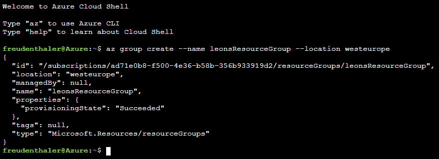
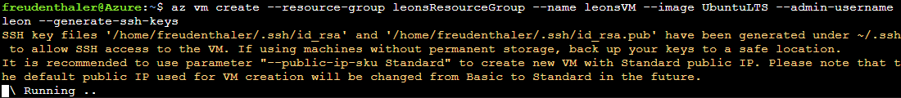
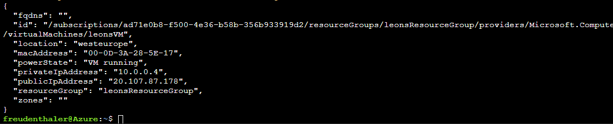
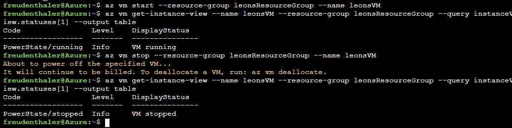
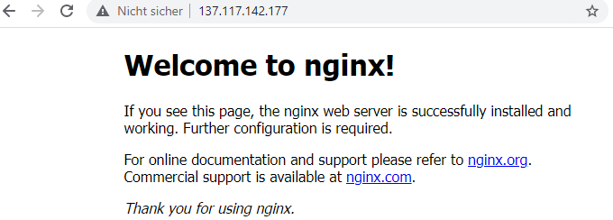
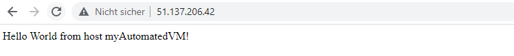
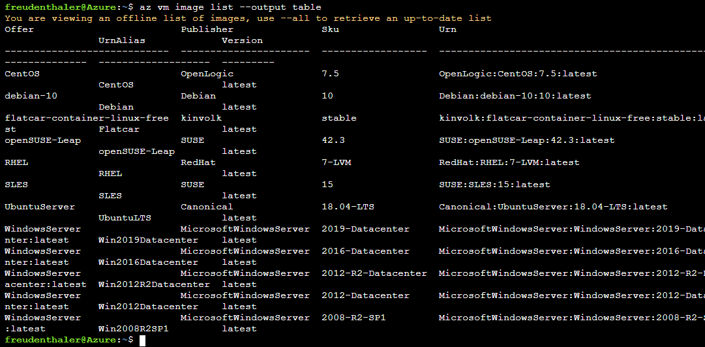
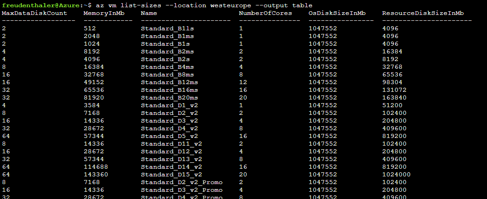

# {{ $frontmatter.title }}

## Aufgaben Übersicht
::: tip Aufgaben
* Video zu GIT
  * als Vorbereitung für Einheit am **10.12.**
* Erstellung VM in Azure und automatisierte Konfiguration mit Cloud-init (Gruppenarbeit) 
  * Abgabe eines Learning Diary bis **19.01.2022** auf Moodle
  * Learning Diary: Dokument, das einzelne Schritte mittels Beschreibung und Screenshots dokumentiert
* Freiwillig - Lernpfade zur Virtualisierung
:::

::: danger VM Ressourcen
Um freie Einheiten einzusparen, bitte immer alle Ressourcen löschen, wenn diese nicht mehr genutzt werden! (Nicht vergessen, den Namen der Resource Group an den verwendeten anzupassen)
```shell
az group delete --name myResourceGroup --no-wait --yes
```
:::

## 1. Prerequisites
- [Azure Pass einlösen](/azure/) und Account bei Microsoft Azure anlegen

## 3. VMs in Azure

### Azure Command Line Interface (CLI) öffnen
* Auf Azure einloggen
* Azure CLI öffnen
  * übers Webinterface öffnen (rechts oben `Cloud Shell`)
  * oder in eigenem [Tab](https://shell.azure.com/bash) öffnen
* `Bash Shell` auswählen 
* `Speicher erstellen` klicken (optional - wird nur gebraucht, wenn noch keiner hinterlegt)

### Resource Group erstellen

Eine Resource Group wird über das Azure CLI mit dem Command `az group-create` erstellt. Mittels `--name` wird ein Name für die Ressourcen Gruppe vergeben und mittels `--location` kann eine bestimmte Availability Zone ausgewählt werden. Theoretisch kann hier jede Availability Zone von Azure gewählt werden, es macht aber Sinn, eine Zone so nah wie möglich zu wählen, um **Latenzzeiten** vorzubeugen.

In der Shell:
``` shell
az group create --name myResourceGroup --location westeurope
```


*Erstellung Resource Group Azure CLI*

::: tip Liste Availability Zones

Eine Liste möglicher Zonen von Azure findet man bspw. hier: [Location Shortnames Azure](https://azuretracks.com/2021/04/current-azure-region-names-reference/)
:::

### VM erstellen
Zum Erstellen einer **VM** in einer bestimmten **Resource Group** wird im Azure CLI der `az vm create` Command verwendet. 

``` shell
az vm create --resource-group leonsResourceGroup --name leonsVM --image UbuntuLTS --admin-username leon --generate-ssh-keys
```
Erklärung der Commands:
  * `--resource-group`: Name der vorher erstellten Resource Group
  * `--name`: Name der VM
  * `--image`: gewünschtes OS Image
  * `--admin-username`: Admin User (bspw. für SSH wichtig)
  * `--generate-ssh-keys`: automatisch SSH Keys generieren und in die Default Location speichern (~/.ssh)



*Azure CLI Erstellung einer VM*

Wurde die VM erfolgreich angelegt, sollte das Ergebnis in der Shell wie folgt aussehen:


*Nach erfolgreicher Erstellung der VM*

::: tip VM IP-Adresse
  Mit der **publicIpAddress** kann später auf die VM zugegriffen werden. Diese muss man sich jedoch nicht merken. Sie kann auch mit folgendem Command abgerufen werden:
  ``` shell
  az vm list-ip-addresses --resource-group myResourceGroup --name myAutomatedVM --output table
  ``` 
:::

### SSH verbinden
Mithilfe der IP-Adresse, des zuvor definierten Admin-Usernamen und des `ssh` Commands, kann man sich nun einfach mit der VM verbinden.

Wenn man via SSH verbunden ist, können Applikationen installiert und konfiguriert werden. 

```shell
ssh leon@20.107.87.178
```

Mit dem Command `exit` kann die Verbindung wieder getrennt werden.

### VM starten und stoppen

Auch der Start und Stop von virtuellen Maschinen geht relativ einfach mittels einer Commandozeile.

**Der Start:**
```shell
az vm start --resource-group leonsResourceGroup --name leonsVM
```

**Der Stop:**
``` shell
az vm stop --resource-group leonsResourceGroup --name leonsVM
```

### VM Power States
Eine virtuelle Maschine hat in Azure immer einen sogenannten Power State. Dieser Power State stellt den aktuellen Zustand der VM aus Sicht des Hypervisors dar.

* Starting
* Running
* Stopping
* Stopped
* Deallocating
* Deallocated (vom Hypervisor entfernt aber noch verfügbar über das Azure Control Panel)

**Power State der VM abfragen**
```shell
az vm get-instance-view --name leonsVM --resource-group leonsResourceGroup --query instanceView.statuses[1] --output table
```


*Power State einer VM nach dem Start und nach dem Stop*

### Installation [Nginx](https://nginx.org/) Server
Als nächstes installieren wir einen Nginx Server auf der VM und öffnen einen Port, um den Server über das Internet zugänglich zu machen.

Um Applikationen auf der VM installieren zu können, ist als erstes eine **SSH Verbindung** notwendig. 

**Hier muss der zuvor festgelegte Admin-Username und die publicIpAddress entsprechend angepasst werden**:
```shell
ssh leon@20.107.87.178
```

Sobald man mit SSH verbunden ist, werden Updates sowie Nginx installiert:

```shell
sudo apt-get –y update
sudo apt-get –y install nginx
exit
```
`Exit` beendet die SSH Session.

Danach muss nur mehr der Port 80 für den Webserver geöffnet und die VM gestartet werden:

```shell
az vm open-port --port 80 --resource-group leonsResourceGroup --name leonsVM
```
In einem Browser kann nun die IP-Adresse der VM aufgerufen werden. 



## 4. Automatische Konfiguration einer VM mit Cloud-init
[Cloud-init](https://cloud-init.io/) wird verwendet, um Linux VMs beim Boot anzupassen (bspw. Pakete zu installieren, Dateien schreiben, Benutzer und Sicherheit konfigurieren). 

Cloud-init funktioniert auch **distributionsübergreifend**. Zum Beispiel muss nicht `apt-get install` oder `yum install`, zur Installation von Paketen verwendet werden. Stattdessen kann eine Liste der zu installierenden Pakete definiert werden. Cloud-init verwendet automatisch das systemeigene **Paketmanagement-Tool** der ausgewählten Distribution.

Bei dieser Aufgabe werden wir Cloud-init verwenden, um einen **Nginx** Server zu installieren, auf dem eine einfache [Node.js](https://nodejs.org/en/) Applikation ausgeführt wird. 

Dazu muss ein File namens `cloud-init.txt` erstellt werden. In der Cloud Shell kann mit folgendem Command das File erstellt, sowie ein beliebiger Editor zum Bearbeiten des Files (bspw. Nano), ausgewählt werden:

```shell
sensible-editor cloud-init.txt
```

Die folgende Cloud-init-Konfiguration installiert die erforderlichen Pakete, erstellt eine Node.js-App und initialisiert und startet die App. Bei der Konfiguration wird davon ausgegangen, dass der Admin-User der VM **"azureuser"** ist.

::: details Code anzeigen
```yaml
#cloud-config
package_upgrade: true
packages:
  - nginx
  - nodejs
  - npm
write_files:
  - owner: www-data:www-data
    path: /etc/nginx/sites-available/default
    content: |
      server {
        listen 80;
        location / {
          proxy_pass http://localhost:3000;
          proxy_http_version 1.1;
          proxy_set_header Upgrade $http_upgrade;
          proxy_set_header Connection keep-alive;
          proxy_set_header Host $host;
          proxy_cache_bypass $http_upgrade;
        }
      }
  - owner: azureuser:azureuser
    path: /home/azureuser/myapp/index.js
    content: |
      var express = require('express')
      var app = express()
      var os = require('os');
      app.get('/', function (req, res) {
        res.send('Hello World from host ' + os.hostname() + '!')
      })
      app.listen(3000, function () {
        console.log('Hello world app listening on port 3000!')
      })
runcmd:
  - service nginx restart
  - cd "/home/azureuser/myapp"
  - npm init
  - npm install express -y
  - nodejs index.js
```
:::

::: warning Achtung
 Darauf achten, dass der Inhalt der Cloud-init Datei korrekt kopiert wird, insbesondere die erste Zeile.

 Copy + Paste in der Cloud Shell funktioniert mit `Strg + C` und `Shift + Einfg`
:::

### Erstellen der VM
Nun wird eine neue VM mit dem Usernamen **azureuser** (falls zuvor das Konfigurations-File angepasst wurde, diesen Usernamen verwenden) und dem Command `custom-data` angelegt. Dieses verweist auf die `cloud-init.txt` Datei.

```shell
az vm create --resource-group myGroup --name myAutomatedVM --image UbuntuLTS --admin-username azureuser --generate-ssh-keys --custom-data cloud-init.txt
```

Wie zuvor muss noch der Port 80 geöffnet werden, damit der Nginx Server von Außen erreichbar ist:

```shell
az vm open-port --port 80 --resource-group myGroup --name myVM
```

Nun kann wieder mittels Browser auf die publicIpAddress der VM zugegriffen werden:


*Nginx Server mit Nachricht*

## Reminder - Ressourcen löschen
Nicht vergessen, die erstellten Ressourcen wieder zu löschen!

```shell
az group delete --name myResourceGroup --no-wait --yes
```

## 5. Video zu VCS und GIT
Als Vorbereitung für die kommende Einheit bitte folgendes Video zu Version Control Systemen und GIT anschauen: 

[](https://www.youtube.com/watch?v=8JJ101D3knE)

## Freiwillige [Lernpfade](https://docs.microsoft.com/de-de/learn/paths/cmu-cloud-computing-how-cloud-works/) zu Virtualisierung von Microsoft
- [Grundlegendes zur Virtualisierung](https://docs.microsoft.com/de-de/learn/modules/cmu-virtualization-developer/)
- [Freigabe von Cloudressourcen](https://docs.microsoft.com/de-de/learn/modules/cmu-share-cloud-resources/)
- [Virtualisieren der Rechenleistung](https://docs.microsoft.com/de-de/learn/modules/cmu-virtualize-computing-power/)
- [Virtualisieren von Arbeitsspeicher](https://docs.microsoft.com/de-de/learn/modules/cmu-virtualize-memory/)
- [Virtualisieren der E/A](https://docs.microsoft.com/de-de/learn/modules/cmu-virtualize-input-output/)
- [Speicher- und Netzwerkvirtualisierung](https://docs.microsoft.com/de-de/learn/modules/cmu-storage-network-virtualization/)

## 6. Azure erweitert

### Verfügbare Images in Azure anzeigen

```shell
az vm image list --output table
```

**Beispiel-Output**


### Verfügbare VM Sizes in einer Location (VM Arten in Azure)

```shell
az vm list-sizes --location westeurope --output table
```

**Beispiel-Output**


### VM Size beim Erstellen der VM angeben
Mit dem `--size` Command:

```shell
az vm create --resource-group myResourceGroupVM  --name myAutomatedVM --image UbuntuLTS --size Standard_F4s --generate-ssh-keys
```

### VM Size einer speziellen VM angeben
```shell
az vm show --resource-group leonsResourceGroup --name leonsVM --query hardwareProfile.vmSize
```

## 7. Azure Dokumentation (weitere Azure Tutorials zu VMs)

[Quick Guide - Erstellung einer VM in Azure (Azure CLI)](https://docs.microsoft.com/en-us/azure/virtual-machines/linux/quick-create-cli)

[Quick Guide - Erstellung einer VM in Azure (Portal)](https://docs.microsoft.com/en-us/azure/virtual-machines/linux/quick-create-portal)

[Tutorials für VMs in Azure](https://docs.microsoft.com/en-us/azure/virtual-machines/linux/tutorial-manage-vm) (unterschiedlichste Tutorials - siehe linke Taskleiste)

[Azure Docs](https://docs.microsoft.com/en-us/azure/?product=popular)

[Azure Learn (Learning Paths)](https://docs.microsoft.com/en-us/learn/azure/)
