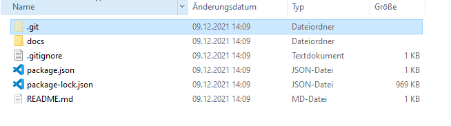
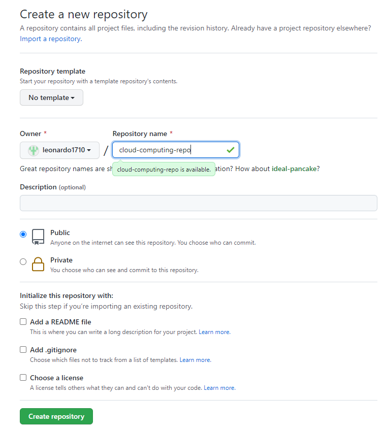
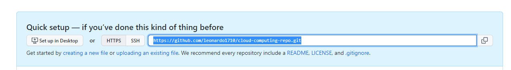
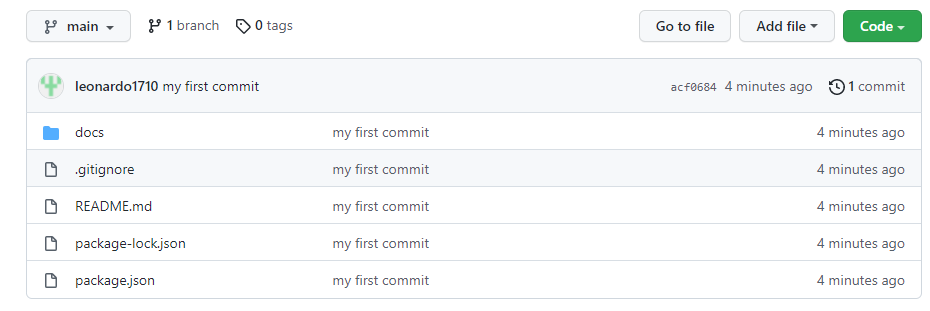
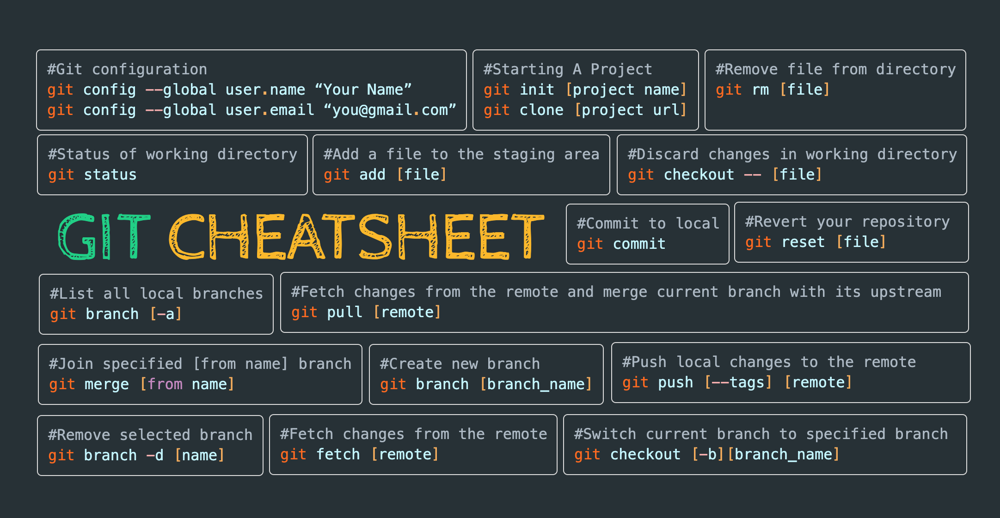

# {{ $frontmatter.title }}
## Aufgabenstellung
Aufgabe ist es, in Gruppen GIT anhand einer Web Applikation auszuprobieren. Folgende Schritte sind umzusetzen:
* Web Applikation klonen (muss nur 1 Teammitglied machen)
* Ein eigenes Remote Repository für die Gruppe aufsetzen (Github, Gitlab, Bitbucket, ...)
* Restliches Team klont das neue Remote Repository 
* Durchführen von Änderungen (lokal) und Änderungen ins Remote Repository pushen
* Erstellung von mindestens einem Branch je Teammitglied
* Änderungen im Branch vornehmen und Branch wieder in `master` Branch mergen
* Link zum Remote-Repository auf Moodle abgeben
  
## 1. Prerequisites
* Installation [Node.js](https://nodejs.org/en/download/)
* Installation einer IDE (bspw. [VSCode](https://code.visualstudio.com/download))
* Installation [GIT](https://git-scm.com/downloads)
* Account anlegen bei einem Git Repository Hosting Service ([GitHub](https://github.com/), [Bitbucket](https://bitbucket.org/), [Gitlab](https://gitlab.com/), etc. )

::: warning Projekt Setup
Das Projekt Setup muss nur 1 Teammitglied machen!
:::

## 2. Projekt Setup
Zum Ausprobieren von Git wird in diesem Arbeitsauftrag eine simple Web Applikation zur Verfügung gestellt. Somit sind **keine Programmiererfahrungen** im weitesten Sinne notwendig. Wollt ihr in eurem Team ein eigenes Projekt nutzen und an diesem mit GIT arbeiten ist das auch möglich. In diesem Fall bitte den Punkt [Projekt klonen](#projekt-klonen) überspringen.
Weiters muss nicht die **Git Bash** verwendet werden. Es kann auch ein Git Client wie [GitHub Desktop](https://desktop.github.com/) oder [Sourcetree](https://www.sourcetreeapp.com/) verwendet werden.

### Projekt klonen - intial 
Bei der Web Applikation handelt es sich um eine Static Webpage, die mithilfe von [VuePress](https://vuepress.vuejs.org/guide/) erstellt wurde. VuePress ist ein Static Site Generator, der dabei hilft statische Webpages sehr einfach zu erstellen. Dabei können Markdown Files, HTML-Files aber auch das Framework Vue.js verwendet werden. Das Projekt-Setup ist bereits integriert und funktioniert Out-of-the-Box. Für diesen Arbeitsauftrag sind keinerlei Vue.js Kenntnisse notwendig, wir konzentrieren uns nur auf die Versionskontroller mit GIT. 

``` git
git clone https://github.com/leonardo1710/cloud-starter-app.git
```
Damit die Verbindung zur Remote entfernt wird, muss zuerst im erstellten Verzeichnis der `.git` Folder gelöscht werden. Das ist notwendig, damit ihr ein eigenes lokales Git Repository mit eurer eigenen Remote anlegen könnt.



::: tip Tipp
Unter Windows wird der `.git` Folder eventuell nicht angezeigt. Dazu muss zuerst die Anzeigen von versteckten Ordnern aktiviert werden [siehe hier](https://support.microsoft.com/de-de/windows/anzeigen-versteckter-dateien-0320fe58-0117-fd59-6851-9b7f9840fdb2)
:::

### Projekt starten (optional)
Damit die Web Applikation ausgeführt werden kann, müssen zuerst alle notwendigen Dependencies installiert werden. Ausführung bspw. mithilfe der Command Shell im Projektordner:

```
npm i 
```
Danach kann das Projekt im Development Modus ausgeführt werden:

```
npm run docs:dev
```
Wenn das Projekt erfolgreich gebuildet wurde, sollte in der Shell nun die Adresse stehen, auf der die Web Applikation lokal gehostet wird. Bspw.: `VuePress dev server listening at http://localhost:8081/`
Um die Web Applikation anzusehen, kann die URL in einem Browser aufgerufen werden.

### Lokales Git Repository initialisieren
Nun muss ein neues Repository initialisiert werden (mithilfe von Git Bash im Projektordner):

``` git
git init -b main
```
`main` steht dabei für den Namen des ersten Branchs.

> Jetzt sollte wieder ein `.git` Folder in eurem Projektordner sein

### `Add` Files im lokalen Repository
Der `add` Command fügt alle ausgewählten Änderungen einer sogenannten `Staging Area` hinzu. Alle Änderungen an Files der Staging Area sind in einem darauffolgenden `Commit` enthalten:

``` git
git add .
# Adds the files in the local repository and stages them for commit. 
```
> Änderungen aus der `Staging Area` entfernen mit: `git reset HEAD YOUR-FILENAME`

### `Commit` der Änderungen im lokalen Repository
Der `git commit` Command erzeugt einen **Snapshot** der aktuellen Projektversion (aus der Staging Area). Diese Snapshots werden in Git versioniert und nicht mehr geändert (außer man macht das explizit). Somit kann das Projekt immer auf eine bestimmte Version zurückgesetzt werden. 
``` git
git commit -m "my first commit"
```

### Erstellung eines Remote Repository
Damit kollaborativ an dem Projekt gearbeitet werden kann, muss ein zentrales Remote Repository angelegt werden. Dazu in dem ausgewählten Git Repository Hosting Service anmelden und ein Repository anlegen. 
Bei GitHub kann man [hier](https://github.com/new) ein neues Repository anlegen.

::: warning Achtung
Beim Anlegen des Remote Repository kein README.md File oder .gitignore File auswählen, sonst kann es zu Konflikten mit dem lokalen Repository kommen. Das Repository `public` kennzeichnen, damit ich bei der Abgabe die Commit-Historie einsehen kann.
:::

In folgendem Beispiel kann man die Auswahl bei GitHub sehen:


Sobald das Projekt angelegt wurde, die erstellte Remote Repository URL kopieren:


### Remote mit lokalem Repository verknüpfen
In der Git Bash wird mittels des `git remote add origin <Repo_URL>` Command das Remote Repository verknüpft. So wird festgelegt, in welches zentrale Repository **gepusht** werden soll. 

``` git
git remote add origin  <REMOTE_URL> 
git remote -v
```

### Änderungen in Remote **pushen**
Beim `git push` werden lokale Änderungen in das Remote Repository geladen. Das betrifft alle Commits, die noch nicht auf die Remote geladen wurden. 

``` git
git push origin main
```

Wurde das lokale Repository erfolgreich gepusht, solltet ihr diese Änderungen auch auf GitHub sehen können: Alle lokalen Files sind nun auch hier zu finden:


## 3. Klonen des neuen Remote Repository
An dieser Stelle können jetzt alle Teammitglieder mit dem `git clone` Command von zuvor, das neue Repository klonen. Damit die anderen auch autonom in das Remote Repository pushen können, müssen sie noch als **Contributors** hinzugefügt werden:
* Auf GitHub im Repository unter `Settings` -> `Manage access` -> `Add people` -> GitHub Username oder E-Mail Adresse auswählen

``` git
git clone <YOUR_REPOSITORY_URL>
```
Der `git clone` Command initialisiert bei allen anderen Teammitgliedern automatisch das notwendige Git Repository. Nun können alle Teammitglieder Änderungen in den Files machen, Änderungen in die Staging Area hinzufügen, committen und auf die Remote pushen.


Änderungen durchfühen, dann:
``` git
git add .
git commit -m "changed file x"
git push origin main
```

## 4. Änderungen der Remote **pullen**
Wurden von einem Teammitglied Änderungen auf die Remote gepusht, müssen alle anderen ihre lokalen Repositories aktualisieren (neuesten Stand des Projektes integrieren). Mittels `fetch` kann geschaut werden ob es Änderungen auf der Remote gibt. Mit `pull` werden die Änderungen in das lokale Repository gemerged.

``` git
git fetch origin main
git pull origin main
```

## 5. Weitere Arbeitsaufträge
Da das Initialsetup des Projekts jetzt bei allen Teammitgliedern funktioniert, kann mit der eigentlichen Git Übung begonnen werden. Folgendes ist zu tun:
* Jedes Teammitglied macht Änderungen im lokalen Repository und pusht diese in die Remote (siehe Workflow von zuvor)
* Jedes Teammitglied erstellt einen **Branch**, macht Änderungen in dem Branch und **merged** diesen Branch wieder in den `main` Branch
* Alles soll auch immer im Remote-Repository festgehalten werden!
  
Falls manche Schritte nicht klar sind, bitte noch einmal das Video von der letzten Übung schauen. Weiters gibt es ein Cheatsheet im Anhang, falls manche Commands entfallen sind.

### Abgabe 

Repository URL und Teammitglieder in [Moodle](https://moodle.fh-campuswien.ac.at/mod/assign/view.php?id=498586) abgeben.

## Git Cheatsheet


## Weitere (spaßige) Ressourcen zum Lernen von Git
[Learn Git Branching](https://learngitbranching.js.org/)

[Oh my Git!](https://ohmygit.org/)

[GitHub Minesweeper](https://profy.dev/project/github-minesweeper)


