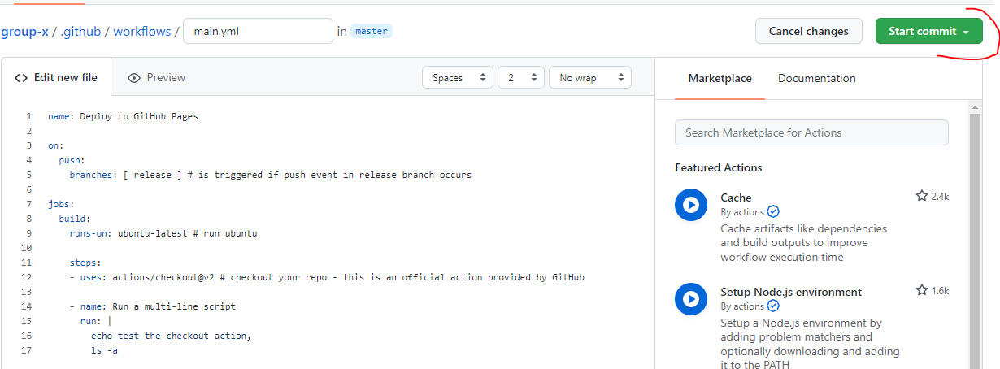

# {{ $frontmatter.title }}

# Aufbau einer CI/CD Pipeline mit Github Actions und Github Pages

## Aufgabenstellung
* Erstellen eines neuen Team-Repositories
* Erstellen eines Github Actions Workflows
* Konfiguration des Workflows
* Auto-deploy bei Push in einen Branch
* Abgabe: URL der gehosteten Page auf Moodle + Teammitglieder

## Prerequisites
* Installation [Node.js](https://nodejs.org/en/download/)
* Installation [GIT](https://git-scm.com/downloads)
* Account bei [GitHub](https://github.com/)

## Erstellen eines Team-Repository
::: warning Achtung
Wie in der letzten Einheit muss dieser Schritt nur von 1 Person im Team gemacht werden. Generell ist es nicht notwendig, dass alle Teammitglieder das Projekt klonen. Es kann zusammen an einem Projekt via Screensharing gearbeitet werden.
:::

Ein Repository der [Source Applikation](https://github.com/leonardo1710/webapp) auf Github anlegen. Damit das etwas simpler als in der letzten Übung gestaltet wird, wurde die Applikation als Template hinterlegt. Zum Erstellen eines Remote-Repository für das Team muss nur auf `Use this template` geklickt werden:


Danach kann direkt ein neues Repository angelegt werden. Hier einen **Namen** für das Projekt vergeben und die Einstellung **public** auswählen.


### Klonen des Projekts
Jetzt kann das Repository geklont werden - also lokal auf euren PC. Für diese Übung muss das nur eine Person aus eurem Team machen, wenn ihr wollt können natürlich auch alle vom Team das Projekt klonen.

Zur Erinnerung, das ging mit dem Command:
``` git
git clone <YOUR-REPO-LINK>
```
Bevor wir die CI/CD Pipeline einrichten, kurz ein paar Hintergrundinformationen zu Github Actions und Github Pages.

## Was ist Github Actions?
Mit [Github Actions](https://docs.github.com/en/actions) können Prozesse (Build, Test und Deployment) eines Projekts direkt von Github aus automatisiert werden. Diese Prozesse können durch bestimmte Ereignisse ausgelöst werden, wie z. B. das Pushen von Code, neue Releases usw.

Github Actions sind ereignisgesteuert: Durch festlegen von Befehlen, die ausgeführt werden sollen, wenn bestimmte Ereignisse (z. B. push to /main branch) eintreten. 
Stand 2021 sind in Github Actions 2000 Gratisminuten für private Repositories und unlimitierte Minuten für public Repositories verfügbar.


### Komponenten von Github Actions:
#### Workflows
Workflows können einfach zu einem GitHub Repository hinzugefügt werden. Ein Workflow ist eine automatisierte Prozedur, die aus einem oder mehreren [jobs](#jobs) besteht. Die Ausführung von Workflows kann durch festgelegte [events](#events) getriggert werden.
#### <a name="events">Events</a>
Events triggern Workflows. Beispielsweise kann ein `Push` in einen speziellen Branch einen Workflow triggern, der die Applikation deployed. Events können bis ins kleinste Detail angepasst werden. Folgende Liste enthält alle Events und beispielhafte Konfigurationssettings für diese: [Events](https://docs.github.com/en/actions/reference/events-that-trigger-workflows)
#### <a name="jobs">Jobs</a>
Jeder Workflow besteht aus einem oder mehreren Jobs. Jeder Job kann mehrere `steps` (Ausführungsschritte) beinhalten, die zur gleichen Zeit ausgeführt werden. Dazu werden sogenannte [runner](#runner) verwendet.
Standardmäßig werden diese Jobs parallel ausgeführt, man kann die Ausführung aber auch sequenziell einstellen (bspw. wenn ein Job ausgeführt sein muss, damit der nächste ausgeführt werden kann). [Sequentielle Ausführung von Jobs in Github Actions](https://docs.github.com/en/actions/reference/workflow-syntax-for-github-actions#example-requiring-dependent-jobs-to-be-successful).
#### <a name="actions">Actions</a>
Actions sind die kleinste Komponente eines jeden Workflows. Actions können entweder selbst erstellt, oder vordefinierte Actions der Github Community verwendet werden.
#### <a name="runner">Runner</a>
Runner sind die Server, auf denen die Workflows laufen. Github bietet einige vordefinierte Runner, die verwendet werden können. Es ist auch möglich, einen eigenen Runner zu hosten. Wenn Runner von Github selbst verwendet werden, kann zwischen verschiedenen Betriebssystem-Runnern gewählt werden: Ubuntu Linux, Microsoft Windows oder macOS.


## Was ist GitHub Pages?
GitHub Pages ist ein Static Site Hosting Service, mit dem Webpages direkt aus einem GitHub Repository deployed werden können. 
Es gibt drei Arten von GitHub Pages-Sites: Projekt-, Benutzer- und Organisationssites. Projektseiten sind mit einem bestimmten, auf GitHub gehosteten Projekt verbunden. Benutzer- und Organisationsseiten sind mit einem bestimmten Konto auf GitHub.com verbunden.

In dieser Übung werden wir GitHub Pages als Deploymentplattform für die Applikation, also für das von euch angelegte GitHub Repository, nutzen.
Die Source Files für eine Projektsite werden in demselben Repository abgelegt, dass ihr erstellt habt.

Standardmäßig wird bei GitHub Pages ein Branch namens `gh-pages` als Deploymentsource herangezogen.

### Limitierungen in GitHub Pages
* GitHub Pages dürfen nicht größer als 1GB sein
* Bandbreitenbegrenzung von 100GB im Monat
* 10 Builds/Stunde

## Wie würde ein manuelles Deployment der Applikation aussehen?
Würden wir das Projekt manuell deployen, würden die Schritte wie folgt aussehen:
1. Branch mit Source Files auschecken
2. Dependencies der Applikation installieren (bspw. mit `npm i`)
3. Statische Files des Sourcecode generieren und Files "bundlen" -> sozusagen der **Build Step**. Das Beispielprojekt verwendet hierzu [Webpack](https://webpack.js.org/). Für die Übung ist das aber irrelevant. In der Applikation wird der Buildprozess mit dem Command  `npm run build` ausgeführt. Dabei wird ein `/dist` Folder mit den zu hostenden Files erstellt.
4. Die statischen Files bzw. der `/dist` Folder müssen dann auf einen Webserver transferiert werden

## Erstellung eines GitHub Actions Workflow
Um die zuvor beschriebenen Schritte mit GitHub Actions zu automatisieren, muss zuerst ein Workflow im GitHub Repository angelegt werden. In eurem Repository wählt den Tab `Actions` aus.

Hier kann man vorkonfigurierte Workflows auswählen (bspw. *Deploy Node.js to Azure Web App*, *Deploy to Amazon ECS*) oder einen eigenen Workflow anlegen.
Wählt hier bitte **set up a workflow yourself** aus:


GitHub Actions schlägt nun ein main.yml File vor. Schaut euch das File genau an. Wie ihr sehen könnt, gilt für einen Workflow in GitHub Actions:
* Workflows werden in einer YAML-Datei definiert, die sich im Verzeichnis .github/workflows eures Repos befindet
* Ein oder mehrere Events können den Workflow auslösen (bspw. `on: push` bzw. `on: pull_request`)
* jeder **Workflow** hat eine Anzahl von Jobs
* jeder **Job** startet auf einer neuen Instanz (bspw. Ubuntu-latest)
* jeder Job besteht aus mehreren **Steps**, in denen einzelne Aktionen oder Bash Commands ausgeführt werden
  
Fürs Erste löscht alle Inhalte des main.yml Files und fügt folgende Konfiguration ein.

::: details main.yml File
``` yaml
name: Deploy to GitHub Pages

on:
  push: 
    branches: [ release ] # is triggered if push event in release branch occurs

jobs:
  build:
    runs-on: ubuntu-latest # run ubuntu

    steps:
    - uses: actions/checkout@v2 # checkout your repo - this is an official action provided by GitHub

    - name: Run a multi-line script
      run: |
        echo test the checkout action,
        ls -a
```
:::

Dann muss ein Commit erstellt werden, damit das yml-File in eurem Repository ist. Das kann über die Github GUI gemacht werden, wenn man auf `Start commit` klickt. Hier muss nur mehr eine Commit Message eingegeben werden.


Damit ihr das neue yml-File auch lokal im `.github/workflows/` Ordner habt, müsst ihr noch die Änderung von der Remote pullen:

``` git
git pull
```

## Branch `release` erstellen
Erstellt einen Branch mit dem Namen `release` und wechselt in den Branch:

``` git
git branch release
git checkout release
```
Macht eine Änderung unter `/src/index.html`, erstellt dann einen **Commit** und pusht den `release` Branch.

``` git
git add .
git commit -m "test the workflow"
git push
```
> Es kann sein, dass anstelle von `git push` zuvor noch der Branch veröffentlicht werden muss. Verwendet hierzu `git push --set-upstream origin release`, das erstellt den Branch in der Remote und pusht die Commits.


Nun solltet ihr im GitHub Repository unter `Actions` sehen, dass ein neuer Workflow getriggert wurde. Wird der Workflow gerade ausgeführt, wird der Status **gelb** indiziert, wurde der Workflow fertig ausgeführt, ist der Status **grün**. Wenn es Fehler beim Ausführen des Workflow gab, wird der Status **rot** eingefärbt:


Jeder Workflow kann dann, für weitere Details, angeklickt werden. In diesem Fall, werden in den Workflow Details die Folder des Repositories aufgelistet (`ls -a` Command aus dem yml-File):


## Workflow adaptieren
Im nächsten Schritt werden wir den Workflow so aktualisieren, dass der vorher beschriebene **manuelle Build** automatisiert ausgeführt wird. Im Falle unserer  Applikation muss zuerst der Befehl `npm run build` ausgeführt werden. Um `npm` Befehle ausführen zu können, muss auf der Instanz **Node.js** installiert werden. Dazu verwenden wir eine andere offizielle GitHub-Action, die `setup-node-action`.

Dazu werden erstmal die `echo` und `ls` Commands aus dem Skript gelöscht und mit denen genannten ersetzt:

::: details main.yml File

``` yaml
name: Deploy to GitHub Pages

on:
  push: 
    branches: [ release ] # is triggered if push event in release branch occurs

jobs:
  build:
    runs-on: ubuntu-latest # run ubuntu

    steps:
    - uses: actions/checkout@v2 # checkout your repo - this is an official action provided by GitHub

    - name: Generate static vuepress files
      uses: actions/setup-node@v1
      with:
        node-version: '12.x'
    - run: npm i # install dependencies
    - run: npm run build # run build
```

:::

Nach dem nächsten gepushten Commit in den `release` Branch, sollte die Action neu getriggert werden und die Commands ausführen:


Wenn ihr euch an die Schritte beim manuellen Deployment erinnert, muss jetzt nur noch der generierte `/dist` folder in das **Publishing Directory** eurer GitHub Pages Site gepusht werden. In einem manuellen Setup würde man dazu in den Ordner, in dem die Files generiert wurden, wechseln. Dieser würde schlussendlich als neues Git Repository initialisiert und die enthaltenen Files in das Publishing Directory (`gh-pages`) gepusht werden. Genau das werden wir jetzt automatisiert machen:

::: details main.yml File

``` yaml
name: Deploy to GitHub Pages

on:
  push: 
    branches: [ release ] # is triggered if push event in release branch occurs

jobs:
  build:
    runs-on: ubuntu-latest # run ubuntu

    steps:
    - uses: actions/checkout@v2 # checkout your repo - this is an official action provided by GitHub

    - name: Generate static vuepress files
      uses: actions/setup-node@v1
      with:
        node-version: '12.x' # install node on runner
    - run: npm i # install dependencies
    - run: npm run build # run build
    - name: Init new repo in dist folder and commit generated files
      run: |
        cd dist
        git init
        git add -A
        git config --local user.email "action@github.com"
        git config --local user.name "GitHub Action"
        git commit -m 'deploy'
    - name: Force push to destination branch
      uses: ad-m/github-push-action@v0.5.0
      with:
        # Token for the repo. Can be passed in using $\{{ secrets.GITHUB_TOKEN }}
        github_token: ${{ secrets.GITHUB_TOKEN }}
        # Destination branch to push changes
        branch: gh-pages
        # Use force push to fully overwrite the destination branch
        force: true
        # We have to push from the folder where files were generated.
        # Same were the new repo was initialized in the previous step
        directory: dist
```
:::

Wenn ihr jetzt in euer Github Repository schaut, solltet ihr einerseits unter den `Actions` den Workflow einsehen können, andererseits unter euren Branches einen Branch `gh-pages` finden. Dieser wurde mithilfe des Skripts neu angelegt. In dem Branch befinden sich nur die Inhalte des `dist` Folders:


## GitHub Pages aktivieren
Nun ist der Workflow fertig konfiguriert. Jetzt muss nur mehr GitHub Pages aktiviert werden. Dazu im Repository unter `Settings` -> `Pages` als Source den `gh-pages` Branch auswählen.


Das Deployment der Page könnte ein paar Minuten dauern. Wartet etwas und refresht dann die Seite. Wenn GitHub Pages fertig eingerichtet ist, sollte in grün *"Your site is published at https://username.github.io/app-name/"* stehen. Klickt auf den Link um das Ergebnis zu sehen:


Sehr gut. Die CI/CD Pipeline ist fertig erstellt. Ab sofort wird die Seite immer automatisch neu deployed, wenn in den `release` Branch gepusht wird.

## Zusätzliche Ressourcen
[Introduction to Github Actions](https://docs.github.com/en/actions/learn-github-actions/introduction-to-github-actions)

[Workflow Syntax](https://docs.github.com/en/actions/reference/workflow-syntax-for-github-actions)


