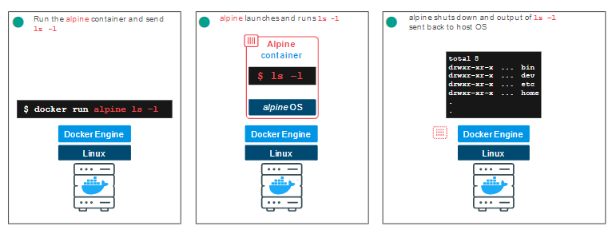

# {{ $frontmatter.title }}

## Aufgabenstellung
* Kennenlernen der Docker-Environment im [Docker-Playground](https://labs.play-with-docker.com/)
  * Docker anhand der Beispiele des Tutorials auszuprobieren
  * Wenn ihr Docker bereits installiert habt, kann das auch im *"echten"* Docker ausgeführt werden - ist aber nicht notwendig für diese Einheit
* Download [Docker](https://www.docker.com/products/docker-desktop) - notwendig für die nächste Einheit

## Was ist **Play with Docker**?
In dieser Einheit werden wir das online Lab von Docker für eine erste Intro in Docker verwenden. In der nächsten Einheit werden wir mit der richtigen Docker Installation arbeit (bitte bis kommende Woche downloaden).

> Play with Docker (PWD) ist ein von Marcos Liljedhal und Jonathan Leibiusky entwickeltes Projekt, das von Docker Inc. gefördert wird.

> PWD ermöglicht es Benutzer:innen, Docker-Commands in Sekundenschnelle auszuführen. Es können Docker-Container erstellt und ausgeführt und sogar Cluster im Docker Swarm-Modus erstellt werden.

> Jede Instanz ist 4 Stunden verfügbar

## Playground starten und erste Instanz erstellen
Öffnet den [Docker-Playground](https://labs.play-with-docker.com/) in einem Browser und erstellt eine neue Instanz mit `ADD NEW INSTANCE`:


Der Playground startet daraufhin einen neuen Node + IP Adresse. Weiters sollte die Commandline geöffnet werden (siehe Abbildung oben).

Wie es der Brauch in der IT will, beginnen wir den Tutorial mit einer *Hello World*-App. Dazu werden wir mithilfe des `run` Commands einen neuen Container erstellen:

``` shell
docker container run hello-world
```

Die Ausgabe des Containers `hello-world` verrät ein wenig über das, was gerade passiert ist. Im Wesentlichen hat die **Docker-Engine**, die in eurem Terminal läuft, versucht, ein Image namens `hello-world` zu finden. Da ihr gerade erst angefangen habt mit der Instanz zu arbeiten, sind keine Images lokal gespeichert ("*Unable to find image...*"), also geht die Docker-Engine zur **Standard-Docker-Registry**, dem **Docker Hub**, und sucht nach einem Image mit dem Namen `hello-world`. Sie findet das Image dort, lädt es herunter und führt es in einem Container aus. Die einzige Funktion von `hello-world` besteht darin, den Text "*Hello from Docker!*" auszugeben, den ihr auch im Terminal sehen solltet. Danach wird der Container beendet.


## Docker Images
Im weiteren Verlauf dieser Übung werden wir einen *Alpine-Linux-Container* ausführen. Alpine ist eine leichtgewichtige Linux-Distribution, die schnell heruntergeladen und ausgeführt werden kann, was sie zu einem beliebten Ausgangspunkt für viele andere Images macht.

Um loszulegen `pullen` wir einmal das Alpine Image aus der **Docker Registry**:
``` shell
docker image pull alpine
```

Der Befehl `pull` holt das Alpine-Image aus der Docker-Registry und speichert es in unserem System. In diesem Fall die **Registry Docker Hub**. 

Mit dem Befehl `docker image` kann eine Liste aller Images auf eurem System angezeigt werden:

``` shell
docker image ls
```


## Container Run
Als nächstes starten wir unseren Container mit dem `docker run` Command:
``` shell
docker container run alpine ls -l
```


Während der `ls` Befehl wahrscheinlich unspektakulär wirkt, ist bei diesem simplen Command im Hintergrund einiges passiert. Der `run` Befehl sucht nach dem Image `alpine` in unseren installierten Images, erstellt den Container und führt dann den Command in diesem Container aus. Nach Beendigung des Befehls `ls` wird der Container heruntergefahren.



Wichtig an dieser Stelle ist, dass der Container nach dem Command wieder gestoppt wurde. Schauen wir uns dieses Vorgehen mit einem anderen Befehl noch einmal genauer an:

``` shell
docker container run alpine echo "hello from alpine"
```
In diesem Fall führte der Docker-Client den `echo`-Befehl in unserem Alpine-Container aus und beendete sie dann. Wie ihr wahrscheinlich feststellen konntet, geschah dies alles ziemlich schnell und unser Container wurde wieder beendet. 
Wie wir in den kommenden Schritten noch sehen werden,
wurde der `echo`-Befehl in einer separaten **Container-Instanz** ausgeführt. 

Stellt euch vor, ihr würdet an dieser Stelle eine VM starten, einen Befehl ausführen und dann beenden; es würde ein oder zwei Minuten dauern, nur um die VM zu starten, bevor der Befehl ausgeführt wird. Eine VM muss einen kompletten Hardwarestack emulieren, ein Betriebssystem booten und dann eure Anwendung starten - sie ist eine virtualisierte Hardwareumgebung. Docker-Container funktionieren auf der Anwendungsebene, sodass sie die meisten Schritte, die VMs benötigen, überspringen und nur das ausführen, was für die Anwendung erforderlich ist. 

Probieren wir einen weiteren Command:
``` shell
docker container run alpine /bin/sh
```
Was ist passiert? Es sieht so aus, als wäre nichts passiert, aber mit dem Befehl habt ihr eine dritte Instanz des Alpine-Containers gestartet, der den Befehl `/bin/sh` ausführte und dann beendet wurde. Ihr habt keine weiteren Befehle an `/bin/sh` übergeben, also wurde nur die Shell gestartet, die Shell beendet und dann der Container gestoppt. Manche haben jetzt vielleicht eine **interaktive Shell** erwartet. Docker bietet dafür eine Möglichkeit, indem es ein Flag hinzufügt, um den Container in einem interaktiven Terminal auszuführen. Für dieses Beispiel gebt Folgendes ein:
``` shell
docker container run -it alpine /bin/sh
```
Jetzt befindet ihr euch innerhalb des Containers in einer Linux-Shell und könnt einige Befehle wie `ls -l`, `uname -a` und andere ausprobieren. Beachtet, dass Alpine ein kleines Linux-Betriebssystem ist und daher einige Befehle fehlen könnten. Die Shell könnt ihr mit dem `exit` Befehl verlassen. 

Ok, wir haben gesagt, dass wir jeden unserer Befehle oben in einer separaten Container-Instanz ausgeführt haben. Wir können diese Instanzen mit dem Befehl `docker container ls` sehen. Das Kommando `docker container ls` zeigt euch alle Container an, die gerade laufen:

``` shell
docker container ls
```
Da gerade keine Container in Betrieb sind, wird hier nichts ausgegeben. Versuchen wir eine nützlichere Variante: 
``` shell
docker container ls -a
```


Was ihr nun sehen solltet, ist eine Liste aller Container, die ihr ausgeführt habt. In der Spalte `STATUS` sieht man, dass diese Container vor einiger Zeit beendet wurden.

Um mehr über `run` zu erfahren, verwendet `docker container run --help`, um eine Liste aller unterstützten Flags zu erhalten. Im weiteren Verlauf werden wir einige weitere Varianten von `docker container run` sehen, aber ihr könnt hier gerne experimentieren, bevor ihr fortfahrt.

## Container Isolation
In den obigen Schritten haben wir mehrere Befehle über Container-Instanzen mit Hilfe von `docker container run` ausgeführt. Der Befehl `docker container ls -a` zeigte uns, dass mehrere Container aufgelistet waren. Warum sind so viele Container aufgelistet, wenn sie alle aus dem Alpine-Image stammen?

Das ist ein kritisches Sicherheitskonzept aus der Welt der Docker-Container. Obwohl jeder **Docker-Container `Run` Command** dasselbe Alpine-Image verwendet, ist jede Ausführung ein **separater, isolierter** Container. Jeder Container hat ein eigenes Dateisystem und läuft in einem anderen Namespace; standardmäßig hat ein Container keine Möglichkeit, mit anderen Containern zu interagieren, auch nicht mit denen aus demselben Image. Versuchen wir eine weitere Übung, um mehr zur Isolation zu lernen.

``` shell
docker container run -it alpine /bin/ash
```
Die `/bin/ash` ist ein weiterer Shell-Typ, der im Alpine-Image verfügbar ist. Sobald der Container gestartet ist und ihr euch in der Eingabeaufforderung des Containers befindet, gebt die folgenden Befehle ein:

``` shell
 echo "hello world" > hello.txt

 ls
```


Der erste `echo`-Befehl erstellt eine Datei namens *"hello.txt"* mit den Worten "*hello world*". Der zweite Befehl gibt eine Verzeichnisliste der Dateien aus und sollte die neu erstellte Datei *"hello.txt"* anzeigen. Gebt nun wieder `exit` ein, um diesen Container zu verlassen.

Um zu zeigen, wie die Isolation funktioniert, führen wir den folgenden Befehl aus:
``` shell
docker container run alpine ls
```

Es ist derselbe `ls`-Befehl, den wir in der interaktiven ash-Shell des Containers verwendet haben, nur diesmal fehlt die *hello.txt* Datei. Das ist **Container Isolation**. Unser Befehl wurde in einer neuen und separaten Instanz ausgeführt, obwohl sie auf demselben Image basiert. Die zweite Instanz hat keine Möglichkeit, mit der ersten Instanz zu interagieren, da die Docker-Engine sie getrennt hält und wir keine zusätzlichen Parameter eingerichtet haben, die eine Interaktion zwischen diesen beiden Instanzen ermöglichen würden.

Bei der täglichen Arbeit nutzen Docker-Benutzer diese Funktion nicht nur aus Sicherheitsgründen, sondern auch, um die Auswirkungen von Anwendungsänderungen zu testen. Die Isolation ermöglicht es den Benutzern, schnell separate, isolierte Testkopien einer Anwendung oder eines Dienstes zu erstellen und sie nebeneinander laufen zu lassen, **ohne dass sie sich gegenseitig beeinträchtigen**. Es gibt sogar einen ganzen Lebenszyklus, in dem die Benutzer ihre Änderungen mit Hilfe dieses grundlegenden Konzepts und der integrierten Funktionen von Docker Enteprise in die Produktion überführen. 

Im Moment ist die offensichtliche Frage: "*Wie komme ich zu dem Container zurück, in dem sich meine Datei 'hello.txt' befindet?*"

Gebt dazu noch einmal den Command zur Anzeige der Container Instanzen, die ausgeführt wurden ein:
``` shell
docker container ls -a
```
Grafisch dargestellt, ist Folgendes in der Docker Engine passiert:


Der Container, in dem wir die Datei "*hello.txt*" erstellt haben, ist derselbe, in dem wir die Shell `/bin/ash` verwendet haben, die wir in der Spalte "`COMMAND`" sehen. Die Container-ID-Nummer aus der ersten Spalte identifiziert diese bestimmte Container-Instanz eindeutig. In meinem Fall lautet die Container-ID 9b7a81e2b0dfffie. Wir können einen etwas anderen Befehl verwenden, um Docker anzuweisen, diese spezielle Container-Instanz auszuführen. Gebt bitte eure Container-ID ein:

``` shell
docker container start <container ID>
```
::: tip Pro-Tipp
Man muss nicht die gesamte Container ID angeben. Es reicht auch die ersten Zeichen einzuben. Der Container muss nur eindeutig identifizierbar sein.
:::

Verwenden wir nun erneut den Befehl `docker container ls`, um die laufenden Container aufzulisten.
``` shell
docker container ls
```
Diesmal läuft unsere Container-Instanz noch. Wir haben dieses Mal die `ash`-Shell verwendet, so dass `ash` auf einen Befehl wartet, anstatt sich einfach zu beenden, wie es `/bin/sh` zuvor getan hat. Wir können ein Command an den Container senden, das er ausführen soll, indem wir den Befehl `exec` wie folgt verwenden:
``` shell
docker container exec <container ID> ls
```
Diesmal erhalten wir eine Verzeichnisauflistung und es wird unsere Datei "*hello.txt*" angezeigt, da wir die Container-Instanz verwendet haben, in der wir diese Datei erstellt haben.


In dieser Übung haben wir nun einige der wichtigsten Konzepte von Containern kennengelernt. In der nächsten Übung werden wir sehen, wie wir unsere eigenen Docker-Images erstellen können und wie man ein Dockerfile verwendet, um Images zu standardisieren, so dass wir größere, komplexere Images auf einfache, automatisierte Weise erstellen können.