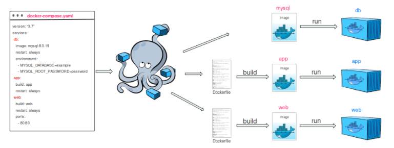
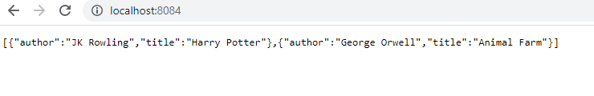
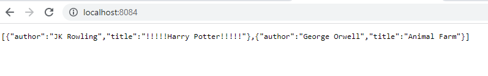
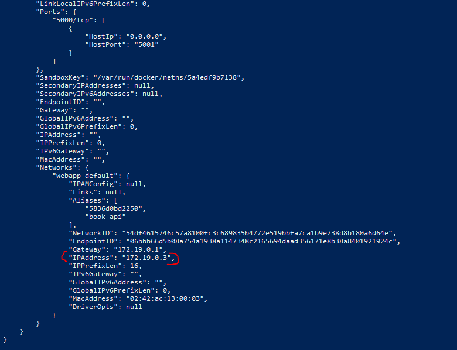
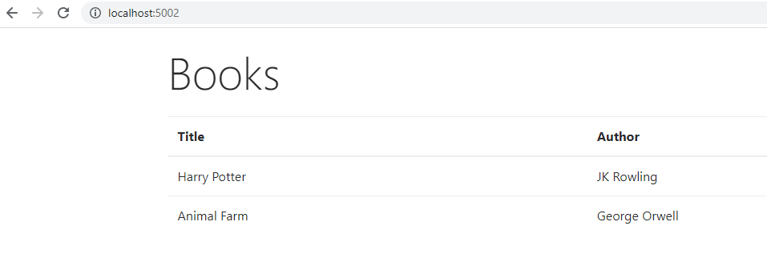
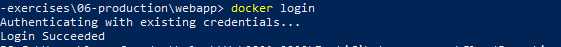
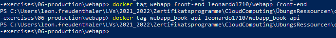
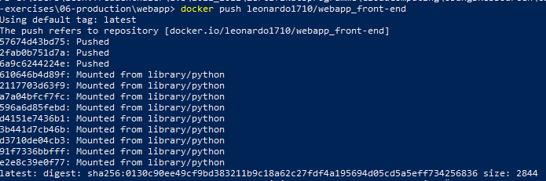
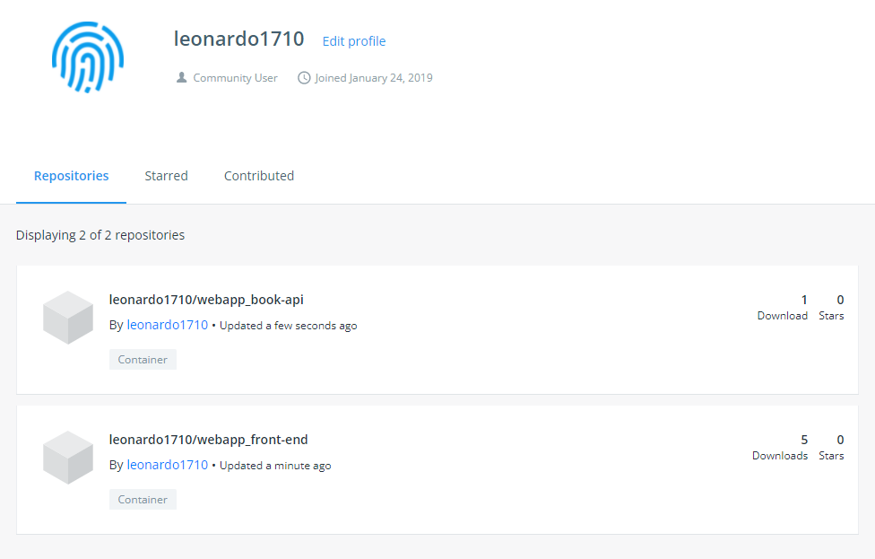
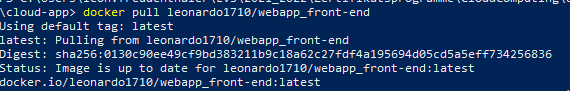

# {{ $frontmatter.title }}

## Aufgabenstellung
- Docker-Compose anwenden
- 2 Microservices mit Docker-Compose verbinden
- Services auf Docker-Hub publizieren
- **Abgabe** auf Moodle: Name der Docker Images, die von der Docker Hub gepullt werden können (`<USERNAME>/<IMAGE_NAME>`)

## Prerequisites
- Arbeitsauftrag 6.2 erledigt
- Docker und GIT installiert
- Docker-Compose installiert (bei Docker Desktop Version bereits inkludiert)
- Account bei [Docker Hub](https://hub.docker.com/)


## Was ist Docker-Compose?
Compose ist ein Tool zur Definition und Ausführung von **Multi-Container-Docker-Anwendungen**. Mit Compose verwenden wir eine **YAML-Datei**, um die Dienste unserer Anwendung zu konfigurieren. Dann erstellen und starten wir mit einem einzigen Befehl alle Dienste aus der Konfiguration. 
Diese Konfigurations-Datei könnt ihr dann (genau wie ein einzelnes Dockerfile) zum Beispiel mit Kolleg:innen teilen und alle haben wieder dieselbe Serverumgebung ohne großartige Erklärungen welcher Container nun genau welchen Port wohin verlinken muss.

Ein Docker Container ist eine in sich abgeschlossene Einheit. Standardmäßig gibt es weder Verbindungen nach drinnen noch nach draußen. Oft ist es aber nötig, dass entweder mehrere Container untereinander kommunizieren müssen (beispielsweise ein Webserver mit einer Datenbank) oder ein Container mit dem Hostcomputer, auf dem er gestartet wurde, kommunizieren muss (beispielsweise um auf Dateien zuzugreifen, die dort auf der Festplatte liegen).

Und genau hier kommt die Verlinkung ins Spiel. Diese ermöglicht uns, bestimmte Ports freizugeben um eine Verbindung von außen (also anderen Containern) zuzulassen oder eben auch ein bestimmtes (oder mehrere) Verzeichnis mit dem Hostsystem zu teilen. Bei zwei Containern ist das noch kein großer Aufwand. Aber stellen wir uns mal eine typische Webumgebung vor. Da haben wir:

* Den **Webserver** (bspw. Nginx), der Zugriff auf die Webpage-Dateien (um sie auszuliefern) und eine Verbindung zu der Applikation am Server (um Bescheid zu geben, welche Datei nun ausgeführt werden soll) benötigt. 
* Die **Applikation**, die unsere Logik enthält (bspw. eine Node.js oder Flask App)
* Außerdem benötigt die Applikation auch noch eine Verbindung zur **Datenbank** (bspw. MySql, Postgres) um dort benötigte Daten abfragen zu können.



### docker-compose.yml
Das Herzstück von Docker Compose bildet eine YAML Datei namens `docker-compose.yml`. In dieser Datei definieren wir die Container, die wir starten wollen und ihre Beziehungen untereinander. Wir können **Verzeichnisse mit dem Hostsystem teilen, Ports freigeben und Verlinkungen herstellen** – und natürlich noch einiges mehr. 

Docker-compose wird im YAML Format geschrieben. YAML ist ähnlich zu JSON oder XML. Dabei ähnelt YAML der Programmiersprache Python, dh. Einrückungen und Leerzeichen können Auswirkungen auf die Interpretation haben.

In der ersten Ebene (**Einrückung** beachten!) der Datei schreiben wir die zu verwendende [Docker-Version](https://docs.docker.com/compose/compose-file/), sowie `services`. `services` gibt eine Auflistung unserer einzelnen Container an. In der Ebene unter `service` definieren wir die Namen unserer einzelnen Container. Diese sind wichtig, da wir mit Hilfe dieser Namen auf andere Container referenzieren können. In der Unterebene zu jedem Container werden dann die einzelnen Eigenschaften durchgegangen, von denen wir als nächstes ein paar besprechen. Ein einfaches Beispiel dafür sieht so aus:

``` yml
# docker-compose.yml
version: "3"  # docker-compose version
services:
  db:
    image: dbImage
  app:
    image: appImage
```

### Komponenten des docker-compose.yml

#### image
Ist wie wir bereits schon aus dem Dockerfile kennen, das image des Containers.

``` yml
# docker-compose.yml
version: "3"  # docker-compose version
services:
  nginx:
    image: nginx
```

#### build
`build` ist sozusagen das Gegenstück zu `image` (und die beiden sind auch exklusiv, es kann also nur eins von beidem für einen Container geben). Wir erinnern uns: entweder man erstellt Images mithilfe von Dockerfiles oder man lädt diese aus dem Dockerhub bzw. generiert sie aus laufenden Containern.
Als Wert vergeben wir beim `build` einfach den Pfad zu einem Dockerfile – relativ von unserem `docker-compose.yml` File aus gesehen – das beim Starten der Container ausgeführt werden soll. 
Da wir das für jeden einzelnen Container machen können haben wir die Möglichkeit, unsere Container ganz auf unsere Wünsche anzupassen. Falls sich das Dockerfile im selben Verzeichnis wie die docker-compose.yml Datei befindet geben wir einfach einen` . `an.

``` yml
# docker-compose.yml
version: "3"  # docker-compose version
services:
  nginx:
    build: nginx/
```

#### ports
Diese Eigenschaft ist ziemlich eindeutig benannt und sie macht auch genau das, was man erwarten würde. Ports öffnet die angegebenen Ports in unserem Container und verbindet sie mit einem Port auf dem Host. Dadurch können wir zum Beispiel dafür sorgen, dass zwei Programme, die denselben Port benutzen, auf demselben Server laufen. Wir weisen einfach dem einen Programm einen anderen Port auf dem Host zu als dem anderen.
Hier gibt es mehrere Schreibweisen:

* Eine einzelne Zahl (zum Beispiel *8080*) öffnet einen einzelnen Port. Wird für den Host kein Port angegeben wird ein zufälliger bestimmt.
* Mit Doppelpunkten getrennte Zahlen (zum Beispiel *8080:80*) mappen Ports vom Host (vor dem Doppelpunkt) in den Container (nach dem Doppelpunkt).
* Mit Bindestrich getrennte Zahlen öffnen eine ganze Reihe von Ports (zum Beispiel *8001-8010*).

Diese Eigenschaft benötigen wir beispielsweise wenn wir Programme wie einen Webserver oder MySQL in einem Container laufen lassen. Die anderen Container benötigen Zugriff darauf, daher müssen wir die passenden Ports (zum Beispiel 80/443 für den Webserver oder 3306 für MySQL) freigeben.

``` yml
# docker-compose.yml
version: "3"  # docker-compose version
services:
  nginx:
    build: nginx/
    ports:
      - "80:80"
      - "443:443"
```

#### volumes
Die `volumes` Eigenschaft gibt uns die Möglichkeit, ein Verzeichnis (oder auch mehrere) vom Host im Container verfügbar zu machen. Dafür geben wir einfach den Pfad auf dem Host an, wo das Verzeichnis zu finden ist. Außerdem können wir optional noch mit Doppelpunkt getrennt einen Pfad angeben, auf den das Verzeichnis im Container gemappt werden soll. Werden Änderungen auf einer Seite gemacht (also beispielsweise im Container) sind diese automatisch auch auf der anderen Seite (also auf dem Host). Das ist eine einfache Möglichkeit, Datenkonsistenz zu erhalten, denn normalerweise werden Daten, die in einem Container liegen, beim Zerstören des Containers gelöscht. Werden sie allerdings über ein solches Volume auf dem Hostrechner abgelegt bleiben sie auch beim Containerneustart erhalten.

``` yml
# docker-compose.yml
version: "3"  # docker-compose version
services:
  nginx:
    build: nginx/
    volumes:
      - /var/www/my_project:/var/www/project1
```

#### volumes_from
Klingt sehr ähnlich wie die vorherige Eigenschaft – ist auch beinahe dasselbe. `Volumes_from` lässt uns alle Volumes, die wir in einem anderen Container haben, auch in diesen Container übernehmen. Das ist äußerst praktisch um immer Zugriff auf dieselben Daten zu haben. Das wird beispielsweise wichtig, wenn wir in einem Container einen Webserver und im anderen die Applikation laufen lassen. Beide benötigen Zugriff auf die Applikations-Dateien. Hier geben wir einfach den Namen des Containers an, so wie wir ihn in unserem docker-compose.yml vergeben haben.

``` yml
# docker-compose.yml
version: "3"  # docker-compose version
services:
  nginx:
    build: nginx/
    volumes:
      - /var/www/html:/var/www/html
  app:
    image: node:12.18.1
    volumes_from:
      - mynginx
```

#### links
Die `links` Eigenschaft ist wirklich hilfreich. Docker Compose erlaubt uns damit, einen Hosteintrag von einem Container in einem anderen zur Verfügung zu stellen. Müssen wir in einem Container also beispielsweise auf einen anderen zugreifen (beziehungsweise benötigen dessen IP Adresse in einer Konfiguration) können wir diesen Eintrag vergeben und können anstatt der IP Adresse einfach den Namen des Containers verwenden – Docker Compose kümmert sich um den Rest.

``` yml
# docker-compose.yml
version: "3"  # docker-compose version
services:
  nginx:
    build: nginx/
    volumes:
      - /var/www/html:/var/www/html
    links: app
  app:
    image: node:12.18.1
    volumes_from:
      - mynginx
```
In diesem Beispiel hätten wir also die Möglichkeit, in unserer Nginxkonfiguration einfach den app-Container mit dem Hostnamen `app` anzusprechen. 

### Docker-Compose Befehle
Nachdem wir nun wissen wie die fundamentalen Command des `docker-compose.yml` File funktionieren, sehen wir uns auch noch an wie wir die Container starten, stoppen und verwalten können.

#### docker-compose up
Der erste Befehl ist `docker-compose up`. Dieser Command startet einfach die Container, die wir in unserem YAML File definiert haben. Das bedeutet, wir können alle unsere Container mit diesem einen Befehl starten.

#### docker-compose build
Der `docker-compose build` Befehl baut alle Container zusammen und tagged diese dann, sodass sie beim nächsten Starten schneller verfügbar sind. Wenn sich also etwas in einem Buildverzeichnis oder einem Dockerfile ändert führen wir einfach diesen Befehl aus, um die Änderungen in unserer Docker Compose Umgebung mitzubekommen.

#### docker-compose container
`docker-compose ps` listet die aktiven Container auf, die von Docker Compose aktuell verwaltet werden.

#### docker-compose start / stop
Mit den Namen, die wir im `docker-compose ps` Befehl sehen können, können wir einzelne Container mit Hilfe von `docker-compose start / stop` ganz einfach starten / stoppen.

#### docker-compose rm
Ebenfalls mit dem Namen können wir einen getaggten Container mit `docker-compose rm` auch wieder Entfernen. Führen wir danach `docker-compose up` aus wird dieser auch neu erzeugt.

## Arbeitsauftrag
Zum Start der Übung navigiert im Projekt in den Folder `04-compose` und seht euch das bereitgestellte `docker-compose.yml` an:
``` shell
cd <PATH_WHERE_YOU_SAVED_REPO>/cloud-docker-exercises/04-compose/webapp
```

``` yaml
# 04-compose/webapp/docker-compose.yml
version: '3'

services:

  server:
    build:
      context: .
    ports:
      - 8084:5000
```
**version**: Version von Docker-Compose

**services**: Container, die wir konfigurieren wollen - derzeit gibt es nur einen

**server**: Name von unserem Container Service

**build**: beschreibt die Schritte, die für den Build notwendig sind

**context**: Ort an dem Dockerfile hinterlegt ist -> für den Build notwendig

**ports**: Port-Mapping des Containers auf den Host

Um unseren Service zu builden, können wir jetzt einfach den `docker-compose build` Befehl ausführen:

``` shell
docker-compose build
```

Zum Starten des Service nutzen wir den `docker-compose up` Command:
``` shell
docker-compose up
```
Wenn der Container mit dem Namen Server läuft, mappt Docker-Compose die Ports auf den Host. Also wird der Command `-v port:port` für uns ausgeführt.  
Wie auch schon bei dem Arbeitsauftrag zuvor, sollte die Webapp die Bücherliste zurückgeben:


Damit wir jetzt nicht nach jeder Änderung im Sourcecode einen **Build** machen müssen, ändern wir unser `Dockerfile` so ab, dass wir immer das Directory vom Host in den Container mounten. Dazu entfernen wir den `COPY` Command, da die Daten jetzt gemountet werden sollen:

``` dockerfile
# 04-compose/webapp/Dockerfile
FROM  python:3.6 
  
COPY ./src/requirements.txt /tmp
RUN pip install -r /tmp/requirements.txt 

# removed: COPY ./src /app
WORKDIR /app

EXPOSE 5000
CMD python server.py
```

Normalerweise würden wir zum Mounten jetzt den Command `-v <HOST_DIRECTORY>:<CONTAINER_DIRECTORY>` nutzen. Mit Docker-Compose können wir das aber direkt im `docker-compose.yml` definieren:

``` yaml
# 04-compose/webapp/docker-compose.yml
version: '3'

services:

  server:
    build:
      context: .
    ports:
      - 8084:5000
    volumes:
      - ./src:/app
```

Das mountet unser `./src` Directory unseres Host in das `/app` Directory im Container. 
Damit wir unser neues YML File testen können, müssen wir erst mal alle Container stoppen und entfernen:

``` shell
docker-compose stop
docker-compose rm
```

Und ein Rebuild und Start der Container:
``` shell
docker-compose build
docker-compose up
```
> Note: ein Rebuild ist notwendig, da wir das `Dockerfile` geändert haben. Das Mounting erspart uns derzeit den Rebuild nur bei Änderungen im `./src` Directory!

Ändert jetzt beispielsweise einen Titel in der Bücherliste des `server.py` und refresht dann euren Browser. Die Aktualisierung sollte automatisch übernommen worden sein:



Derzeit läuft nur ein Container in unserem Docker-Compose Setup. Jetzt sehen wir uns einmal an, wie man Microservices mit Docker-Compose umsetzen kann.

### Microservice Architektur mit Docker-Compose

#### Microservice Recap
Bei einer Microservice Architektur wird eine große Anwendung in kleine, isolierte Module zerlegt. Die Module können somit unabhängig von einander entwickelt werden und ergeben zusammen das Gesamtprodukt. Als Architektur-Frameworks sind Microservices verteilt und lose gekoppelt, sodass die Änderungen eines Teams nicht dazu führen können, dass die gesamte Anwendung nicht mehr funktioniert. 

Eine Microservice Architektur führt zu:
* hoher Skalierbarkeit 
* einfaches Deployment
* schnelle Time-to-Market
* mehr Resilienz (wenn ein Service ausfällt, laufen die anderen trotzdem noch)
* unabhängig von Programmiersprachen
* kein Single-Point-of-Failure

Für diese Aufgabe switcht in das Directory `05-microservices`:
``` shell
cd <PATH_WHERE_YOU_SAVED_REPO>/cloud-docker-exercises/05-compose/webapp
```
Der `webapp` Folder besteht jetzt aus einer `book-api` und einem `front-end` Folder. Beide sind Flask Apps, die unabhängig von einander sind - also Microservices darstellen.
Der Fokus bei der Aufgabe wird die Kommunikation von Microservices mittels Docker-Compose sein und nicht die Entwicklung der Applikationen. Der Code wird euch in den folgenden Schritten zur Verfügung gestellt.

In der `book-api` findet ihr wieder ein `server.py` File. Das File unterscheidet sich von der letzten Aufgabe nur durch den Endpoint - `get_books()`. Dieser Endpoint ist so konfiguriert, dass er über einen GET-HTTP Request erreichbar ist:

``` python
# 05-microservice/book-api/server.py
from flask import Flask, jsonify

app = Flask(__name__)
app.config['JSONIFY_PRETTYPRINT_REGULAR'] = False 

@app.route('/books', methods=["GET"]) # listens to GET requests at host:port/books
def get_books():
    Books = [
        {
            "title": "Harry Potter",
            "author": "JK Rowling"
        },
        {
            "title": "Animal Farm",
            "author": "George Orwell"
        }
    ]
    return jsonify(Books)

if __name__ == '__main__':
    app.run(debug=True, host='0.0.0.0')
```

Auch im `/front-end` findet ihr ein `server.py`. Das Frontend soll eine simple Bücherliste in HTML rendern. In diesem Fall wird dazu die Library [Jinja](https://jinja.palletsprojects.com/en/3.0.x/) genutzt. Die Funktion `render_template()` übergibt dem `show_books.html` die Bücherliste, in der ein HTML gerendert und zurückgegeben wird.

``` python
# 05-microservice/front-end/server.py
from flask import Flask, render_template
import requests

app = Flask(__name__)

@app.route('/')
def show_books():
    Books = [{"title": "Eragon", "author": "Christopher Paolini"}] 
    return render_template('show_books.html', books=Books)

if __name__ == '__main__':
    app.run(debug=True, host='0.0.0.0')
```

Die genaue Funktionalität der Flask App soll uns in dieser Übung wie gesagt nicht interessieren. Sehen wir mal in das `docker-compose.yml` File:

``` yaml
version: '3'

services:

  book-api:
    build:
      context: ./book-api
    ports:
      - 5001:5000
    volumes:
      - ./book-api/src:/app
    

  front-end:
    build:
      context: ./front-end
    ports:
      - 5002:5000
    volumes:
      - ./front-end/src:/app
```
Im docker-compose File gibt es jetzt 2 Services: book-api und front-end. Für beide Services wurden schon die Ports vergeben: die book-api soll auf Port 5001 und das front-end auf Port 5002 laufen.

Builden wir einmal die Images und führen die Container aus. Beide Container werden mit Docker-Compose gleichzeitig gestartet:

``` shell
docker-compose build
docker-compose up
```

Unter `localhost:5002` solltet ihr jetzt die Frontend Applikation sehen.


Unter `localhost:5001/books` solltet ihr die Bücher von der book-api sehen können. 

> Alternativ kann die `book-api` auch mit [Postman](https://www.postman.com/) untersucht werden.

Derweil sind die Bücherlisten in beiden Services hardcoded. Dh. unsere Services kommunizieren noch nicht miteinander, sie laufen nebenher auf der Host-Maschine. Im nächsten Schritt werden wir das **Networking von Containern** anschauen.

#### Networking mit Docker-Compose
Eine Möglichkeit der Kommunikation von Services ist es, die IP Adressen herauszufinden und über diese zu kommunizieren.

> Achtet darauf, dass eure Container auch laufen!

Findet die Namen eurer Container mithilfer von `docker container ls` oder `docker ps` heraus. 
Um mehr Informationen zu euren Containern anzuzeigen können wir den `docker inspect` Command verwenden:

``` shell
docker inspect <YOUR_CONTAINER_NAME>
```
Unter dem Punkt `Networks` solltet ihr die IP Adresse des Containers finden. In meinem Fall ist es `172.19.0.3`:



**Docker-Compose** setzt automatisch ein internes Netz für uns auf und vergibt den Containern IP Adressen. Container dürfen sich standardmäßig gegenseitig kontaktieren (außer es wird explizit verboten). Ihr könnt beispielsweise von eurem Frontend Container aus einen **Ping** an den Book-api Container senden:

``` shell
docker exec -it webapp_front-end_1 /bin/bash
ping 172.19.0.3
```

:::warning Ping not found
Falls die Fehlermeldung auftritt, dass der Command `ping` nicht gefunden wird, müsst ihr das Paket vorher in der Shell installieren:

``` shell
apt-get update
apt-get install iputils-ping
ping 172.19.0.3
```
::: 

Theoretisch könnten wir mithilfe der IP Adresse des Containers, die Bücherdaten in der Frontend Applikation abfragen. Bspw. so:

``` python
# 05-microservices/front-end/server.py
from flask import Flask, render_template
import requests

app = Flask(__name__)

@app.route('/')
def show_books():
    # Your Container IP instead
    Books = requests.get('http://172.19.0.3:5000/books').json()  
    return render_template('show_books.html', books=Books)

if __name__ == '__main__':
    app.run(debug=True, host='0.0.0.0')
```

Jetzt solltet ihr die Bücher der `book-api` in eurem Frontend sehen können. Das funktioniert zwar, jedoch kann es sein, dass den Containern beim nächsten Start eine andere IP zugewiesen wird. Dh. es wird nicht immer funktionieren. Aus diesem Grund bietet Docker ein weiteres Feature: Docker legt automatisch IP **Aliase** an.

Wir werden für die IP Adresse eine Umgebungsvariable im `docker-compose.yml` anlegen:

``` yaml
version: '3'

services:

  book-api:
    build:
      context: ./book-api
    ports:
      - 5001:5000
    volumes:
      - ./book-api/src:/app
    
  front-end:
    build:
      context: ./front-end
    environment:
      - BOOK_API_SERVER=http://book-api:5000
    ports:
      - 5002:5000
    volumes:
      - ./front-end/src:/app
```

Und passen den GET Request der Frontend Applikation mit der Umgebungsvariable an:

``` python
import requests, os
from flask import Flask, render_template

BOOK_API_SERVER = os.environ['BOOK_API_SERVER'] # get environment variable
app = Flask(__name__)

@app.route('/')
def show_books():
    Books = requests.get(BOOK_API_SERVER + "/books").json() # pass variable
    return render_template('show_books.html', books=Books)

if __name__ == '__main__':
    app.run(debug=True, host='0.0.0.0')
```

Stoppt und startet eure Container noch einmal neu:

``` shell
docker-compose stop
docker-compose rm
docker-compose build
docker-compose up
```

Wenn ihr jetzt auf mit dem Browser auf euer Frontend navigiert (`localhost:5002`) solltet ihr auch jetzt die Bücher der `book-api` sehen können:



Eine kleine Verbesserung in unseren Services werden wir jetzt noch vornehmen. Unsere Frontend Applikation ist abhängig von der Book-API, da wir die Daten von dieser beziehen. Wenn wir die Container mit Docker-Compose starten, ist mit der derzeitigen Konfiguration nicht ganz sichergestellt, dass die API vor unserem Frontend gestartet wird. Das muss extra im `docker-compose.yml` mithilfe von `depends_on` konfiguriert werden:

``` yaml
version: '3'

services:

  book-api:
    build:
      context: ./book-api
    ports:
      - 5001:5000
    volumes:
      - ./book-api/src:/app
    
  front-end:
    build:
      context: ./front-end
    environment:
      - BOOK_API_SERVER=http://book-api:5000
    ports:
      - 5002:5000
    volumes:
      - ./front-end/src:/app
    depends_on:
      - book-api
```

Mithilfe von `depends_on` sagen wir Docker, dass unser `front-end` Service von der `book-api` abhängig ist. Nun sollte die API immer vor dem Frontend gestartet werden.

:::tip Microservice Architektur
Die Möglichkeit, Komponenten auszutauschen, ist einer der wichtigsten Aspekte der Microservice Architektur. Mit einem schnellen Update in Docker-Compose kann jeder Service der Applikation innerhalb von Sekunden ausgetauscht und verwendet werden. 

Unser Frontend der Applikation ist mit Flask umgesetzt. Es könnte ganz einfach gegen beispielsweise eine [React](https://reactjs.org/) Applikation oder alles mögliche getauscht werden. Auch die Book-API könnte durch eine [Node.js](https://nodejs.org/en/) Applikation oder ein anderes **Backend**, unabhängig der Programmiersprache, ersetzt werden.
:::
Super, ihr habt gerade eure ersten **Microservices** mithilfe von **Docker-Compose** erstellt!

### Docker Hub
In einem letzten Schritt werden wir die Services **production-ready** machen und in die Cloud bringen. Dazu werden wir Docker Hub verwenden.

Docker Hub ist ein public (oder private) Repository für Docker Images. Man könnte auch sagen, **Docker Hub ist das Github für Docker Images**.

Wechselt dazu in den letzten Folder der Beispielapplikation `06-production`. Hier wurden nur die Dockerfiles production-ready gemacht. Sehen wir uns einmal an, wie diese nun aussehen:

``` dockerfile
FROM  python:3.6 

WORKDIR /app

COPY ./src .
RUN pip install -r requirements.txt 

EXPOSE 5000
CMD python server.py
```

Anstatt den App Sourcecode in die Container zu mounten, werden diese jetzt wieder mit dem `COPY` Befehlt kopiert - da wir in der Produktionsumgebung keine Hostmaschine haben und nur ein Image erstellen wollen, das deployed werden kann. Weiters können wir uns die Caching-Strategien beim Build von Docker sparen, da wir die Images nur einmal builden, nämlich jetzt kurz vor der Veröffentlichung in Docker Hub.

Also erstellen wir einmal einen Build der Services:

``` shell
docker-compose build
```

Als nächstes müssen wir uns bei Docker einloggen:

``` shell
docker login
```
> Note: es könnte sein, dass ihr je nach Docker Version, automatisch authentifiziert werdet. Falls nicht, gebt hier eure Credentials von Docker Hub ein.



Fürs publizieren der Images, müssen diese vorher getaggt werden. Bitte verwendet bei folgenden Snippets euren eigenen Usernamen:

``` shell
docker tag webapp_front-end <YOUR_USERNAME>/webapp_front-end
docker tag webapp_book-api <YOUR_USERNAME>/webapp_book-api
```


Dann können wir die Images in das Repository pushen:

``` shell
docker push <YOUR_USERNAME>/webapp_book-api
docker push <YOUR_USERNAME>/webapp_front-end
```



Jetzt solltet ihr eure Images in eurem Docker Hub Profil sehen können:



Eure Images können jetzt von allen gepullt und verwendet werden. Testet es aus mit:

``` shell
docker pull <YOUR_USERNAME>/webapp_book-api
docker pull <YOUR_USERNAME>/webapp_front-end
```


#### Container Deployment
Die Container können jetzt theoretisch bei verschiedensten Cloud Providern deployed werden. Container Deployment werden wir in den kommenden Einheiten noch genauer anschauen.

#### Container Best Practices
Die besten Richtlinien zum Container Development ergeben sich aus den Guidelines zur [12-Factor-App](https://12factor.net/):

:::tip The 12 Factors
**I. Codebase** One codebase tracked in revision control, many deploys

**II. Dependencies**
Explicitly declare and isolate dependencies

**III. Config**
Store config in the environment

**IV. Backing services**
Treat backing services as attached resources

**V. Build, release, run**
Strictly separate build and run stages

**VI. Processes**
Execute the app as one or more stateless processes

**VII. Port binding**
Export services via port binding

**VIII. Concurrency**
Scale out via the process model

**IX. Disposability**
Maximize robustness with fast startup and graceful shutdown

**X. Dev/prod parity**
Keep development, staging, and production as similar as possible

**XI. Logs**
Treat logs as event streams

**XII. Admin processes**
Run admin/management tasks as one-off processes
:::

**Weitere Best Practices**
* Container sollten nie permanente Daten beinhalten
* Container sollten Daten außerhalb speichern
* Container sollten flüchtig sein
* Container sollten genau eine Aufgabe haben
* Laufzeit Konfigurationen sollten über Environmentvariablen gesetzt werden
* Container sollten Ports nur freigeben, wenn notwendig
* Caching Layers bei Images sollten so klein wie möglich gehalten werden

