# {{ $frontmatter.title }}

## Aufgabenstellung
- Recap zu Docker Images, Command Line und Container start und stop
- Verstehen was Dockerfiles sind und wie man sie verwendet
- Container Mounting umsetzen
- Container und Host Port-Mapping
- Verstehen was Docker Layer Caching ist und wie man es nutzen kann

## Prerequisites
* Installation von [Docker](https://www.docker.com/products/docker-desktop)
* GIT
* Windows User: PowerShell benutzen - `CMD` kann nicht alle notwendigen Befehle

## Docker Installation prüfen
Nachdem Docker installiert ist, kann mit folgendem Command überprüft werden, ob bei der Installation alles funktioniert hat:
``` shell
docker
```
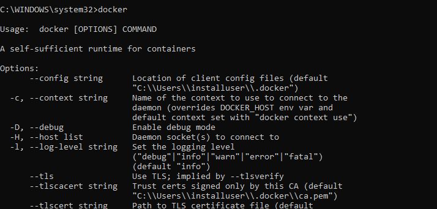

Weiters überprüfen, ob *docker-compose* richtig installiert wurde (die Ausgabe sollte ähnlich zu der obrigen sein):
``` shell
docker-compose
```
> Note: **Linux User** müssen *docker-compose* extra installieren -> [Link](https://docs.docker.com/compose/install/#install-compose)

## Arbeitsauftrag
### 01 Docker Images
Wie wir aus der letzten [Übung](../06-containerization/06-containerization.md) bereits wissen, ist ein **Image** eine schreibgeschützte Vorlage mit Anweisungen zur Erstellung eines Docker Containers. Dieses Image kann theoretisch auf jeder Maschine, die Docker installiert hat, ausgeführt werden.

Für unsere heutige Übung werden wir ein *Ubuntu* Image downloaden:
``` shell
docker pull ubuntu:14.04
```
Mit dem Befehl `docker images` können alle heruntergeladenen Images angezeigt werden:
``` shell
docker images
```
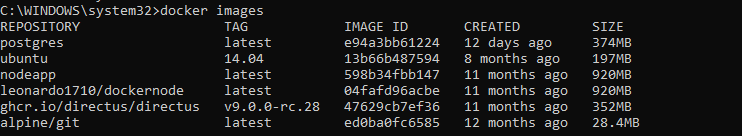

> Zur Erinnerung: ein Docker Image kann mit folgendem Command ausgeführt werden `docker run <image> <optional shell command to run inside container>`.

``` shell
docker run ubuntu:14.04 echo 'hello world'
```
Dieser Command startet das Ubuntu Image und übergibt gleich auch ein Command an den Container, nämlich `echo "hello world"`. Der Container startet, führt das Command aus und stoppt.

Wie ihr bereits wisst, können wir mit dem Command `docker ls` alle laufenden Container ausgeben. Da unser Container wieder gestoppt wurde, wird diese nicht angezeigt. Mit dem `docker ls -a` Command, können wir uns aber alle vergangenen Ausführungen von Containern anzeigen lassen:
``` shell
docker container ls # Lists running docker containers
docker container ls -a # Lists running and stopped docker containers
```

### 02 Container Command Line
Verbinden wir uns, wie in der letzten Übung mit dem Terminal des Containers.
``` shell
docker run -it ubuntu:14.04 /bin/bash
```
Nun befinden wir uns wieder im Container selbst. Man erkennt das daran, dass der User `root@<container_id>` ist:

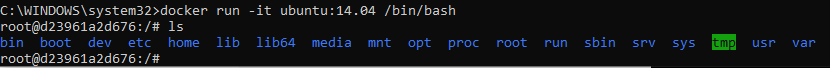

Wir sind jetzt also wieder in einem vollkommen funktionsfähigen Ubuntu OS. Gerne könnt ihr an dieser Stelle jetzt wieder alle möglichen Commands im Container ausprobieren.

Der Container läuft nun vollkommen **unabhängig** vom Image und isoliert von der **Host-Maschine**. Öffnet ein zweites `CMD` Window und gebt noch einmal den Befehl `docker container ls` ein:
``` shell
docker container ls
```

Ihr solltet nun euren laufenden Container sehen können:
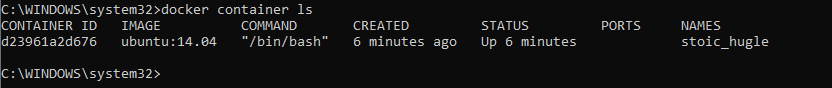

### 03 Container starten und stoppen
Zur Wiederholung, werden wir uns noch einmal anschauen, wie man Container startet, stoppt und Commands in laufenden Containern ausführen kann.
Wechselt dafür wieder in euer erstes `CMD` Window. Erstellt einen Folder *TEST* und verlasst die `bin/sh`:

``` shell
mkdir /TEST
exit
```

Zeigt eure Container an, um die Container-ID des letzten Containers zu bekommen:

``` shell
docker container ls -a
```
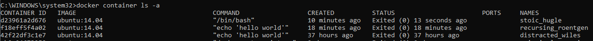

Im Folgenden werden wir unseren letzten Container starten, die laufenden Container anzeigen und das Terminal des Containers starten.

> Zur Erinnerung: ihr müsst nicht die ganze ID eingeben, es funktioniert auch mit den ersten Zeichen, die den Container eindeutig identifizieren.

``` shell
docker start d239    # Your container id instead
docker container ls
docker exec -it d239 /bin/bash   # Your container id instead
```
Im Terminal, listen wir wieder das Verzeichnis auf, damit wir sehen, dass wir im richtigen Container sind. Der richtige Container beinhaltet das Verzeichnis `/TEST`, das wir zuvor angelegt haben:
``` shell
ls
```
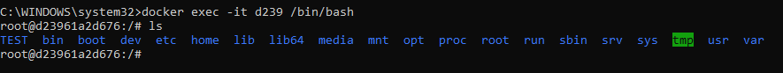

Zum Stoppen und Löschen des Containers, führen wir folgende Commands aus:

``` shell
docker container ls
docker stop d239   # Your container ID instead
docker container ls
docker rm d239     # Your container ID instead
```

### 04 Dockerfiles

Mit Docker kann die **Umgebung**, in der unser Code läuft, mit anderen **geteilt** werden, so wie man mit GitHub Code teilen kann. Beispielsweise, in dem man ein Image im Docker Hub veröffentlicht, das von anderen Docker Clients gepullt und ausgeführt werden kann.

In Docker kann man **Images auf 2 Arten erzeugen**:
* Images können direkt aus einem Container erzeugt werden
* Mithilfe eines **Dockerfile** kann explizit angegeben werden, wie das Image aufgebaut werden soll

Wir werden uns jetzt die 2. Art ansehen, nämlich wie man mit **Dockerfiles** Images erzeugt.
In einem **Dockerfile** können wir die Schritte zum Einrichten der Umgebung für die Anwendung **dokumentieren**. Die Docker-Engine analysiert unser Dockerfile und erstellt daraus ein Docker-Image. Dh. dieses Dockerfile kann auf jeder Maschine, die Docker installiert hat, gebuildet (Erstellung des Image) und ausgeführt (Container Instanz) werden.

:::tip Vorteile von Dockerfiles
* explizite Dokumentation des Image
* wartbare Vorlagen
* einfach bearbeitbar (-> wir können Dockerfile ändern und unser Image wird sofort mit der neuen Konfiguration gestartet)
:::

Für unsere nächsten Beispiele, werden wir Codesamples benötigen. Diese werden in einem Repository zur Verfügung gestellt. Als erstes klont bitte dieses Repo und navigiert in das neu geklonte Projekt, in den Folder `/01-dockerfile-intro`:

``` shell
git clone https://github.com/leonardo1710/cloud-docker-exercises.git
cd <PATH_WHERE_YOU_SAVED_REPO>/cloud-docker-exercises/01-dockerfile-intro
```
In dem Folder befinden sich 2 Files:
1. `pyramid.sh`: ein Shell Skript, das eine Pyramide in der Konsole ausgibt
2. `Dockerfile`: das zuvor beschriebene Dockerfile, das angibt, wie das Skript ausgeführt werden soll

Öffnet hierzu euer `Dockerfile` im `/01-dockerfile-intro` Directory mit einem Editor eurer Wahl:

``` dockerfile
FROM  ubuntu:14.04   
COPY  ./pyramid.sh  /pyramid.sh
RUN   chmod +x /pyramid.sh && sed -i 's/\r//' /pyramid.sh
CMD   bash /pyramid.sh
```
Die Commands in Großbuchstaben sind Teil der "Dockerfile-Sprache". 

**FROM**: Das Image, das wir als Grundlage für unser Image verwenden wollen. In unserem Fall ist das Ubuntu:14.04. Unser Programm wird folglich in einem Ubuntu OS ausgeführt.

**COPY**: Kopiert ein File vom Host in unseren Container.

**RUN**: Führt Shell Commandos aus, als befänden wir uns direkt im Terminal des Containers. In unserem Fall vergeben wir mithilfe von `chmod +x` Ausführungsrechte (execution) auf das `pyramid.sh` File. Der Command `sed -i 's/\r//' /pyramid.sh` soll Linebreak Probleme zwischen Unix und Windows vorbeugen. Windows verwendet `CRLF` während Unix `LF` Linebreaks verwendet - wenn ihr also auf einem Windows Rechner arbeitet, kann es sein, dass das `pyramid.sh` nicht in Ubuntu (Container) ausgeführt werden kann. Mit dem Command tauschen wir alle `CRLF` gegen `LF` aus. Hier finden Interessierte mehr Informationen zum [Linebreak-Problem](https://www.aleksandrhovhannisyan.com/blog/crlf-vs-lf-normalizing-line-endings-in-git/#crlf-vs-lf-what-are-line-endings-anyway).

**CMD**: Command der nach dem Start des Containers ausgeführt werden soll.

> Weitere Dockerfile Commands findet ihr in der [Docker Dokumentation](https://docs.docker.com/engine/reference/builder/#from)

#### 05 Build Image
Um ein Image zu erzeugen, müssen wir den `docker build` Command ausführen:
``` shell
docker build . --tag pyramid
```
Nach dem `build` gibt man den Folder an, in dem sich das Dockerfile befindet. `.` steht dabei für den aktuellen Folder. Mit `--tag` wird der Name des Image bestimmt.

Ihr solltet nun euer neues Image mit `docker images` finden:

``` shell
docker images
```
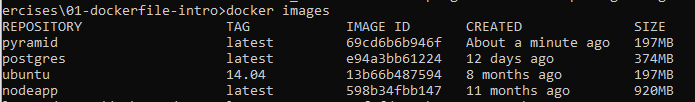

Jetzt starten wir das Image in einem Container:

``` shell
docker run pyramid
```
Wenn alles geklappt hat, sollte jetzt eine Pyramide in eurer Shell ausgegeben worden sein:
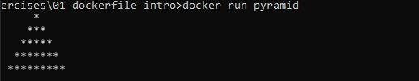

Zusammengefassung von dem was wir gerade getan haben:
* Wir haben die Datei pyramid.sh in das Pyramid Docker Image kopiert, als wir es **gebuildet** haben. Mit `docker run pyramid ls` solltet ihr das Skript sehen können 
* Beim Start des Containers wurd unser `CMD` Command ausgeführt
* Unser Shellcode wurde ausgeführt

:::warning Achtung
Da wir das Shell-Skript in das Image kopiert haben, werden Änderungen am Skript (auf unserem lokalen PC) nicht übernommen. Wenn ihr Änderungen im `pyramid.sh` ins Image übernehmen wollt, müsst ihr noch einmal `docker build` aufrufen.
:::

Damit unser Skript etwas mehr Funktionalität bekommt, ändern wir es jetzt so ab, dass ein User auch eingeben kann, wie hoch die Pyramide sein soll. Dazu ändern wir die letzte Zeile des `pyramid.sh` wie folgt:

``` shell
...
# makePyramid 5 - the old line
makePyramid $1
```
Für die Änderungen muss unser Image neu gebuildet werden:
``` shell
docker build . --tag pyramid
```
Jetzt können wir unseren Container wie folgt ausführen:
``` shell
docker run pyramid bash /pyramid.sh 8
```
In der Ausgabe sollte die Pyramide jetzt 8 Zeilen hoch sein:
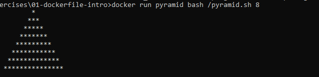

> Note: Ihr könnt statt 8 natürlich jede andere ganze, positive Zahl übergeben

Mit dem Command `bash /pyramid.sh 8` haben wir soeben den `CMD` aus unserem Dockerfile überschrieben. Leider funktioniert die Übergabe der Pyramidenhöhe nicht mit `docker run pyramid <PYRAMID_HEIGHT>`. Zumindest nicht mit unserem derzeitigen Dockerfile ;-)

Passen wir unser Dockerfile wie folgt an:

``` dockerfile
FROM  ubuntu:14.04   
COPY  ./pyramid.sh  /pyramid.sh
RUN   chmod +x /pyramid.sh && sed -i 's/\r//' /pyramid.sh
ENTRYPOINT ["bash", "/pyramid.sh"]   
CMD   ["5"]
```
Der `CMD` Befehl wird jetzt an alles angehängt was wir als `ENTRYPOINT` definieren. In Dockerfiles werden mehrere Commandos in einer Liste definiert (mit `[]` Klammern). Nachdem `CMD` an unseren `ENTRYPOINT` angehängt wurde, sieht das finale Command so aus: `bash /pyramid.sh 5`

Wird vom User nichts übergeben, wird standardmäßig `5` übergeben. Es kann jetzt aber auch eine Höhe dynamisch übergeben werden (wie zuvor beim ausgeschriebenen Command):

``` shell
docker build . --tag pyramid  # Rebuild the image after changes
docker run pyramid 3
```
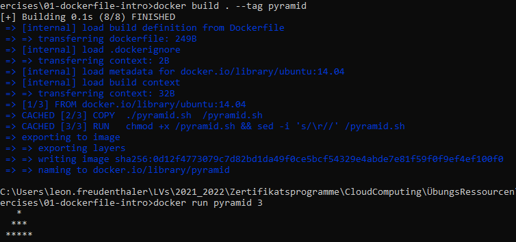

### 06 Container Mounting
**Mounting** in einem Docker Container bedeutet, dass wir ein Verzeichnis der Host-Maschine in den Container "einbinden"/mounten. 

> Das Mounting/Einbinden der Host-Maschine in einen Container ermöglicht dem Container das Lesen und Schreiben auf dem Host. 

Mounting funktioniert in Docker wie folgt:
`docker run -v <HOST_DIRECTORY>:<CONTAINER_DIRECTORY>`

In unserem Fall wollen wir das Verzeichnis des Projekts in das Verzeichnis `/mounted` im Container mounten:

``` shell
cd ../  # switch to project directory
docker run -it -v ${pwd}:/mounted ubuntu:14.04 /bin/bash # mount project directory to container /mounted folder and open the bash
ls          # list folders
ls mounted  # show contents of mounted
touch mounted/testfile  # create a testfile in mounted
```

::: warning Windows Nutzer aufgepasst
Unter Windows kann es sein, dass explizite Mountrechte für Docker vergeben werden müssen (*Error response from daemon: status code not OK but 500: "System.UnauthorizedAccessException..."*). Das geht so:
* Rechtsklick auf Docker in der Taskleist
* *"Settings"* -> *"Resources"* -> *"File Sharing"* -> Pfad zu eurem Projekt hinzufügen
* *"Apply & Restart"* klicken
* Bitte für den Mount-Command die Windows Powershell nutzen, da CMD den Befehl ${pwd} nicht kennt
:::

Euer Terminal sollte bei Eingabe der Commands so aussehen:
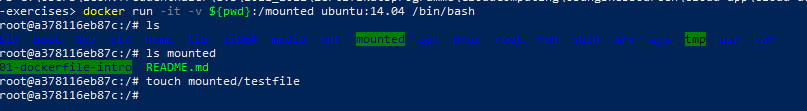

Wenn ihr jetzt mit eurem Host-System in euer Projekt Verzeichnis navigiert (im Explorer bspw.), solltet ihr auch hier ein File namens `textfile` im Verzeichnis haben. Mittels **Mounting** konnte also ein File in einem Container erstellt werden, das auch in einem Verzeichnis des Host erstellt wurde.

### 07 Docker Volumes
**Docker Volumes sind Container, die Daten speichern und persistieren**. Diese Volumes können dann von laufenden Containern konsumiert werden - also Container können dann auf diese Daten zugreifen. Im Gegensatz zum Mounting, werden Daten also nicht auf dem Host-System abgelegt, sondern in einem Volume Container. Die anderen Container mounten dann die Volume. 
Docker Volumes sind sehr nützlich, wenn Container Daten persistent sein müssen, oder mehrere Container Daten austauschen können sollen.

In dieser Übung werden wir Docker Volumes nicht im Detail anschauen. Wenn ihr Interesse an ihrer Funktionsweise habt, findet ihr [hier](https://docs.docker.com/storage/volumes/) eine Intro zu Docker Volumes.


### 08 Container Ports
In dem Projekt Repository findet ihr unter `02-server` eine kleine Python Web Applikation, die mit dem [Flask](https://flask.palletsprojects.com/en/2.0.x/) Framework erstellt wurde.

Der Flask Server `/02-server/server.py` bietet eine ganz simple REST-API, die ein HTML zurückgibt:

``` python 
from flask import Flask
app = Flask(__name__)

@app.route('/')
def hello_world():
    return '<h1>Hello, World!</h1>'

if __name__ == '__main__':
    app.run(debug=True, host='0.0.0.0')
```
Das `/02-server/Dockerfile` zeigt ein Image Setup, das typischerweise für Python Web Apps verwendet wird:

``` dockerfile
FROM  python:3.6   
# Create a directory
WORKDIR /app                  
# Copy the app code
COPY . ./                                  
# Install Requirements
RUN pip install -r requirements.txt  
# Expose flask's port
EXPOSE 5000
# Run the server
CMD python server.py 
```

**FROM**: diesmal starten wir anstelle von Ubuntu mit einem Python Image. Dh. auf diesem Image ist Python vorinstalliert.

**WORKDIR**: erstellt das Directory `/app`, wenn es nicht existiert und wechselt in das Verzeichnis

**EXPOSE**: Flask, läuft standardmäßig am Port 5000

**Networking** in Docker erfordert 2 Schritte:
1. Container Port öffnen mit `EXPOSE`
2. Container Port an den Host **mappen**

Wenn ihr jetzt das Image buildet und ausführt:
``` shell
cd 02-server
docker build . --tag python-webapp
docker run python-webapp
```

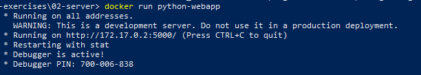

Sollte euch das Terminal eine IP-Adresse mit dem Port 5000 angeben. In meinem Fall ist es `http://172.12.02:5000`.Versucht die Applikation einmal in einem Browser aufzurufen.

Das funktioniert noch nicht, weil wir den 2. notwendigen Schritt, das **Port-Mapping**, noch nicht eingerichtet haben. 

> Stoppt den Flask Server mit `CTRL + C`.

Die Web App soll auf dem Port 5000 laufen. Deswegen müssen wir unserem Host-System noch sagen, dass es auf diesem Port *lauschen* soll. Das geht mit dem Command `docker run -p <HOST_PORT>:<CONTAINER_PORT>`. In unserem Fall also:

``` shell
docker run -p 8082:5000 python-webapp
```
Ihr könnt hier als Host-Port jeden nicht belegten Port verwenden. In meinem Fall hat sich der Port `8082` angeboten.

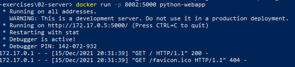

Wenn ihr jetzt in einem Browser `localhost:<YOUR_PORT>` eingebt, solltet ihr die Response der Flask Applikation sehen können:


An dieser Stelle werden wir jetzt mal etwas *"aufräumen"* und unsere Container stoppen. Das könnte ihr entweder mit dem `docker stop <CONTAINER_ID>` und `docker rm <CONTAINER_ID>` Command machen. 

``` shell
docker container ls # show running docker containers
docker stop <YOUR_CONTAINER_ID>
docker rm <YOUR_CONTAINER_ID>
```
Es gibt auch einen Shortcut, um alle laufenden Container zu stoppen und zu löschen:

``` shell
docker stop $(docker ps -a -q)   # Stops all containers
docker rm $(docker ps -a -q)     # Removes all stopped containers
```
> Note: das Stoppen des Containers muss vor jedem `docker run` auf unsere Web Applikation durchgeführt werden, da der Port sonst besetzt ist.

### 09 Docker Layer Caching (DLC)
Docker erstellt Container Images mithilfe von Schichten (Layern). Jeder Command im Dockerfile erzeugt eine neue Schicht. Jede Schicht enthält die Änderungen am Filesystem  des Image bzw. dessen Zustand, vor und nach der Ausführung des Commands. Diesen Prozess nennt man **Layer-Caching**.

Docker nutzt diese Technik, um den Prozess der Erstellung (Build) von Docker Images zu optimieren und zu beschleunigen.
Das **Docker Layer Caching** kommt vor allem in Deployment und Integration Pipelines zu tragen: je mehr gecached wird, desto kürzer dauern die Builds der Container, desto schneller kann deployed werden.

In diesem Beispiel, werden wir uns genauer ansehen, wie sich Layer Caching auf die Ausführung auswirkt und wie wir es nutzen können, um unsere Builds zu optimieren.

Dazu wechseln wir einmal in das Directory `cloud-docker-exercises/03-layers`:

``` shell
cd <YOUR_REPO_PATH>/cloud-docker-exercises/03-layers
```

Das Dockerfile sieht etwas anders aus als zuvor. Das `server.py` File ist in einen `/src` Ordner gewandert, deswegen wird mit dem `COPY` Command das `/src` Directory in den Container kopiert.

``` dockerfile
# 03-layers/Dockerfile
FROM  python:3.6   

COPY ./src /app                               
WORKDIR /app   

RUN pip install -r requirements.txt    

EXPOSE 5000
CMD python server.py
```
Wenn man ein Dockerfile schreibt, werden neue Layer einem bestehenden Image hinzugefügt, um ein neues Image zu generieren. Zur Erinnerung:

**FROM**: weist Docker an, ein bestehendes Image als Basis für das neue Image zu verwenden. Neue Commands werden Layer auf diesem Image erzeugen.

**COPY**: kopiert die Inhalte des `./src` Directory des Host in den Folder `/app` im Image.

**WORKDIR**: setzt den aktuellen Pfad im Image zum Pfad `/app`.

Docker cached den Zustand des Images. Versucht mehrmals das neue Directory mithilfe des Dockerfile zu builden. Achtet dabei darauf, wie lange die Build-Zeiten sind:

``` shell
# Inside cloud-docker-exercises/03-layers/Dockerfile
docker build . --tag python-webapp
docker build . --tag python-webapp
docker build . --tag python-webapp
```
Der erste Build wird vermutlich länger dauern - 5-10 Sekunden. Die Builds danach sollten viel schneller ausgeführt werden. Das funktioniert mithilfe von **Docker Layer Caching**. 

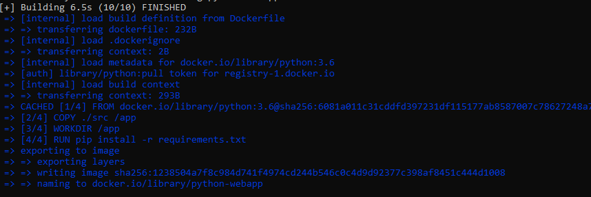
*Build erster Run - kein Cache; 6.5s*
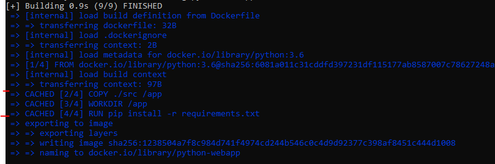
*Build zweiter Run - Cache; 0.9s*

Wenn ein neues Command dem Dockerfile hinzugefügt wird, wird Docker nur den Image Zustand **VOR** dem Command cachen. Zur Demonstrationszwecken fügt ein neues `RUN` Command im Dockerfile hinzu:

``` dockerfile
# Inside cloud-docker-exercises/03-layers/Dockerfile
FROM  python:3.6 
  
COPY ./src /app 
WORKDIR /app    
             
RUN pip install -r requirements.txt

# Copy this new line to your Dockerfile
RUN echo "Hello, World"  

EXPOSE 5000
CMD python server.py
```

Und macht einen Rebuild des Images:

``` shell
docker build . --tag python-webapp
```
Die Commands vor unserem neuen `RUN` Command werden gecached:
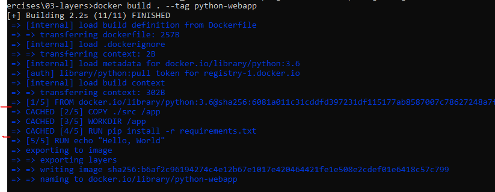

Verschiebt nun die Zeile `RUN echo "Hello, World"` VOR euren anderen RUN Command (`RUN pip install -r requirements.txt`) und führt noch einen Build aus:

``` dockerfile
# Inside cloud-docker-exercises/03-layers/Dockerfile
FROM  python:3.6 
  
COPY ./src /app 
WORKDIR /app    

# Copy this new line to your Dockerfile
RUN echo "Hello, World"  
         
RUN pip install -r requirements.txt

EXPOSE 5000
CMD python server.py
```

``` shell
docker build . --tag python-webapp
```
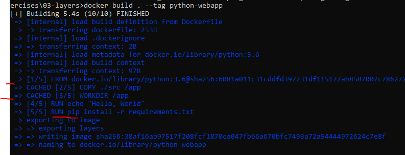

In eurer Ausgabe solltet ihr sehen, dass alle Commands vor dem neuen `RUN` Command gecached wurden. Die Zeile `RUN pip install -r requirements.txt` wurde jetzt jedoch nicht mehr gecached und deshalb musste sie neu ausgeführt werden.

Auch wenn wir etwas in den Files der Applikation ändern, wird der Cache nicht genutzt. Das ist natürlich meistens gut so. Fügt beispielsweise im File `cloud-docker-exercises/03-layers/src/requirements.txt` eurer Web Applikation ein weiteres Package hinzu:

``` requirements.txt
Flask==0.12
requests==2.18
```

Und führt ein Rebuild aus:
``` shell
docker build . --tag python-webapp
```

Auch jetzt wird kein Cache für den Command `RUN pip install -r requirements.txt` genutzt.
Docker prüft beim Build auf Unterschiede in den Dateien. Wenn sich eine Datei geändert hat, wird der Cache für alle nachfolgenden Ebenen für ungültig erklärt.

Prinzipiell ist das ein sehr gutes Feature von Docker. Natürlich müssen nur die Files, die geändert wurden, neu gebuildet werden. Ein Problem, dass sich durch unsere Dockerfile Struktur ergibt ist, dass auch bei Änderungen im `server.py` der `RUN pip install` Command für ungültig erklärt wird und somit neu ausgeführt wird. Während der Entwicklung an der Applikation, werden die Dateien jedoch häufig geändert werden. Um das Layer Caching optimal zu nutzen, sollte man auch die Struktur im Dockerfile berücksichtigen.

Ändern wir einmal das `server.py` so ab, dass unser `hello_world` Endpoint eine Liste aus Büchern zurückgibt:

``` python
from flask import Flask
from flask import jsonify

app = Flask(__name__)
app.config['JSONIFY_PRETTYPRINT_REGULAR'] = False # add this line too

@app.route('/')
def hello_world():
    Books = [
        {
            "title": "Harry Potter",
            "author": "JK Rowling"
        },
        {
            "title": "Animal Farm",
            "author": "George Orwell"
        }
    ]
    return jsonify(Books)

if __name__ == '__main__':
    app.run(debug=True, host='0.0.0.0')
```
Beim Rebuild würde jetzt auch wieder das Command `RUN pip install` ausgeführt werden. Ihr könnt es gerne ausprobieren.

`docker build . --tag python-webapp`

Um das zu verhindern, können wir das Dockerfile wie folgt umstrukturieren:

``` dockerfile
# Inside cloud-docker-exercises/03-layers/Dockerfile
FROM  python:3.6 
  
COPY ./src/requirements.txt /tmp
RUN pip install -r /tmp/requirements.txt 

COPY ./src /app
WORKDIR /app

EXPOSE 5000
CMD python server.py
```

Der `COPY` Command für unser Directory wird somit erst nach dem `RUN` Command ausgeführt. Da wir beim `RUN` jedoch die Abhängigkeiten aus dem `requirements.txt` File benötigen, wird dieses zuvor in einem temporären Ordner `/tmp` gespeichert.

Alle Änderungen im `server.py` sollten jetzt keine Auswirkungen auf das Caching mehr haben. Probiert es aus und macht einen weiteren Rebuild: 

``` shell
docker build . --tag python-webapp
```
Startet den Container wieder auf einem freien Port:

``` shell
docker run -p 8084:5000 python-webapp
```

Und navigiert dann im Browser zu eurer `localhost` URL.

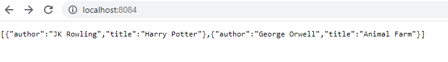

:::tip Regeln beim Erstellen des Dockerfile
Um die Built-in-Caching Funktionen von Docker optimal zu nutzen, sollte man sich an folgende Regeln halten:
1. Commands, die sich wahrscheinlich nicht oft ändern sollten zu Beginn des Files stehen
2. Commands wie `COPY`, die Daten in den Container kopieren, sollten eher am Ende des Files stehen
3. Commands, die zeitintensiv sind, sollten zu Beginn des Files stehen
:::

### 10 Host aufräumen ;)
Nach dieser Übung, werdet ihr durch das viele Ausprobieren sehr viele Images am Hostsystem erstellt haben. Ihr könnt euch die Images mit `docker images` anzeigen lassen.

Damit wir den Host jetzt wieder etwas aufräumen und keinen unnötigen Speicherplatz besetzen, löschen wir wieder alle Images:

``` shell
docker stop $(docker ps -a -q)   # Stops all containers
docker rm $(docker ps -a -q)     # Removes all stopped containers
docker rmi $(docker images -aq)   # Remove all images
```


