# {{ $frontmatter.title }}

## Aufgaben Übersicht
* Azure Function Projekt einrichten
* Projektstruktur verstehen
* Function lokal ausführen
* Function in Azure deployen

## 1. Prerequisites
- [Azure Pass einlösen](/azure/) und Account bei Microsoft Azure anlegen
- Download und Installation von [Visual Studio Code](https://code.visualstudio.com/)
- [Node.js](https://nodejs.org/en/) installiert (Version 14 oder 16 - `node --version`)
- [Azure Functions Core Tools](https://docs.microsoft.com/en-us/azure/azure-functions/functions-run-local?tabs=v4%2Cwindows%2Ccsharp%2Cportal%2Cbash#install-the-azure-functions-core-tools), am besten über die Powershell oder Bash mit NPM installieren: `npm install -g azure-functions-core-tools@3 --unsafe-perm true`

### Azure Functions Extension in Visual Studio Code
Zuerst starten wir Visual Studion Code und installieren die [Azure Functions Extension](https://marketplace.visualstudio.com/items?itemName=ms-azuretools.vscode-azurefunctions):
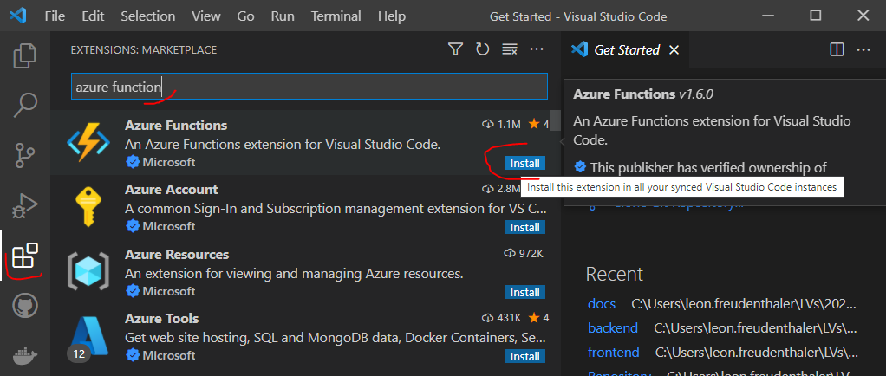
## 2. Projekt erstellen
Als nächstes erstellen wir ein Azure Functions Projekt in VSCode wie folgt:

1. Azure Icon in der Taskleiste klicken und in der Azure Functions Area "Create new Project..." auswählen:
  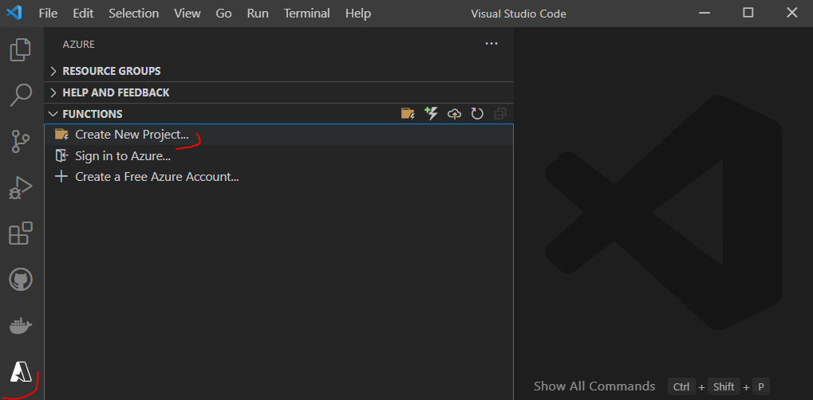
2. Ordner auswählen, in dem das Projekt gespeichert werden soll
3. Die folgenden Prompts selektieren:
   1. `Select a language for your function project` -> `Javascript`
   2. `Select a template for your project's first function` -> `HTTP trigger`
   3. `Provide a function name` -> `HttpExample`
   4. `Authorization level` -> `Anonymous`
   5. `Select how you would like to open your project` -> `Add to workspace` auswählen

Die **Projektstruktur** sollte jetzt wie folgt aussehen:
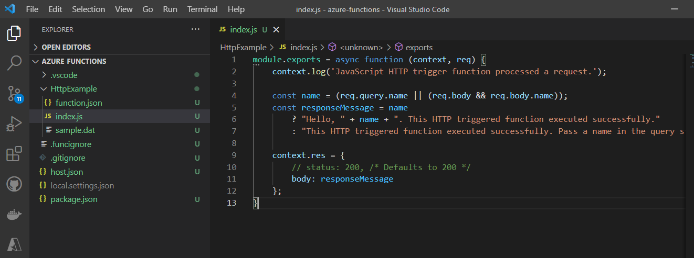

* **host.json**: hier können Funktionshost konfiguriert werden. Die Einstellungen gelten für die lokale Ausführung aber auch für die Ausführung in Azure. Mehr Informationen findet ihr unter [host.json-Referenz](https://docs.microsoft.com/en-us/azure/azure-functions/functions-host-json)
* **local.settings.json**: Einstellungen für die lokale Ausführung (Achtung: das File sollte sich NIE in einem VCS befinden, weil es Passwörter enthalten kann)
* **package.json**: befindet sich immer in Node.js Applikationen (Verwaltung von Dependencies, Scripts etc.)
* **/HttpExample**: beinhaltet die "wirklichen" Files der Funktion, nämlich das `function.json` File (Definition der Funktion) und das `index.js` File, welches den Funktionscode beinhaltet.
  * **function.json**: Das function.json File definiert die Trigger (bspw. http) für die Funktion und weitere Konfigurationen. Mittels **Bindings** können andere Ressourcen an die Funktion "gebunden" werden. Anhand dieser Konfigurationsdatei ermittelt die Runtime, welche Ereignisse überwacht werden sollen und wie Daten in die Funktionsausführung übergeben und aus dieser zurückgegeben werden.

## 3. Funktion lokal ausführen
VSCode kann Funktionen lokal ausführen, wenn die [Azure Function Core Tools](https://docs.microsoft.com/en-us/azure/azure-functions/functions-run-local?tabs=v4%2Cwindows%2Ccsharp%2Cportal%2Cbash#install-the-azure-functions-core-tools) installiert sind. Solltet ihr sie noch nicht installiert haben, ist das auch noch in diesem Step möglich.
Zum Auführen der Funktion `F5` klicken (in VSCode). Sind die Core Tools nicht installiert, sollte euch die Option "Install Azure Function Core Tools" jetzt angeboten werden. 

Wurde die Funktion erfolgreich ausgeführt, solltet ihr im `Terminal` Fenster den URL Endpoint der Funktion sehen können:
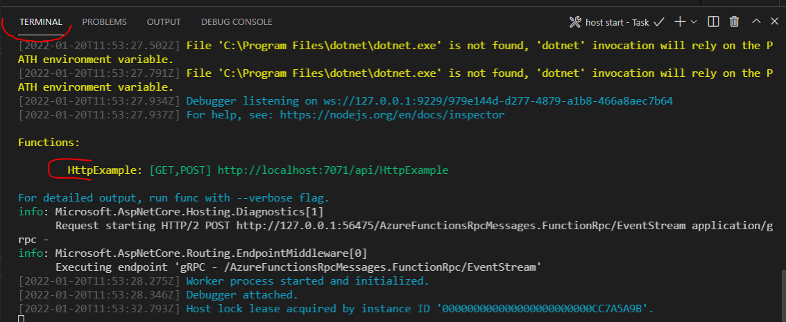

Die Function wird jetzt sozusagen im Hintergrund "callable" gemacht, dh. sie ist von anderen Services erreichbar. Zum Testen der Funktion werden wir jetzt einen Request/Trigger zum Ausführen der Function setzen.
In VSCode navigiert wieder in die Azure Area. Klappt den `Functions` Teil auf und klickt `Execute Function Now...`:

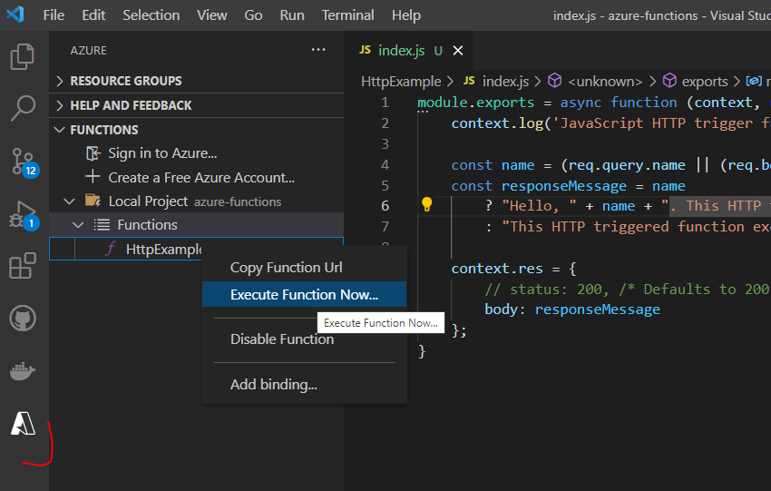

Unter `Enter request body (Press 'Enter' to confirm or 'Escape' to cancel)` gebt `{ "name": "Azure" }` ein (falls nicht eh schon vorgeschlagen) und drückt `Enter`.

Ob eure Function erfolgreich ausgeführt wurde, erkennt ihr an 2 Stellen: 
1. Im Terminal Window solltet ihr eine Nachricht bekommen haben, dass die Function ausgeführt wurde. `JavaScript HTTP trigger function processed a request.  `
2. Ein kleines Fenster sollte aufpoppen, in dem ihr die Response der Function einsehen könnt. `Response: "Hello Azure. This HTTP triggered function executed successfully."`
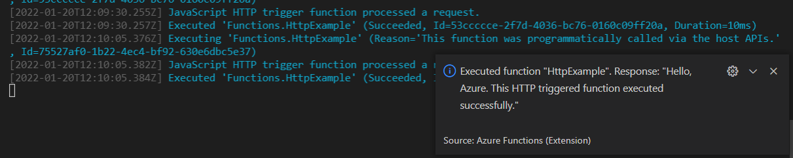

### Was ist passiert?
1. Mithilfe der Azure Core Tools habt ihr eure Funktion "erreichbar" gemacht
2. Mittels `Execute Function Now...` habt ihr einen Http Request (Trigger) an die Function gesendet, mit dem Inhalt `{ "name": "Azure"}`
3. In eurer Function (siehe Code unten) wird der Request Inhalt mithilfe von `req.body.name` in eine Variable namens `name` gespeichert.
4. In der Function wird weiters eine Response Message zusammengebaut. Wenn `name` existiert, wird die Übergebene Variable und der Text `This HTTP triggered function executed successfully.` zurückgegeben. Wurde kein Name übergeben (`name === undefined`), wird `"This HTTP triggered function executed successfully. Pass a name in the query string or in the request body for a personalized response."` als Response zurückgegeben.
5. Im letzten Schritt wird der Message Body von `res` (Response) vom `context` mit eben dieser Response Message befüllt.
``` javascript
module.exports = async function (context, req) {
    context.log('JavaScript HTTP trigger function processed a request.');

    const name = (req.query.name || (req.body && req.body.name));
    const responseMessage = name
        ? "Hello, " + name + ". This HTTP triggered function executed successfully."
        : "This HTTP triggered function executed successfully. Pass a name in the query string or in the request body for a personalized response.";

    context.res = {
        // status: 200, /* Defaults to 200 */
        body: responseMessage
    };
}
```

Beim Aufrufen der Funktion könnt ihr anstelle von `Azure` alle möglichen Zeichen übergeben:

```json
{ "name": "Bart Simpson" }
```
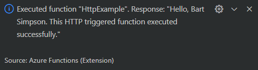

## 4. Funktion auf Azure deployen

### In Azure einloggen
Falls ihr euch noch nicht in Azure über VSCode eingeloggt habt, wählt im Azure Window die Option `Sign in to Azure...`.

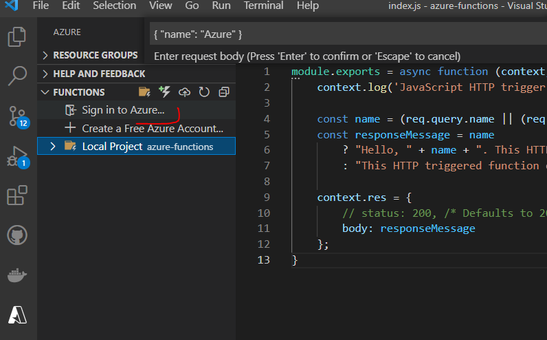

### Projekt auf Azure deployen
1. Im Azure Menu in VSCode das Cloud Icon (*Deploy function app..*) auswählen
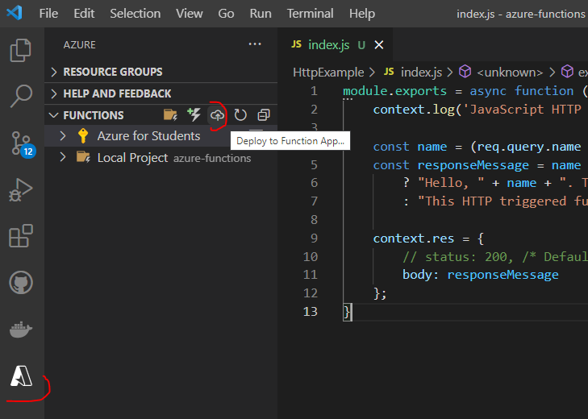
2. Folgende Prompt wie folgt selektieren:
   1. `Select Function App in Azure` -> `Create new Function App` auswählen
   2. `Enter a globally unique name for the function app` -> einen Namen vergeben, der eine gültiger URL Pfad ist
   3. `Select a runtime` -> lokale Node Version auswählen
   4. `Select a location for new resources` -> Region auswählen (westeurope bspw.)
3. Wenn die Function deployed wurde, sollte eine Notification in VSCode aufpoppen.

#### Erstellte Ressourcen beim Deployment von Functions
Folgende Ressourcen wurden beim Deployment erstellt:
* Eine **Resource Group**, in der sich die Function befindet (für gewöhnlich mit dem Namen, den ihr vorher für die URL gewählt habt)
  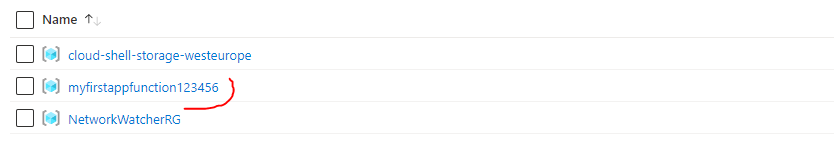
* Ein **Standard-Azure-Storage** (Speicherkonto), das den Status und andere Informationen zum Projekt verwaltet
* Ein **App-Service-Plan**, der den zugrundeliegenden Host für die serverless Function definiert
* Die **Funktions-App**, die die Umgebung für die Ausführung der Function bereitstellt
* **Application-Insights**, die die Nutzung der Function überwacht

Ihr könnt die Ressourcen im Azure Portal ansehen, wenn ihr in die Resource Group Detailansicht wechselt:
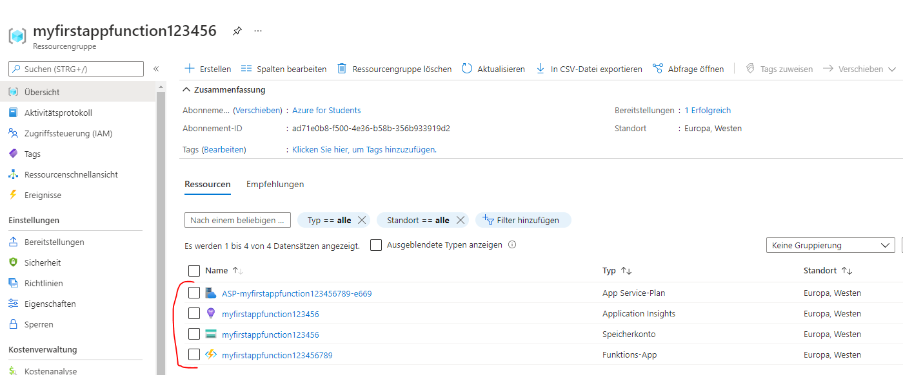

Der Output der erstellten Ressourcen kann auch eingesehen werden, indem ihr in der Success-Notification auf `View output` klickt:
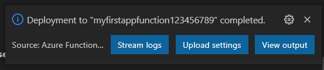


*Ausschnitt aus dem Output Panel*

### Gehostete Function ausführen
Die deployte Function könnt ihr auch aus VSCode heraus ausführen. Dazu wechselt wieder in das Azure Window und wählt diesmal unter `Functions` eure Azure Subscription aus. Klickt auf euren Function (Name von vorhin) und Rechtsklick auf `HttpExample` -> `Execute Function Now...`.
Die Response wird jetzt etwas länger dauern, als bei der lokalen Function, da der Request an die Azure Cloud gesendet wird. Ihr solltet die Response auch als Notification in VSCode sehen.

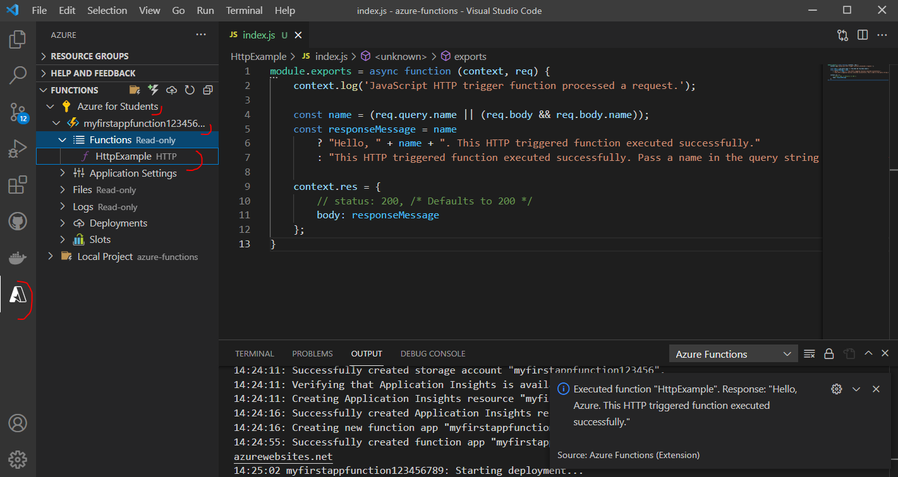

::: tip
  Eure Function ist jetzt natürlich nicht nur von VSCode erreichbar, sondern immer via Http. Beispielsweise könnt ihr eure Function über Curl ausführen.
  Vergesst nicht, die URL in eure Function URL zu ändern! 
:::

**Windows CMD**
``` Windows
curl -i -X POST -H "Content-Type: application/json" -d "{\"name\":\"Bart\"}" https://myfirstappfunction123456789.azurewebsites.net/api/httpexample
```
Oder **Linux Shell**
``` Linux Shell
curl --header "Content-Type: application/json" \
  --request POST \
  --data '{"name":"Bart"}' \
 https://myfirstappfunction123456789.azurewebsites.net/api/httpexample
```

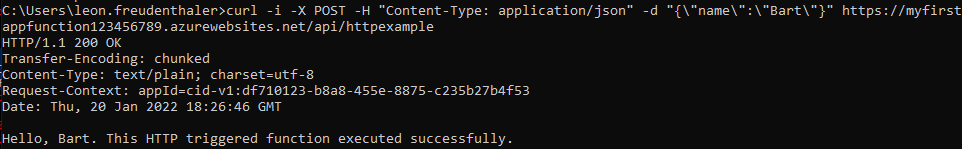
*Curl Response*

Oder über ein Tool wie **[Postman](https://www.postman.com/)**:

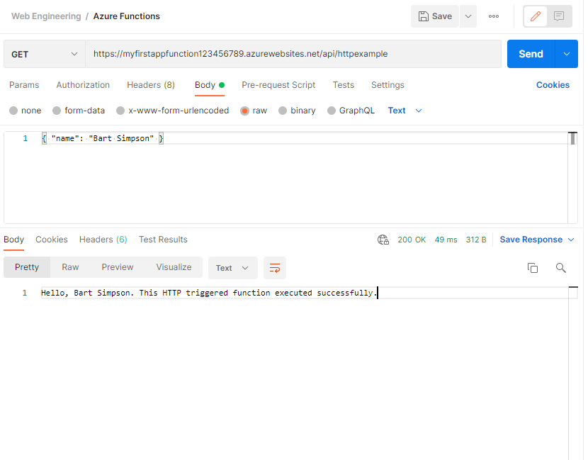

## 5. Troubleshooting
| Problem                                               | Lösung                                                                                                                                               |
|-------------------------------------------------------|------------------------------------------------------------------------------------------------------------------------------------------------------|
| Lokales Function Projekt kann nicht erstellt werden?  | Überprüfen ob Azure Functions Extension in VSCode installiert ist                                                                                    |
| Function kann lokal nicht ausgeführt werden?          | Überprüfen ob Azure Functions Core Tools installiert sind. Unter Windows darauf achten, dass das Terminal in VSCode nicht auf WSL Bash gestellt ist. |
| Deployment der Function auf Azure funktioniert nicht? | Output checken.                                                                                                                                      |


## 6. Clean-Up
::: warning Resourcen löschen
Nicht vergessen die Resource Group nach der Übung zu löschen:

```shell
az group delete --name <YOUR_RESOURCE_GROUP_NAME> --no-wait --yes
```
:::

## Weitere Ressourcen
[Azure Functions Development Guide](https://docs.microsoft.com/en-us/azure/azure-functions/functions-reference?tabs=blob)

[Azure Functions Docs](https://docs.microsoft.com/de-de/azure/azure-functions/)

[Azure Functions Coding Samples](https://docs.microsoft.com/de-de/samples/browse/?products=azure-functions)

[Intro Firebase Functions](https://firebase.google.com/docs/functions/get-started)


