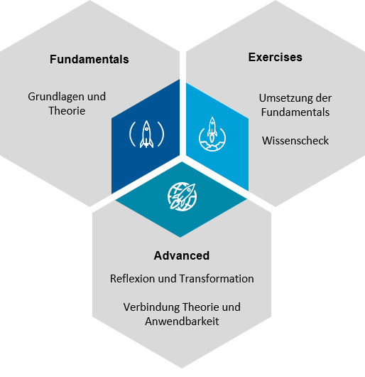
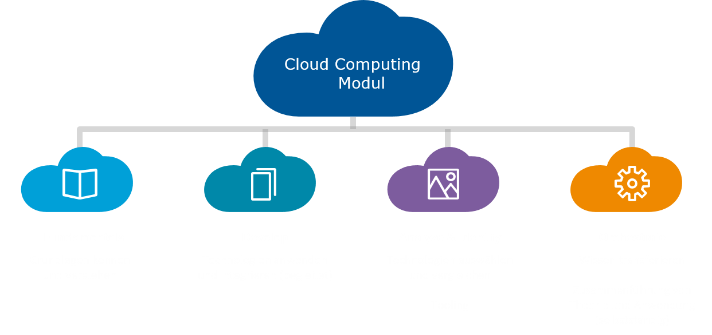

**Willkommen auf der Webpage des Moduls Cloud Computing im Modern Cloud Administrator:in Programm!** Auf dieser Page findet ihr erweiterte Unterlagen zu den Inhalten des Moduls (*Lectures*), sowie die Angaben und Tutorials zu den Arbeitsaufträgen (*Übungen*).
## Aufbau des Moduls

  

  
<b>Fundamentals (in den Einheiten)</b>
 
  
  <ul>
    <li>Theoretische Grundlagen</li>
    <li>Aktive Diskussion</li>
    <li>Besprechung von Exercises</li>
  </ul>
  

  

    
<b>Exercises (betreutes Lernen)</b>

    <ul>
      <li>Geleitete Anwendung der Fundamentals</li>
      <li>Hands-On</li>
      <li>Moodle-Quizzes zur Einheit (Wissenscheck)</li>
    </ul>
  

  

  
<b>Advanced (Abschlussgespräch)</b>

    <ul>
      <li>28.01.2022</li>
      <li>Expertengesprächn</li>
      <li>Zusammenführung Theorie und Anwendung</li>
    </ul>
  

## Lernziele

 
## Grading

  

  
<b>Aktive Diskussion – Mitarbeit (15%)</b>
 
  
  <ul>
    <li>Diskussion und Diskurs in den Einheiten</li>
    <li>Aktivität im Moodle-Forum</li>
    <li>Präsentation und Besprechung der Exercises</li>
  </ul>
  

  

    
<b>Exercises (35%) – muss positiv sein</b>

    <ul>
      <li>Abgabe der Exercises (30%)</li>
      <li>Moodle-Quizzes (5%)</li>
    </ul>
  

  

  
<b>Abschlussgespräch (50%) – muss positiv sein</b>

    <ul>
      <li>28.01.2022</li>
    </ul>
  

## Vortragende

  

    

    

      
    

      

        <h2>Leon Freudenthaler</h2>
        
Hauptverantwortlicher Vortragender

        
leon.freudenthaler@fh-campuswien.ac.at

        
<a href="mailto:leon.freudenthaler@fh-campuswien.ac.at">Contact</a>

      

    

  

  

    

    

      
    

      

        <h2>Bernhard Taufner</h2>
        
Vortragender

        
bernhard.taufner@fh-campuswien.ac.at

        
<a href="mailto:bernhard.taufner@fh-campuswien.ac.at">Contact</a>

      

    

  

