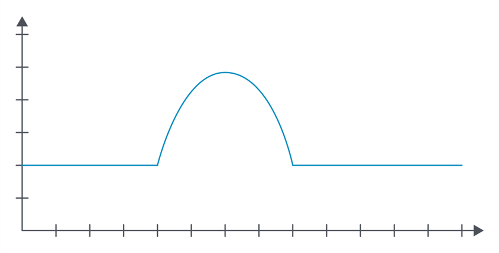

<h1>Einführung in Cloud Computing</h1>

Oft wird die Cloud wie folgt beschrieben:

> "The cloud is just somebody else's computer." (Quelle unbekannt)

Die Cloud funktioniert nicht mit Magie - Cloud Computing löst nicht automatisch alle Probleme, die sich durch traditionelle Infrastrukturen ergeben. In dieser Einheit erfahren Sie, wie eine Cloud aufgebaut ist und welche typischen Services sie anbietet, aber auch, welche Fallstricke mit solchen Einrichtungen verbunden sein können.

## Was ist ein Server?

::: tip Zusammenfassung
- Heutzutage entweder x86 or ARM Architektur
- Redundante Hardware
- Flache Formprofile für Server-Racks
- Out-Of-Bounds Management Interface zum Monitoring und Remote Management.
- Energieverbrauch muss berücksichtigt werden
- Der Kauf eines Servers kann lange dauern und stellt eine Vorabinvestition dar.
:::

Der Begriff **Server** hat in der Informatik zwei unterschiedliche Ausprägungen:
- **Server als Software**: ein Computerprogramm, das mit einem Clientprogamm (Client-Server-Architektur) kommuniziert und dabei bestimmte Services zur Verfügung stellt (bspw. Netzwerkverbindung, Auslesen von Files, Verarbeitung von Daten)
- **Server als Hardware**: ein Computer, auf dem ein oder mehrere Serverprogramme laufen

In den 1980er Jahren war der Unterschied zwischen Servern und den typischen Arbeitscomputern noch enorm. Einerseits durch ihr Äußeres (Gewicht, Form), aber auch durch ihre Architektur ([SPARC](https://en.wikipedia.org/wiki/SPARC), [Power](https://en.wikipedia.org/wiki/IBM_POWER_microprocessors)). 
Bei PCs kam vorwiegend die [x86](https://en.wikipedia.org/wiki/X86) Architektur zur Anwendung.

*Der erste Server des WWW am CERN. Source: [Wikipedia](https://de.m.wikipedia.org/wiki/Datei:First_Web_Server.jpg)*

Über die Jahre konnte sich die x86 Architektur jedoch auch in der Server-Landschaft durchsetzen. Dadurch wurden die Architekturen von PCs und Servern immer ähnlicher. In der Theorie heißt das, dass eine Kopie einer Maschine erstellt werden kann und auch (ohne aufwendige Anpassungen) auf einem Server laufen könnte.

Eine Ausnahme unter den Architekturen stellt nur die [ARM](https://en.wikipedia.org/wiki/ARM_architecture) Architektur dar, die ab Mitte der 90er Jahre mehr Verwendung fand. Die ARM Architektur ist heute vor allem am Smartphone und Tablet Markt weit verbreitet, da sie energiesparender ist.

> **Energieverbrauch** 
> 
> Aus der Perspektive der Home-PCs Nutzung macht es wahrscheinlich keinen großen Unterschied, ob ein Computer 200 oder 300 Watt verbraucht. Aus der Sicht eines Datacenters, mit mehreren hunderten bis tausenden Servern, kann das Einsparen von wenigen Prozent jedoch enorme Auswirkungen auf die Kosten haben.

Der äußerliche Unterschied von PCs und Servern blieb über die Jahre aber bestehen. Während die meisten Home-PCs als eine Art &ldquo;tower&rdquo; gebaut werden, wird bei Servern eines Datacenters eine flache Form bevorzugt. Das dient dazu, dass mehrere Server in sogenannten **Server-Racks** gestapelt werden können. 

*HP Proliant G5 Server, der aus dem Rack gezogen wurde. Source: [Wikipedia](https://en.wikipedia.org/wiki/ProLiant#/media/File:Proliant380g5_3.jpeg)*

Server-Racks sind so konzipiert, das ganze Server oder Teile dieser, ausgetauscht werden können, ohne den Betrieb einzuschränken.

Server verfügen auch über ein hohes Maß an **Redundanz**. Während ein Heimcomputer vielleicht nur ein einziges Netzteil hat, verfügen Server in der Regel über zwei, die von verschiedenen Stromeingängen gespeist werden können. Dadurch wird sichergestellt, dass der Server auch dann weiterläuft, wenn eines der beiden Netzteile ausfällt oder einer der beiden Stromeingänge nicht funktioniert.

Meist können Server auch **remote** gewartet werden, selbst wenn die Server ausgeschaltet sind. Diese Funktion wird von unterschiedlichen Herstellern meist unterschiedlich bezeichnet (u.a. Out-of-Bounds-Management Interface, Dell Remote Access Control). Dabei dient das OOBM Interface auch der Überwachung mehrerer tausend Maschinen.

Auch der **Server-Kauf** muss gut geplant werden. Meist neigen größere Unternehmen dazu, dieselbe Hardware über längere Zeiten zu nutzen. Weiters wird auch der Support meist zusätzlich gekauft. Der Kauf eines bestimmten Komponentensatzes oder die Bestellung größerer Mengen von Servern stellt eine logistische Herausforderung dar und kann manchmal bis zu 3-4 Monate dauern. Der Kauf von Hardware ist außerdem eine Vorabinvestition, die bei sich schnell ändernden Anforderungen schwer zu rechtfertigen ist.

## Aufbau eines Datacenter
Da es sich bei der Cloud um das Hosting von Maschinen auf der Hardware von jemand anders handelt, wird in diesem Abschnitt der Aufbau solcher Infrastrukturen genauer beleuchten.

Wie bereits erwähnt, werden Server normalerweise in Server-Racks gestapelt. Die Server in einem Rechenzentrum sind meist in Reihen angeordnet. Dies dient auch der **einfacheren Verkabelung** (meist versteckt in den Bodenplatten). 

Da Server eine große Menge an Wärme erzeugen, darf auch ein **Kühlungssystem** nicht fehlen. Für die Kühlung gibt es eine Vielzahl von Möglichkeiten, einige sind umweltfreundlicher als andere. Einige Rechenzentren entscheiden sich zum Beispiel für die Installation von Kaltluftschächten, bei denen kalte Luft zwischen zwei Rackreihen gepumpt und durch die Racks gepresst wird, um die Server zu kühlen.

*CERN Datacenter. Source: [CERN](https://home.cern/science/computing/data-centre)*

Neben der Kühlung ist auch die **Sicherheit** von großer Bedeutung. Je nach Umfeld ergeben sich unterschiedliche Sicherheitsanforderungen. So wird u.a. der Zutritt zu den Server Räumen kontrolliert. Je sicherheitskritischer desto mehr Vorkehrungen werden getroffen. Beispielsweise werden manche Server auch in Bunkern untergebracht, die Druckwellen, Hitze und Strahlung fernhalten sollen.

Auch dem **Brandschutz** wird ein besonderer Stellenwert eingeräumt. Dabei werden Löschanlagen bzw. Brandabschottungen zum Minimieren von Hardwareschäden installiert.

Alle **kritischen Systeme** in einem Rechenzentrum (Stromversorgung, Kühlung, Brandbekämpfungssysteme) sind in der Regel **redundant** ausgelegt, da der Ausfall eines dieser Systeme einen vollständigen Ausfall des Rechenzentrums bedeuten kann. Die Betreiber von Rechenzentren verfügen in der Regel auch über weitere Notfallpläne (z. B. ein USV-System (Batterie), Dieselgeneratoren, Tankwagen in Bereitschaft, eine Hotline für die Feuerwehr), um sicherzustellen, dass das Rechenzentrum die erforderliche Betriebszeit einhalten kann.

## Aufbau der Netzwerkinfrastruktur (Verbindung zum Internet)

Sobald die physische Infrastruktur eingerichtet ist, stellt sich auch die Frage, wie eine Verbindung zum Internet hergestellt werden kann. Wie bereits erwähnt, können Netze sehr kompliziert sein, und es gibt keine Einheitslösung für alle. 

*Möglicher Aufbau einer Netzwerkinfrastruktur im Rechenzentrum Source: [Electronicspost](https://electronicspost.com/what-does-a-data-center-do/)*

Normalerweise werden Server-Racks mit einem Top-of-Rack (ToR) Switch ausgestattet [Layer 2 (Ethernet)](https://en.wikipedia.org/wiki/Data_link_layer) um eine Verbindung zwischen den Servern zu gewährleisten. Mehrere ToR Switches können dabei entweder an weitere Switches oder an einen Router geschalten werden. Der sogenannte Border Router [Layer 3 (IP)](https://en.wikipedia.org/wiki/Network_layer) ermöglicht dabei die Verbindung von externen Kunden mit internen Hosts über bspw. das Internet.

> **Netzwerktechnik Grundlagen**
> 
> Die Grundlagen der Netzwerkinfrastruktur werden in der
<a href="/CloudComputingCWA2021/lectures/02-networking-intro/02-networking-intro" class="nav-link action-button">Einheit 2 →</a> noch im Detail besprochen.

## Software Stack
Das übergeordnete **Ziel von Cloud Computing** ist das zur Verfügung stellen (Hosting) von **Applikationen**. Jeder Server hostet beispielsweise ein Betriebssystem (OS), welches zur Verwaltung der Server Hardware genutzt wird.
Dabei nutzt das Betriebssystem **Schnittstellen** (APIs - Application Programming Interfaces), damit die Hardwareressourcen verwendet werden können (über den sogenannten **Kernel**).

*OS Kernel*

Im Unterschied zum gewöhnlichen Software Stack mit einem Betriebssystem, bietet **Virtualisierung** die Möglichkeit, mehrere Gastbetriebssysteme (Hosts) effizient auf einem Server zur Verfügung zu stellen. Dabei werden die Hardwareressourcen gleichmäßig verteilt. Auf Virtualisierung wird in den folgenden Einheiten noch im Detail eingegangen.

*Virtualisierung*

### Laufzeitumgebung - Runtime Environment
Einige Applikationen benötigen für ihren Betrieb/Ausführung sogenannten Laufzeitumgebungen. Bspw. benötigen manche kompilierte Applikationen Zugriff auf *Shared Libraries*, welche von den Komponenten der Applikation wiederverwendet werden können. Laufzeitumgebungen finden sich meistens bei Applikationen, die in einer *Higher-Level Language* geschrieben sind, wie bspw. Java, Javascript (Node.js), PHP und C#.

*Laufzeitumgebung im Software Stack*

## Die Cloud
Die bisher beschriebenen Technologien oder Provider, die Hosting Services anbieten, sind keine neue Erfindung und gab es dementsprechend auch schon vor der "Erfindung" der Cloud. Der eigentliche Game-Changer, der die Entwicklung der Cloud begünstigt hat, war das **Self-Service**, welches in der Cloud zum Kern gehört. 
> **Self-Service**: Salopp gesagt, muss man kein Ticket mehr schreiben, wenn man etwas an den gehosteten Services ändern will, sondern trifft diese Entscheidungen und Konfigurationen selbst.

### Erste Schritte zur Cloud (Amazon Web Services - AWS)

:::warning E-Mail von Jeff Bezos an seine Entwickler:innen (2002)
1) All teams will henceforth expose their data and functionality through service interfaces.
2) Teams must communicate with each other through these interfaces.
3) There will be no other form of interprocess communication allowed: no direct linking, no direct reads of another team’s data store, no shared-memory model, no back-doors whatsoever. The only communication allowed is via service interface calls over the network.
4) It doesn’t matter what technology is used. HTTP, Corba, Pubsub, custom protocols — doesn’t matter.
5) All service interfaces, without exception, must be designed from the ground up to be externalizable. That is to say, the team must plan and design to be able to expose the interface to developers in the outside world. No exceptions.
6) Anyone who doesn’t do this will be fired.
:::

Amazon Web Services gilt als erster und bisweilen erfolgreichster Cloud-Service Anbieter. Die entstandenen APIs (siehe E-Mail) führten zu enormer Flexibilität. Innerhalb von Minuten konnten neue Server bei Bedarf gehostet oder gelöscht werden, wenn diese nicht mehr gebraucht wurden. Die dadurch gewonnene Flexibilität ermöglicht es, die IT Infrastruktur und IT Services rasch an Veränderungen anpassen zu können.
Amazon hatte jedoch auch schon wegen der bestehenden (und enorm schnell gewachsenen) Handelsplattform, eine riesige Server-Infrastruktur. Somit wurden gleich zwei Probleme auf einmal gelöst: die bestehende (und teilweise nicht gebrauchte) IT Infrastruktur konnte zeitweise "vermietet" werden und gleichzeitig konnte sich Amazon dadurch mit seinen Cloud-Diensten den Markt "erobern".

*Cloud Computing Timeline 1960-2005. Source: [bcs](https://www.bcs.org/articles-opinion-and-research/history-of-the-cloud/)*

*Cloud Computing Timeline 2005-2020. Source: [bcs](https://www.bcs.org/articles-opinion-and-research/history-of-the-cloud/)*

## NIST Definition der Cloud
NIST = [National Institute of Standards and Technology](https://www.nist.gov/)

* **On-demand Self-Service**
  * Änderung von Ressourcen und Services ohne Interaktion mit Provider
* **Broad Network Access**
  * Services sind standardisiert über das Netz verfügbar
* **Resource Pooling**
  * Ressourcen in einem Pool des Providers
  * Anwender wissen nicht, wo sich Ressourcen befinden
  * Manches kann vertraglich vereinbart warden (Region, Land, Rechenzentrum)
* **Rapid Elasticity**
  * Services werden schnell oder automatisch zur Verfügung gestellt
  * Ressourcen scheinen “unendlich”
* **Measured Service**
  * Ressourcennutzung kann gemessen und überwacht werden

## Service Modelle
Je nachdem, welche IT-Ressourcen zur Verfügung gestellt werden, unterscheidet man bei Cloud-Computing verschiedene Servicemodelle.

*Pizza-as-a-Service: Erklärung der Service-Modelle anhand einer Pizzeria*

### Infrastructure as a Service (IaaS)
Das IaaS-Modell stellt Nutzer:innen **Speicher-, Rechen-, oder Netzwerkressourcen** zur Verfügung. Cloud-Speicher sind dabei aufgrund der weit verbreiteten Nutzung vor allem auch im privaten Bereich wohl die bekannteste Form dieses Servicemodells. Kommerzielle Anbieter stellen oft kostenlos Speicherplatz für Daten zur Verfügung. Geräte können sich via Netzwerk mit dem Server verbinden und Nutzer:innen die dort abgelegten Daten lesen, bearbeiten, synchronisieren, teilen und sichern.

Bsp.: Azure VM, AWS S3

### Managed Services - Platform as a Service (PaaS)
Das PaaS-Modell bietet Nutzer:innen eine Plattform für die Entwicklung und das Anbieten eigener Software-Anwendungen, indem Programmierungs- und Entwicklungsumgebungen flexibel zur Verfügung gestellt werden.

Bsp.: Heroku, Netlify, Force.com, Google App Engine, AWS Elastic Beanstalk

### SaaS
Dieses Servicemodell wird auch Software-on-Demand genannt und stellt Nutzer:innen Anwendungen zur Verfügung, die auf einer Cloud-Infrastruktur betrieben werden. 

Bsp.: Sharepoint, MS Teams, Zoom

*Cloud Service Modelle - (traditionelle) Übersicht*

## Business Models
Die Flexibilität der Cloud-Anbieter ergibt sich aus ihrer nutzungsabhängigen Preisgestaltung. Diese kann je nach Art des genutzten Dienstes variieren. Virtuelle Maschinen (IaaS) werden beispielsweise in der Regel auf Sekundenbasis abgerechnet. Wenn man eine virtuelle Maschine nur für 5 Minuten startet, zahlt man auch nur für 5 Minuten Laufzeit. So können die Nutzungskosten der Cloud optimiert werden, wenn Maschinen oder Dienste bei Bedarf automatisiert gestartet und gestoppt werden.
In der Regel werden die Kosteneinsparungen in folgenden Szenarien realisiert:

### On-off usage
* Maschinen starten nur wenn notwendig (Batch Processing)
* Bspw. Video konvertieren, ML Trainieren eines Modells

### Growth Usage
* Projekte die mit der Zeit wachsen (Startups etc.)
* Werden meist in die Cloud ausgelagert (Kauf von Servern – Kosten und Zeit!)

### Sudden spike usage
* Um “plötzliche” Applikations-Loads auszugleichen
* Bsp.: Freischaltung Impfanmeldung, Black Friday

### Periodic spike usage
* Unterschiedliche Spikes bspw. je Tageszeit oder Wochentag

### Vergleich On-Premises und Cloud

|      | Cloud                                                                                                               | On-Premises                                                                                                                           |
|------|---------------------------------------------------------------------------------------------------------------------|---------------------------------------------------------------------------------------------------------------------------------------|
| Pros | * Flexibilität    * Weniger Personalaufwand                                                                   | * Sehr gut anpassbar                                                                                                                   |
| Cons | * Potenzieller Vendor-Lock-in    * bei statischer Workload gleich teuer oder teurer   * Keine/Wenig Kontrolle | * Muss gut geplant werden (Vorabinvestition)   * Teuer bei dynamischen Workloads   * Hardware/Software Administration notwendig |

## Deployment Modelle
Bei Cloud-Services unterscheidet man auch die verschiedenen Arten der Bereitstellung. Je nachdem von wem die Services angeboten werden und an welche Zielgruppe sie sich richten.

### Public CLoud
* häufigstes Modell
* Erreichbar über das Internet

Für einige Anwendungsfälle ist der Zugang über das öffentliche Internet jedoch nicht erwünscht oder sogar durch Gesetze oder Vorschriften streng verboten. In anderen Fällen kann ein Unternehmen beschließen, dass bestimmte Systeme niemals mit dem öffentlichen Internet verbunden werden dürfen oder nur über ein selbst gehostetes Gateway zugänglich sind.

### Private Cloud
* Zur Minimierung von Risiko (Beeinflussung unterschiedlicher Kunden, Datenzugriff, …)

Um das Risiko einer gegenseitigen Beeinflussung oder einer Datenexposition durch andere Kunden, die dieselbe Infrastruktur nutzen, zu minimieren. Solche Kreuzkontaminationen sind nicht ungewöhnlich. In den letzten Jahren gab es beispielsweise eine ganze Reihe von CPU-Fehlern wie Meltdown und Spectre.

### Community Cloud 
* Cloud für bestimmte Gruppe von Verbrauchern (Forschungs-Cloud, Behörde, Universität, etc.)

Eine Sonderform einer Private Cloud ist ein Cloud-Angebot, das für eine bestimmte Gruppe von Verbrauchern bestimmt ist, bspw. eine Forschungs-Cloud mit spezieller Hardware oder ermäßigten Tarifen für mehrere Forschungsorganisationen oder Universitäten. Das NIST klassifiziert dies als Community Cloud.

### Hybrid Cloud
* Mischung aus private/public
* Datenschutzkritische Anwendungen im Unternehmen
* Klassifizierung der Applikationen und Daten wichtig

Mit Hybrid Clouds werden Mischformen dieser beiden Ansätze bezeichnet. So laufen bestimmte Services bei öffentlichen Anbietern über das Internet, während datenschutzkritische Anwendungen und Daten im Unternehmen betrieben und verarbeitet werden. Die Herausforderung liegt hier in der Trennung der Geschäftsprozesse in datenschutzkritische und -unkritische Workflows. Voraussetzung ist eine saubere und konsequente Klassifizierung der im Unternehmen vorhandenen und verarbeiteten Daten.

### Realworld Cloud
* Real gibt es eine breite Palette von Mischungen
* Wichtig ist es die Vor- und Nachteile zu kennen und je Anwendungsfall anzupassen

Während die Definitionen des NIST und anderer Organisationen in diesem Bereich eindeutig sind, ist dies im wirklichen Leben selten der Fall. In einem realen Szenario werden Sie eine breite Palette von Mischungen finden, die aus allen der oben genannten Komponenten bestehen. Für Sie als Cloud-Ingenieur ist es wichtiger, die Vor- und Nachteile der einzelnen Lösungen zu verstehen, damit Sie je nach Anwendungsfall eine gute Empfehlung abgeben können

## Automation
Wie man aus den vorangegangenen Abschnitten ableiten kann, macht Cloud Computing die Bereitstellung einer Anwendung nicht unbedingt einfacher. 

Ein großes Versprechen der Cloud ist es jedoch Services on-demand nutzen zu können. Irgendwer muss aber die Ressourcen in Betrieb nehmen, sie testen, tracken ob die Ressourcen noch benötigt werden und abschalten falls nicht. 

Einen Server einzurichten und ihn nicht zu **dokumentieren** ist in dieser Hinsicht dasselbe wie eine Cloud einzurichten und sie nicht zu dokumentieren. In beiden Fällen sind Änderungen später nur schwer durchführbar, da Details der Implementierung verloren gehen.

Es wird auch schwierig sein, eine nahezu identische Kopie der Umgebung für Entwicklungs-, und Testzwecke zu erstellen. Dies liegt zum Teil an der **fehlenden Dokumentation** und zum Teil an der damit verbundenen **manuellen Arbeit**. In der Vergangenheit wurde dieses Problem durch das Klonen von virtuellen Maschinen gelöst, ein Ansatz mit begrenztem Erfolg, da Anpassungen nur schwer möglich waren.

Das Aufkommen von APIs brachte eine willkommene Veränderung: Automatisierungstools wie *Puppet, Ansible und Terraform* automatisieren nicht nur die Installation einer bestimmten Software, sondern dokumentieren auch, wie die Einrichtung funktioniert.

Bsp.: Auto-provisioning von Servern, Datenbackups, Erkennen und Löschen von nicht gebrauchten Prozessen, Continuous Integration und Continuous Development von Applikationen, Kostentracking

## Literatur
> * B. Varghese and R. Buyya, “Next Generation Cloud Computing: New Trends and Research Directions,” Volume 79, Part 3, February 2018, pp. 849-861.
> * Haengkon Kim and Roger Lee, "Software Engineering in IoT, Big Data, Cloud and Mobile Computing", Studies in Computational Intelligence 930, Springer, 2021
> * Lisdorf Anders, "Cloud Computing Basics - A Non-Technical Introduction", Apress, 2021
> * Manvi Sunilkumar and Shyam Gopal Krishna, "Cloud Computing - Concepts and Technologies", CRC Press, 2021
