# {{ $frontmatter.title }}

## IaaS - Intro
Infrastructure as a Service (IaaS) ist ein Service Modell des Cloud Computing, die **virtualisierte Computerressourcen** über das Internet zur Verfügung stellt. Dabei hostet und verwaltet der Service-Provider die Infrastrukturkomponenten, wie bspw. Server, Speicher- und Netzwerkhardware sowie die Virtualisierungs- oder Hypervisor-Schicht.
IaaS bietet Zugriff auf:
* Netzwerkfunktionen
  * Anbindung an das Internet
  * virtuelle private Netzwerke (bspw. Verbindung zwischen VMs)
  * Firewalls
* Computer/Maschinen
  * virtuelle Maschinen (VMs)
  * dedizierte Hardware
* Storage
* Begleitende Dienste
  * Überwachung
  * Abrechnung
  * Sicherheit
  * Load Balancing und Clustering
  * Mechanismen für Ausfallsicherheit (Backups, Replikation, Wiederherstellung)

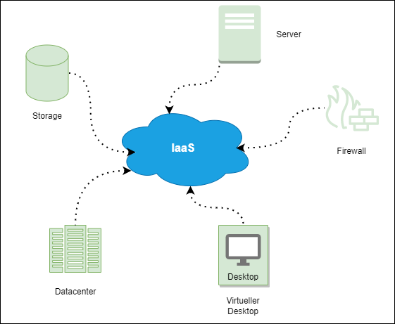
*IaaS Komponenten*

## IaaS als Service Modell des Cloud Computing
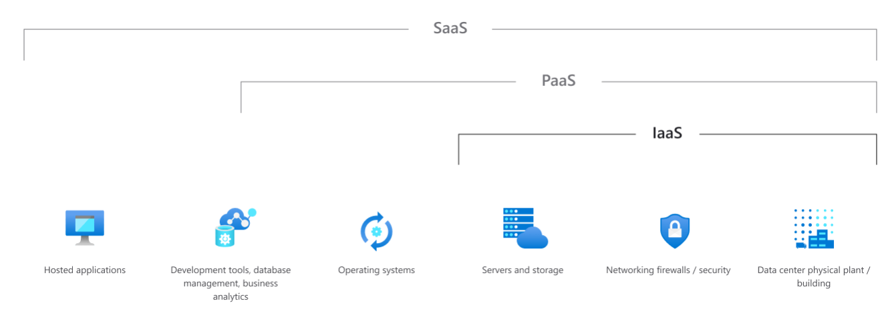
*IaaS als Service Modell des Cloud Computing. Source: [Azure](https://azure.microsoft.com/de-de/overview/what-is-iaas/#overview)*

## Was ist Virtualisierung?
Jede Diskussion über Cloud-Computing beginnt in der Regel mit der Virtualisierung. Virtualisierung bedeutet, Computerressourcen zu nutzen, um andere Computerressourcen oder ganze Computer zu **imitieren**. Sie **trennt Ressourcen und Dienste** von den zugrundeliegenden physischen Bereitstellungsumgebungen (Hardware).
Dabei können mehrere Gast-Betriebssysteme gleichzeitig und effizient auf einem Server laufen, wobei die Hardwareressourcen gleichmäßig aufgeteilt werden.

## Begriffe aus der Virtualisierung
### Hypervisor
Der Hypervisor ist eine spezielle Software, mit der eine oder mehrere virtuelle Maschinen mit ihren eigenen Betriebssystemen (Gastbetriebssystemen) auf einem physischen Computer (Host) ausgeführt werden können. Es gibt zwei Arten von Hypervisoren – Typ 1 und Typ 2.

**Typ 1 Hypervisor**: Hypervisors vom Typ 1 werden auch als *Bare Metal Hypervisor* bezeichnet. Diese werden direkt auf der Hardware ausgeführt. Dabei kontrolliert der Hypervisor die Gastbetriebssysteme und auch die Hardware. Bsp.: Microsoft Hyper V, Xen, Oracle VM Server

**Typ 2 Hypervisor**: Typ 2 Hypervisors werden als *Host OS Hypervisor* bezeichnet. Diese Hypervisors werden auf einem Betriebssystem ausgeführt, ähnlich wie andere Computerprogramme. Dabei bietet der Hypervisor eine **Emulatorumgebung** zur Ausführung eines anderen Betriebssystems.  Mit anderen Worten: Ein Gastbetriebssystem läuft als Prozess auf dem Host. Bsp.: VMware Workstation, VirtualBox 

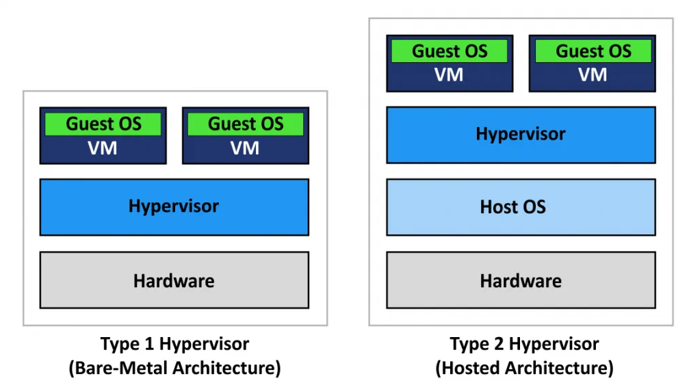
*Vergleich der Hypervisor Arten (Typ 1 und 2)*

### Emulation
= Imitierung eines Programms oder Geräts mithilfe eines anderen Programms oder Geräts.

### Arten von Virtualisierung
* Software Virtualisierung (bspw.: OS Virtualisierung)
  * Ermöglicht es Software, ohne Installationsprozess auszuführen
* Hardware Virtualisierung
  * mehrere virtuelle Prozessoren für jedes der Gastbetriebssysteme emuliert
* Netzwerk Virtualisierung
  * Netzwerkvirtualisierung entkoppelt Netzwerkservices von der zugrunde liegenden Hardware und bietet die virtuelle Bereitstellung ganzer Netzwerke. Physische Netzwerkressourcen wie Switches und Router werden in Pools zusammengefasst und sind für Anwender über ein zentrales Managementsystem zugänglich.
* Storage Virtualisierung
  * Mehrere physische Speicher abstrahieren, sodass sie von einer zentralen Stelle aus gesteuert werden können

## Virtualisierung in der Cloud
Die Cloud erfordert Zugang zu On-Demand Rechenressourchen, dh. der Zugriff auf Computer/Maschinen ist erforderlich, obwohl sich diese nicht physisch in der Nähe befinden. Technologien wie **SSH** (Secure Shell) und **RDP** (Remote Desktop Protocol) ermöglichen einen solchen Zugriff über ein Netzwerk. Dabei ist jedoch immer nur der Zugriff auf eine Maschine möglich, die zuvor eingerichtet, angeschlossen und konfiguriert wurden.

**Ziele der Virtualisierung in der Cloud** ist der Zugriff auf mehrere virtuelle Maschinen (die sich physisch auf einem Rechner befinden können). Weiters soll die Möglichkeit bestehen, VMs von einer physischen auf eine andere Maschine zu übertragen, wodurch das **Betriebssystem unabhängig von der Maschine** sein muss. Eine VM in der Cloud unterscheidet sich von einer traditionellen VM durch die zur Verfügung gestellten APIs -> VMs können nach Bedarf (On-Demand) erstellt und gelöscht werden.

Zusammengefasst heißt das:
::: tip Virtualisierung in der Cloud
Virtualisierung ermöglicht den Zugriff auf Rechenressourcen über das Internet – in kurzer Zeit, ohne Kauf und Installation
:::
 

### Charakteristiken der Cloud Virtualisierung
Die Virtualisierung in der Cloud zeichnet sich durch folgende Charakteristiken aus:
* **Partitionierung**
  * Mehrere OS und Applikationen laufen auf einem physischen System, durch Partitionierung der verfügbaren Ressourcen (Storage, CPU, Memory, …)
* **Isolation**
  * Jede VM läuft isoliert vom physischen System und anderen VMs
  * Absturz einer VM beeinflusst andere VMs nicht
  * Keine geteilten Daten zwischen den VMs
  * Stabilität und Sicherheit (als Folge der Isolation)
* **Flexibles Development**
  * Applikationen können in unterschiedlichsten OS-Umgebungen ausgeführt und getestet werden (kein Kauf neuer Hardware notwendig)
* **Migration (Klonen)**
  * VMs können einfach transferiert werden (bspw. zum Ausgleich von Workload)

## Automatisierung
Um mit Cloud Computing einen Mehrwert zu generieren, reicht das einfache Hosting von virtuellen Maschinen jedoch meist nicht aus. Für gewöhnlich sollen bestimmte Applikationen bzw. Software auf diesen betrieben werden. Aus diesem Grund wurden mehrere Tools entwickelt, die bei der Automatisierung bei der Verwaltung von VM Instanzen helfen sollen.
Eines der bekanntesten Tools ist *Cloud-init*, welches im nächsten Abschnitt genauer erklärt wird.

### [Cloud Init](https://cloudinit.readthedocs.io/en/latest/)

Cloud-init ist die Multi-Distributionsmethode für die plattformübergreifende Initialisierung von Cloud-Instanzen (VMs). Sie wird von defacto allen großen Public-Cloud-Anbietern, Provisioning-Systemen für private Cloud-Infrastrukturen und Bare-Metal-Installationen unterstützt.

Cloud-Instanzen werden aus einem Festplatten-Image und Instanzdaten initialisiert:

* Cloud-Metadaten
* Benutzerdaten (optional)
* Daten des Anbieters (optional)
  
Cloud-init erkennt beim Booten die Cloud, auf der es läuft, liest alle bereitgestellten Metadaten (**user-data Feld**) aus der Cloud und initialisiert das System entsprechend. Im Prinzip handelt es sich um ein Script, welches beim Start einer oder mehrerer virtuellen Maschinen ausgeführt wird. Bspw. für notwendige Installationen oder Konfigurationen auf der VM.

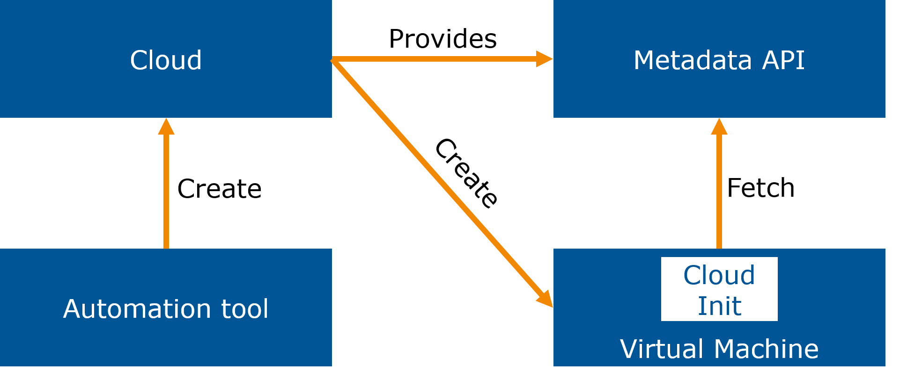
*Aufbau Erstellung von VMs mithilfe von Cloud-Init*

### Weitere Automatisierungstools
Tools wie [Terraform](https://www.terraform.io/) oder [Ansible](https://www.ansible.com/) helfen bei der Verwaltung des gesamten Prozesses der Bereitstellung der virtuellen Maschinen und der Versorgung mit dem richtigen User-Data-Skript. Die folgenden Tools unterstützen dabei das sogenannte **Infrastructure-as-Code** Service Modell, welches in den kommenden Einheiten noch genauer erklärt wird.

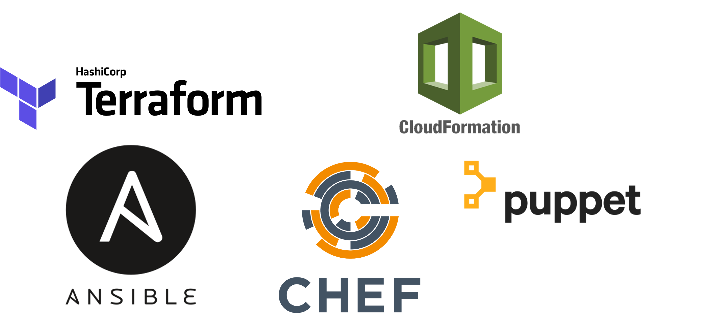

## VM Pooling
Die **User data** in der Cloud kann auch dafür verwendet werden, mehrere VMs zu konfigurieren und zu starten. Zum Beispiel kann ein Mechanismus konfiguriert werden, der eine neue Instanz einer virtuellen Maschine erstellt, wenn eine VM ausfällt (Ausfallmechanismus in der Cloud). Die Erstellung kann dabei manuell und automatisch erfolgen. Cloud Service Provider verwenden für das *VM Pooling* unterschiedliche Bezeichnungen:
* Instance pools (Azure)
* Auto scaling groups (AWS)
* Replica pool (Google Cloud)

## IaaS Infrastruktur
Die Infrastruktur der Cloud Anbieter ist in der Regel nach Weltregionen gegliedert. Regionen sind mehr oder weniger willkürliche geografische Gebiete und können von Anbieter zu Anbieter unterschiedlich sein, aber
folgen in der Regel Schlüsselmärkten wie der EU, den USA, Asien usw. Diese Regionen enthalten sogenannte **Availability Zones** (Verfügbarkeitszonen). Diese Zonen entsprechen in etwa einem Rechenzentrum, können aber
tatsächlich aus mehreren physischen Rechenzentren in unmittelbarer Nähe bestehen. Diese befinden sich in der Region, normalerweise mit einem Mindestabstand von 60 Kilometern, um die Auswirkungen eines katastrophalen Ereignisses wie eines Wirbelsturm, Überschwemmung, Erdbeben oder Ähnlichem zu minimieren. Wenn ein solches Ereignis eintritt, sollten mindestens zwei weitere Verfügbarkeitszonen vorhanden sein, die den Betrieb übernehmen können. Nicht alle Cloud Anbieter haben dieses Redundanzniveau in allen Regionen eingerichtet, aber es ist ein gemeinsames Ziel. Die im Rahmen der IaaS der Cloud-Anbieter angebotene Infrastruktur sind alle durch ein **virtuelles Netz innerhalb einer Region** definiert. 
Die Aufteilung in ein virtuelles Netz:
* Logische Gruppierung von Infrastrukturressourcen
* Jede Ressource hat eine IP-Adresse 
* Virtuelle Netze können in kleinere Netzwerke heruntergebrochen werden (Subnetze, Units, Instanzen)
* Instanzen sind der kleinste Teil in einem IaaS Netzwerk (VM oder physischer Computer)

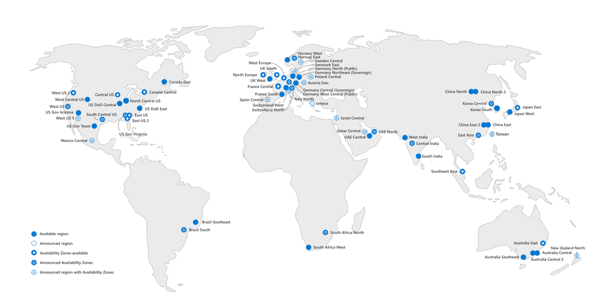
*Availability Zonen von Azure (2020). Source: Microsoft Azure*

## IaaS Compute Ressourcen
Rechenressourcen (Compute Ressourcen) sind das Fundament der Cloud und spiegeln im weitesten Sinne das Innenleben und die Funktionalität eines Computers wide:
* Storage (persistenter Speicher; HDD/SSD)
* Memory (kurzzeitiger Speicher mit direktem Zugriff; RAM)
* I/O
* Controller/Control Unit (Steuereinheit)
* CPU (Verarbeitung von Daten)

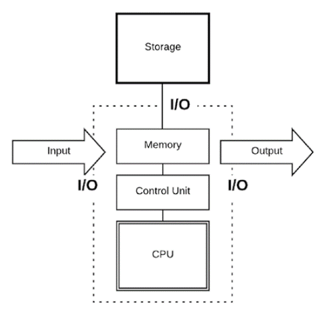
*Kernfunktionalität Computer*

### Arten von Compute Ressourcen in der Cloud

* **General-purpose**
  * Typische Durchschnittskonfiguration
  * Am besten für unvorhergesehene Workloads (Testing/Development)
* **Compute optimized**
  * Komplexe Rechenoperationen (unstrukturierte Daten)
  * Bsp.: Video Konvertierungen, Batch Processing, Machine Learning
* **Memory optimized**
  * Bsp.: Real-time Operationen, IoT, Messaging
* **Storage optimized**
  * Wenig Berechnung, viel Speicher
  * Bsp.: Data-Warehouses, Datenbanken, Objektstorages

### Compute Services - Cloud Anbieter (Überblick)

## IaaS Storage

Was die Datenspeicherung angeht, funktionieren virtuelle Maschinen genauso wie physische PCs: Es gibt eine physische Festplatte (oder mehrere), auf der die Dateien gespeichert werden. Der Unterschied besteht darin, dass eine virtuelle Maschine in der Cloud eine verteilte Speicherarchitektur anstelle einer lokalen Festplatte verwenden kann. In einem verteilten Speichersystem werden die Daten nicht auf dem Rechner gespeichert, auf dem die virtuelle Maschine ausgeführt wird, so dass ein Hardwareausfall auf diesem Rechner nicht zu einem Datenverlust führt.

Ein verteiltes Speichersystem ist jedoch in der Regel entweder langsamer oder bei gleicher Leistung um ein Vielfaches teurer, so dass für einige Anwendungsfälle die Verwendung eines lokalen Speichers erforderlich sein kann.

### Network Block Storage
Network Block Storage ist ein Blockspeicher, der über das Netz bereitgestellt wird. Der Block Storag ist im Allgemeinen nur für eine einzelne virtuelle Maschine geeignet. Es kann nicht von mehreren virtuellen Maschinen aus auf die Dateien zugreifen, die auf einem Blockspeichergerät gespeichert sind.
Im Block Storage werden Informationen als gleichlange Blöcke gespeichert. Dabei werden die Speicherorte von einer Storage Software bestimmt und auch verteilt. Zum Auslesen der Blöcke, müssen diese über Adresse wieder zusammengesucht werden.

**Vorteile**: schnell, niedrige Latenz und Redundanz (möglich)

**Nachteile**: teuer, weil entsprechende Hardware notwendig ist

**Anwendung**: Datenbanken, virtuelle Maschinen

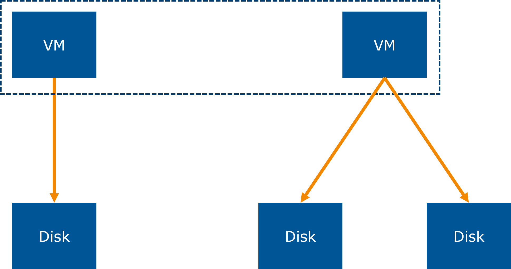
*Block Storage*

### Network File Storage
Im Gegensatz zum Network Block Storage bieten Netzwerk-Dateisysteme den Zugriff auf Daten nicht auf Block-, sondern auf Dateiebene (wie beim PC). Über die verschiedenen Netzwerk-Dateisystemprotokolle können Rechner, die diese Dateisysteme verwenden, Dateien öffnen, lesen und schreiben und sogar Sperren auf sie setzen. Dabei werden alle Informationen als vollständige Dateien gespeichert.

Das Dateisystem muss im Auge behalten, welcher Rechner welche Datei geöffnet hat oder welche Datei gesperrt ist. Wenn mehrere Rechner dieselbe Datei parallel bearbeiten, muss das Dateisystem sicherstellen, dass diese Schreibvorgänge konsistent sind. Dies bedeutet, dass Netzwerkdateisysteme entweder viel langsamer sind als der Zugriff auf Blockebene (z. B. NFS) oder sehr viel mehr CPU und Arbeitsspeicher benötigen, um die Änderungen im Netzwerk zu verfolgen (z. B. CephFS). Einige Cloud-Anbieter bieten dies ebenfalls an, z. B. Amazons EFS.

**Vorteile**: günstig, leich verständlich, leicht horizontal skalierbar (mehrere Festplatten)

**Nachteile**: je mehr Pfade und Dateien, desto langsamer der Zugriff

**Anwendung**: NAS als Dateiserver in Unternehmen, Archivierung

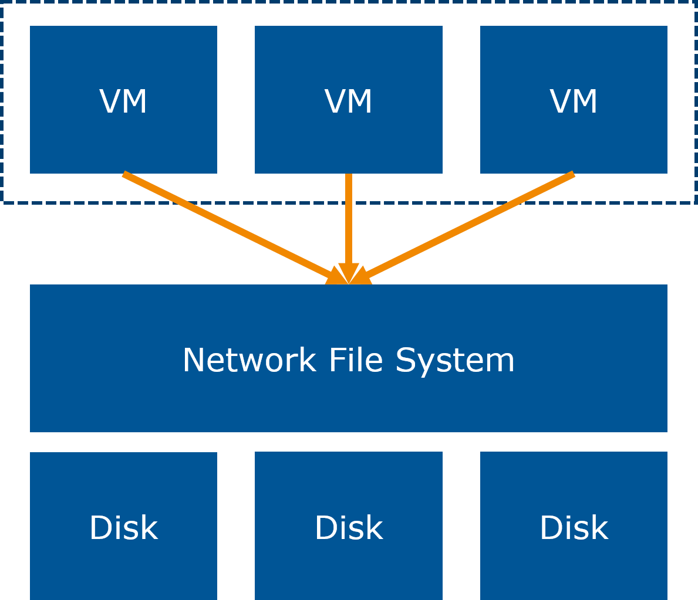

### Object Storage
Objektspeichersysteme ähneln Netzwerkdateisystemen insofern, als sie mit Dateien und nicht mit Blöcken arbeiten. Dabei werden die Informationen/Dateien in eigenständige Einheiten (Objekte) unterteilt. Sie verfügen jedoch nicht über die gleichen Synchronisationsmöglichkeiten wie Netzwerkdateisysteme. Dateien können im Allgemeinen nur als Ganzes gelesen oder geschrieben werden und sie haben auch nicht die Möglichkeit, eine Datei zu sperren.

Jedes Objekt besteht aus:
* Paket mit eigentlichen Dateien
* Metadaten
* ID

Im Gegensatz zu Netzwerkdateisystemen, die hierarchisch aufgebaut sind, werden beim Object Storage alle Objekte auf einer Ebene gespeichert (flache Struktur). Der Datenzugriff erfolgt über HTTP und eine REST-API (siehe Abb. unten).

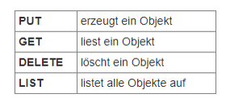

**Vorteile**: hoch skalierbar, flache Struktur, Datenanalyse durch Metadaten möglich

**Nachteile**: langsam bei Änderungen

**Anwendung**: gut bei statischen Dateien (Static Webpages, Fotos, Videos), großen Datenmengen (Big Data)

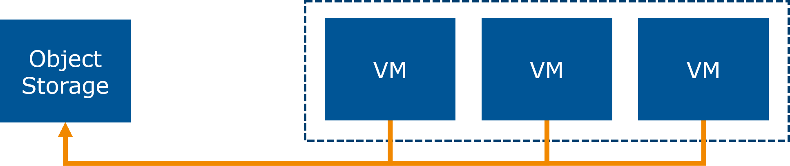

### Überblick IaaS Storage

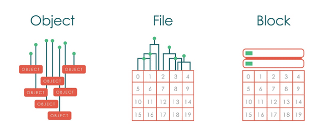

### Storage Services - Cloud Anbieter

| Konzept | AWS                         | Azure        | Google Cloud Platform    |
|---------|-----------------------------|--------------|--------------------------|
| Block   | Block-Storage               | Blob Block   | Disk                     |
| File    | Elastic File System (EFS)   | File Share   | File Storage             |
| Object  | Simple Storage Service (S3) | Blob Storage | Cloud Storage Blob Store |

## Vor- und Nachteile von IaaS

### Vorteile

* Notwendige Ressourcen sofort nutzen
* Keine Vorabinvestition notwendig
* Anwendungsorientiert: Optimierung je Bedarf möglich (Speicher, Arbeitsspeicher, High Performance Computing, …)
* Leichte Skalierbarkeit (nach Bedarf)
* Hochmoderne Infrastruktur (Wartungen und Updates immer vom Provider durchgeführt)
* Disaster Recovery (hohe Verfügbarkeit, auch in Katastrophenfällen etc.)
* Kurze „Time-to-Market“ neuer Produkte

### Nachteile
* Ressourcenüberwachung notwendig
  * Laufende Optimierung
  * Kosten!
* Vendor Lock-in
  * = Abhängigkeit vom Cloud Provider
  * Wechsel theoretisch immer möglich, aber sehr kompliziert
  * Keine einheitlichen Schnittstellen zwischen Anbietern

## Anwendungsgebiete von IaaS

* Start-ups bis große Konzerne
* Hochverfügbare IT-Infrastruktur immer wichtiger
* Optimierung der IT-Kosten wichtiger Aspekt
* Besonders für Unternehmen, die:
  * Schwankenden Bedarf an Hardware oder Rechenleistung haben
  * Hardware am modernsten Stand der Technik betreiben wollen
* Bspw. Auslagerung von Hardware (Server, Speicher, Firewalls, Router), Backup von Daten, Entwicklung und Tests, High Performance Computing, Webanwendungen hosten und skalieren

## Arbeitsauftrag

<a href="/CloudComputingCWA2021/exercises/03-iaas/03-iaas" class="nav-link action-button">
  Zur Übung →
</a>

