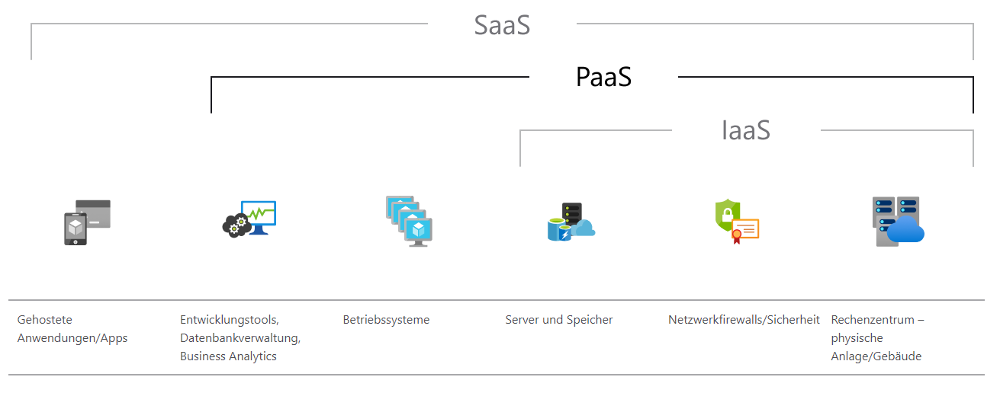

# {{ $frontmatter.title }}

## Was ist PaaS?

Platform-as-a-Service ist eine vollständige Entwicklungs- und Bereitstellungsumgebung in der Cloud, über die man Zugang zu den erforderlichen Ressourcen erhält, um verschiedenste Lösungen bereitstellen zu können – von einfachen cloudbasierten Apps bis hin zu ausgereiften cloudfähigen Unternehmensanwendungen. Somit richtet sich PaaS vor allem an Entwickler:innen.

Genau wie IaaS umfasst PaaS Infrastrukturkomponenten wie Server, Speicher und Netzwerkelemente. Zusätzlich bietet PaaS auch Middleware, Entwicklungstools, BI-Dienste (Business Intelligence), Datenbankverwaltungssysteme und mehr. Mit PaaS lässt sich der gesamte Webanwendungs-Lebenszyklus unterstützen – vom Erstellen, Testen und Bereitstellen der Anwendungen bis hin zu deren Verwaltung und Aktualisierung.

Der einfachste Weg, sich den Unterschied zwischen IaaS und PaaS zu merken, ist, dass **IaaS virtuelle Maschinen und damit verbundene Dienste anbietet**. Um auf einer IaaS-Plattform arbeiten zu können, braucht man jemanden, der sich mit dem Betrieb eines **Betriebssystems** auskennt. Mit anderen Worten: man braucht einen **Systemadministrator**. **PaaS** hingegen ist für **Entwickler:innen** gedacht. Das Hauptziel der PaaS-Dienste besteht darin, Entwickler:innen die Bereitstellung von Anwendungen zu ermöglichen, **ohne dass sie das Betriebssystem** der zugrunde liegenden virtuellen Maschine verwalten müssen.

Es spricht jedoch nichts dagegen, IaaS- und PaaS-Dienste zu mischen. Ein typischer Anwendungsfall wäre die Verwendung einer verwalteten Datenbank mit virtuellen Maschinen. Dies kommt kleineren Teams zugute, da der effiziente Betrieb einer Datenbank in kleinem Maßstab eine unangemessene Belastung darstellen kann.

*PaaS Service Modell. Source: [Azure](https://azure.microsoft.com/)*

## Anwendungsfälle von PaaS

**Entwicklungsframework**. PaaS bietet ein Framework, mit dem Entwickler:innen cloudbasierte Anwendungen entwickeln und individualisieren können. Vergleichbar mit der Erstellung eines Excel-Makros können Entwickler:innen mit PaaS integrierte Softwarekomponenten nutzen, um Anwendungen zu erstellen. Da Cloudfeatures wie Skalierbarkeit, hohe Verfügbarkeit und Mehrinstanzenfähigkeit enthalten sind, wird der Programmieraufwand für Entwickler:innen reduziert.

**Analytics oder Business Intelligence**. Mit den Tools, die bei PaaS als Dienst bereitgestellt werden, können Unternehmen ihre Daten analysieren und ein Data Mining für diese Daten durchführen. Durch die gewonnenen Einblicke, die Ermittlung von Mustern und die Vorhersage von Ergebnissen lassen sich Prognosen optimieren und bessere Entscheidungen zu Produktentwürfen oder anderen Unternehmensfragen treffen. Außerdem lässt sich auf diese Weise die Rendite verbessern.

**Zusätzliche Dienste**. PaaS-Provider bieten möglicherweise weitere Dienste an, mit denen Anwendungen verbessert und erweitert werden können. Dazu zählen z. B. Workflows, Verzeichnisdienste, Sicherheitsfeatures und Planungsfunktionen.

**DevOps, CI/CD**. PaaS unterstützt den gesamten Lebenszyklus von Webanwendungen von der Konzeption bis zur Bereitstellung (Deployment). So können sich Unternehmen auf die von ihnen entwickelten Anwendungen und Dienste konzentrieren und müssen sich nicht mit der Komplexität und den Kosten für die Verwaltung aller anderen Bereiche herumschlagen.

## Vorteile von PaaS
Da Infrastructure-as-a-Service bei PaaS inbegriffen ist, bietet PaaS dieselben Vorteile wie IaaS. Durch die zusätzlichen Features wie Middleware, Entwicklungstools und andere Unternehmenstools profitiert man jedoch von weiteren Vorteilen:

**Reduzierter Programmieraufwand**. Mit PaaS-Entwicklungstools lässt sich der Zeitaufwand für das Schreiben von Code für neue Apps reduzieren, indem vorab programmierte Anwendungskomponenten genutzt werden können, die in die Plattform integriert sind. Dazu zählen z. B. Workflows, Verzeichnisdienste, Sicherheitsfeatures, Suchfunktionen usw.

**Einfachere Entwicklung für mehrere Plattformen (einschließlich mobiler Geräte)**. Einige Service Provider stellen Entwicklungsoptionen für mehrere Plattformen wie Computer, Mobilgeräte und Browser bereit. Dadurch können schneller und einfacher plattformübergreifende Apps erstellt werden.

**Kostengünstige Nutzung ausgereifter Tools**. Dank eines nutzungsbasierten Modells können einzelne Benutzer:innen oder Unternehmen ausgereifte Entwicklungssoftware sowie BI-Tools (Business Intelligence) und Analysetools nutzen, die sie aufgrund der hohen Kosten selbst nicht erwerben könnten.

**Unterstützung geografisch verteilter Entwicklungsteams**. Da der Zugriff auf die Entwicklungsumgebung über das Internet erfolgt, können Entwicklungsteams selbst dann gemeinsam an Projekten arbeiten, wenn sich die Teammitglieder an Remotestandorten befinden.

**Effiziente Verwaltung des Anwendungslebenszyklus**. PaaS bietet sämtliche Funktionen, um den gesamten Lebenszyklus von Webanwendungen zu unterstützen – vom Erstellen, Testen und Bereitstellen der Anwendungen bis hin zu deren Verwaltung und Aktualisierung. Und all das innerhalb einer einzigen integrierten Umgebung.

## Übung CI/CD Pipeline
- Erstellung eines GitHub Actions Workflow
- Konfiguration des Workflow
- Autodeploy bei Push-Event auf GitHub Pages

<a href="/CloudComputingCWA2021/exercises/05-cicd/05-cicd" class="nav-link action-button">
  Zur Übung →
</a>

## Literatur und Ressourcen
> * Lisdorf Anders, "Cloud Computing Basics - A Non-Technical Introduction", Apress, 2021
> * Manvi Sunilkumar and Shyam Gopal Krishna, "Cloud Computing - Concepts and Technologies", CRC Press, 2021
> * Azure, Microsoft, https://azure.microsoft.com/, Zugriff am 09.12.2021