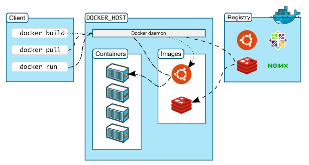
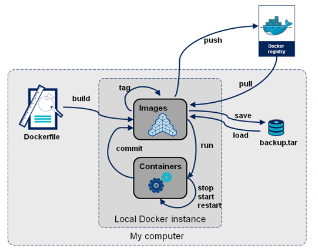

# {{ $frontmatter.title }}

## Was ist Containerization?
Containerisierung ist das Kapseln von Sourcecode in Pakete (Container), die alle erforderlichen Komponenten wie Libraries, Frameworks und andere Dependencies enthalten und in ihrem *Container* isoliert werden.

Auf diese Weise kann die Applikation innerhalb ihres Containers in jede Umgebung verschoben und konsistent auf jeder Infrastruktur ausgeführt werden, **unabhängig von der Umgebung oder dem Betriebssystem der Infrastruktur**. Der Container fungiert als eine Art Rechenumgebung, die eine Anwendung umgibt und sie von ihrem Umfeld **unabhängig** macht. Es handelt sich im Grunde genommen um eine voll funktionsfähige tragbare Rechenumgebung.

Container sind eine Alternative zum Codieren auf einer Plattform oder in einem Betriebssystem, wo das Verschieben einer Anwendung nur schwer möglich ist, wenn der Code mit der neuen Umgebung nicht kompatibel ist. Dies kann zu Fehlern und Störungen führen, die behoben werden müssen oder bei der Entwicklung bedacht werden müssen (was mehr Zeit, weniger Produktivität und viel Frust bedeutet).

Durch die Containerisierung einer Anwendung, die plattform- und infrastrukturübergreifend verschoben werden kann, kann die Anwendung überall dort verwendet werden, wohin sie verschoben wird. Denn sie verfügt über alles, was für eine erfolgreiche Ausführung erforderlich ist.

Die Idee der Prozessisolation gibt es schon seit Jahren. Doch als [Docker](https://www.docker.com/) 2013 die Docker Engine einführte, wurde damit ein Standard für die Verwendung von Containern gesetzt. Die Engine verfügte über Tools, die für Entwickler:innen einfach zu verwenden waren, und einen universellen Paketierungsansatz. Dies hat die Einführung der Containertechnologie weiter beschleunigt. Heute können Entwickler:innen aus einer Auswahl von Container-Plattformen und -Tools auswählen, die die von Docker entwickelten Standards der Open Container Initiative unterstützen.

## Container vs. virtuelle Maschinen
Im Grunde sind Container eine Art der Virtualisierung. 
**Virtuelle Maschinen** virtualisieren die zugrunde liegende **Hardware**, sodass **mehrere Betriebssysteminstanzen** auf der Hardware ausgeführt werden können. Jede VM führt ein Betriebssystem aus und kann auf virtualisierte Ressourcen zugreifen, die die zugrunde liegende Hardware repräsentieren.

Ein **Container** virtualisiert das zugrunde liegende **Betriebssystem** und lässt die Container-App annehmen, dass sie allein über das Betriebssystem sowie CPU, Arbeitsspeicher, Dateispeicher und Netzwerkverbindungen verfügen kann. Da die Unterschiede im zugrunde liegenden Betriebssystem und der zugrunde liegenden Infrastruktur abstrahiert werden, kann der Container überall bereitgestellt und ausgeführt werden – vorausgesetzt, das Basisimage ist konsistent. Für Entwickler:innen ist das ausgesprochen attraktiv.

Container nutzen dasselbe Hostbetriebssystem und müssen daher kein Betriebssystem starten oder Bibliotheken laden. Dadurch sind Container sehr viel **effizienter und schlanker**. Containeranwendungen können innerhalb weniger Sekunden gestartet werden, und auf einem Computer können wesentlich mehr Instanzen der Anwendung ausgeführt werden als in einem VM-Szenario. Die gemeinsame Nutzung des Betriebssystems bietet darüber hinaus den Vorteil, dass Wartungsmaßnahmen wie das Aufspielen von Patches und Updates weniger Aufwand erfordern.

Während VMs gut mit herkömmlicher monolithischer IT-Architektur zusammenarbeiten, wurden Container für neuere Technologien wie die Cloud, CI/CD und DevOps kompatibel gemacht. 


*Container vs. VM. Source: [Docker](https://www.docker.com/blog/containers-replacing-virtual-machines/)*

## Wann verwendet man Container?
::: tip Wann Container und wann VM?
* VMs lösen Infrastrukturprobleme, indem sie es Unternehmen ermöglichen, mehr aus Servern herauszuholen und eine begrenzte Workload-Portabilität zu ermöglichen.

* Container lösen Anwendungsprobleme, indem sie DevOps, CI/CD verbessern, Microservices ermöglichen, die Portabilität erhöhen und die Ressourcennutzung weiter verbessern.
::: 

Es gibt zwar immer noch viele Gründe für den Einsatz von VMs, aber Container bieten ein Maß an Flexibilität und Portabilität, das perfekt für die **Multi-Cloud-Welt**(wenn mehr als 1 Deploymentmodell genutzt wird) ist. Wenn Entwickler:innen neue Anwendungen erstellen, wissen sie möglicherweise nicht, an welchen Orten sie eingesetzt werden müssen. Heute führt ein Unternehmen die Anwendung vielleicht in seiner privaten Cloud aus, aber morgen muss sie vielleicht in einer öffentlichen Cloud eines anderen Anbieters bereitgestellt werden. Die Containerisierung von Anwendungen bietet Teams die Flexibilität, die sie benötigen, um mit den vielen Softwareumgebungen der modernen IT umzugehen. 

Container sind auch ideal für die Automatisierung und DevOps-Pipelines, einschließlich der Implementierung von Continuous Integration und Continuous Deployment (CI/CD).

## Was ist Docker?
Docker ist eine Containerisierungsplattform, die zum Entwickeln, Verteilen und Ausführen von Containern verwendet wird. Docker verwendet keinen Hypervisor, und kann auf dem Computer ausgeführt werden (bspw. beim Entwickeln und Testen von Applikationen). Die Desktopversion von Docker unterstützt Linux, Windows und macOS. Für Produktionssysteme ist Docker für Serverumgebungen verfügbar, darunter viele Varianten von Linux und Microsoft Windows Server 2016 und höher. Fast alle großen Cloud Provider unterstützen Docker.

::: tip Kurzfassung
*Docker is an engine for running virtual operating systems that is extremely light weight.*

*It let’s us run Linux operating systems in isolated environments very quickly.*

*You don’t need to worry about what host system the user is running — as long as they have Docker, the sourcecode will run.*
:::


### Docker Architektur
Die Docker Plattform besteht aus mehreren Komponenten:
* Docker Engine
* Docker Client
* Docker Daemon (Server)
* Docker Objekte
* Docker Hub

#### Docker Engine
Die Docker-Engine besteht aus mehreren Komponenten, die als **Client-Server-Implementierung** konfiguriert werden, bei der der Client und der Daemon (Server) gleichzeitig auf demselben Host ausgeführt werden. Der Client kommuniziert mit dem Server über eine **REST-API**, die es dem Client ermöglicht, auch mit einer Remoteserverinstanz zu kommunizieren.


*Docker Architektur. Source: [Docker](https://docs.docker.com/get-started/overview/)*

#### Docker Deamon
Der Docker Daemon (`dockerd`) lauscht auf Docker-API-Anforderungen und verwaltet Docker-Objekte wie Images, Container, Netzwerke und Volumes. Ein Daemon kann auch mit anderen Daemons kommunizieren, um Docker-Dienste zu verwalten.

#### Docker Client
Der Docker Client (`docker`) meist verwendete Art, mit der viele Docker-User mit Docker interagieren. Wenn man Commands wie `docker run` verwendet, sendet der Client diese Befehle an `dockerd`, der sie ausführt. Der Docker-Befehl verwendet die Docker-API. Der Docker-Client kann mit mehr als einem Daemon kommunizieren.

#### Docker Registry
Eine Docker Registry speichert Docker Images. **Docker Hub** ist eine öffentliche Registrierung, die jeder verwenden kann, und Docker ist so konfiguriert, dass es standardmäßig nach Images auf Docker Hub sucht. 

Wenn man Befehle wie `docker pull` oder `docker run` verwendet, werden die benötigten Images aus der konfigurierten Registry gezogen. Wenn man den Befehl `docker push` verwendet, wird das Image in die konfigurierte Registry übertragen.

#### Objekte in Docker
**Images**. 
Ein Image ist eine schreibgeschützte Vorlage mit Anweisungen zur Erstellung eines Docker Containers. Oftmals basiert ein Image auf einem anderen Image mit einigen zusätzlichen Anpassungen. Man kann zum Beispiel ein Image erstellen, das auf dem Ubuntu-Image basiert, aber den Apache-Webserver und eine eigene Anwendung sowie die Konfigurationsdetails installiert, die für die Ausführung der eigenen Anwendung erforderlich sind.

Es gibt die Möglichkeit eigene Images zu erstellen oder welche zu verwenden, die in einer Registry veröffentlicht wurden.
Um ein eigenes Image zu erstellen, erstellt man eine Dockerdatei mit einer einfachen Syntax zur Definition der Schritte, die zur Erstellung des Image und dessen Ausführung erforderlich sind. Jede Anweisung in einer Dockerdatei erzeugt eine Schicht im Image. Wenn man das Dockerfile ändert und das Image neu erstellt, werden nur die geänderten Schichten neu erstellt. Dies ist einer der Gründe, warum Images im Vergleich zu anderen Virtualisierungstechnologien so leicht, klein und schnell sind.

**Container**
Ein Container ist eine lauffähige Instanz eines Images. Container können über die Docker-API oder die Befehlszeilenschnittstelle erstellt, gestartet, gestoppt, verschoben oder gelöscht werden. Container können mit einem oder mehreren Netzwerken verbunden werden, weiters kann einem Container Speicherplatz zugewiesen oder sogar ein neues Image auf der Grundlage seines aktuellen Zustands erstellt werden.

Standardmäßig ist ein Container relativ gut von anderen Containern und seinem Host-Rechner isoliert. 

Ein Container wird durch sein Image sowie durch alle Konfigurationsoptionen definiert, die ihm beim Erstellen oder Starten zugewiesen wurden. Wenn ein Container entfernt wird, verschwinden alle Änderungen an seinem Zustand, die nicht im permanenten Speicher abgelegt sind.

## Dockerfile
Ein Dockerfile ist eine Textdatei, die Anleitungen enthält, die zum Erstellen und zur Ausführung eines Docker-Images verwendet werden. Die folgenden Aspekte des Images werden definiert:

* Das Basisimage oder das übergeordnete Image, das zur Erstellung eines neuen Images verwendet wird
* Befehle zur Aktualisierung des Basisbetriebssystems und zur Installation zusätzlicher Software
* Einzubeziehende Buildartefakte wie beispielsweise entwickelte Anwendungen
* Verfügbar zu machende Dienste, z. B. Speicher- und Netzwerkkonfiguration
* Ausführbare Befehle, wenn der Container gestartet wird
  
``` dockerfile
# Step 1: specify the parent image - eg Node.js
FROM node:12-alpine 
# Step 2: install dependencies
RUN apk add --no-cache python3 g++ make
# Step 3: set working directory
WORKDIR /app
# Step 4: copy everything from where docker is running into /app
COPY . .
# Step 5: install application dependencies
RUN npm i
# Step 6: run the application
CMD ["node", "src/index.js", "--port 4000"]
```


## Container Orchestrierung
Docker und andere Container-Laufzeiten verwalten Container nicht von selbst über mehrere Server hinweg. Docker hat eine Erweiterung namens [Docker Swarm](https://docs.docker.com/engine/swarm/) erhalten, aber der klare Gewinner der *"Container Wars"* ist heutzutage [Kubernetes](https://kubernetes.io/).

Container-Orchestratoren sind dafür verantwortlich, zu ermitteln, welcher Server freie Kapazitäten hat, und planen die Ausführung von Containern auf diesen Servern. Wenn ein Server ausfällt, sind diese Orchestratoren dafür verantwortlich, ihn zu finden und die Container auf einem anderen Server neu zu starten.

Darüber hinaus enthalten Container-Orchestratoren ein gewisses Maß an Integration mit den Cloud-Anbietern. Docker Swarm verfügt über sehr einfache Integrationen, Kubernetes hingegen bietet Integrationen mit so gut wie jedem Anbieter.

Je nach Cloud-Anbieter kann Kubernetes automatisch Blockspeicher-Mounts auf einen anderen Server verschieben, wenn ein Container verschoben wird, Cloud Load Balancer konfigurieren und vieles mehr.
Diese Flexibilität hat ihren Preis: Kubernetes ist sehr komplex. Eine detaillierte Erklärung, wie man eine Anwendung auf Kubernetes einsetzt, würde den Rahmen dieses Moduls bei weitem sprengen. 
