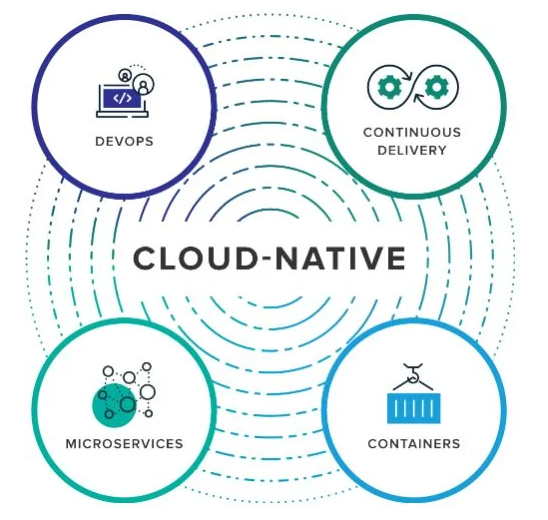
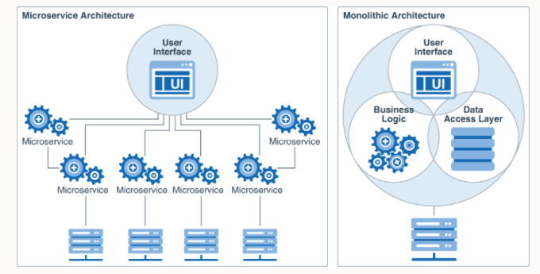

# {{ $frontmatter.title }}

## Was ist Cloud Native Development?
Cloud-native Anwendungen sind speziell für Cloud-Computing-Modelle konzipiert. Dabei werden Anwendungen vollständig in der Cloud entwickelt und bereitgestellt. Dabei handelt es sich aber nicht nur um die Anwendungen und deren Bereitstellungen selbst, sondern um den ganzen Prozess: Cloud-native beschreibt einen agilen Prozess, von der Entwicklung der Anwendungen bis hin zur Bereitstellung (Deployment). Dabei geht es darum, in welcher **Form Anwendungen erstellt und bereitgestellt werden**, nicht an welchem Ort. 

Cloud-native umfasst dabei die Cloud Computing Konzepte **DevOps, Continous Delivery, Microservices und Container**.

Cloud-native Anwendungen laufen nicht mehr in der klassischen Serverfarm im hauseigenen Rechenzentrum, sondern von Anfang an in einer Cloud-Umgebung. Zum Einsatz kommen **Container** und **Microservices** als wesentliche Technologien. Hinzu kommen **agile Methoden** und **DevOps-Konzepte** im Sinne einer Prozessstrategie. Dabei arbeiten Entwickler:innen (Developers) und IT-Betrieb (Operations) von Beginn an eng zusammen, um gemeinsam optimale Lösungen zu liefern. Im ständigen Austausch und auf Basis einer gemeinsamen Ziel- und Wertvorstellung werden Produkte oder funktionsfähige Produkt-Features über automatisierte Prozesse kontinuierlich ausgeliefert (Continuous Delivery). Entwickler:innen können somit deutlich schneller als zuvor auf produktive Umgebungen deployen. Ermöglicht wird dieses Vorgehen durch eine komplett neue Architektur.

*Konzepte von Cloud Native Development. Source: [Plusserver](https://www.plusserver.com/blog/was-ist-cloud-native)*

Die Konzepte [Containerization](/CloudComputingCWA2021/lectures/06-containerization/06-containerization) und [CI/CD](/CloudComputingCWA2021/lectures/04-git/04-git) haben wir in früheren Einheiten schon kennengelernt. Der Fokus dieser Einheit liegt auf den **Microservices** und **DevOps**.

### Einsatz von Cloud Native
Etablierte Unternehmen wählen selten den Cloud-native Ansatz. Dies liegt daran, dass sie in der Regel bereits eine beträchtliche Anzahl von Systemen vor Ort haben. Obwohl dieser Ansatz oft für Demonstrationen und Marketingzwecke verwendet wird, ist es nicht für jedes Unternehmen sinnvoll den Cloud-native Ansatz umzusetzen. Dazu müssten sie das gesamte IT-Personal zu Cloud Experten machen. Für neu gegründete Unternehmen sollte Cloud-Native der Standardansatz sein. Es gibt keinen Grund, nicht als Cloud-Native zu starten. Eine der Herausforderungen der Cloud-Native-Lösung besteht darin, die gleiche
Standardisierung und Governance im Unternehmen zu etablieren, die typischerweise mit On-Premise IT einhergeht. In der Cloud kann "jeder" alles machen, was in einer lokalen Infrastruktur nicht der Fall ist.
Dies bedeutet, dass eine stärkere Steuerung und Kontrolle
aktiv eingesetzt werden müssen. Es geht darum, die betriebliche Stabilität, Sicherheit und Wirtschaftlichkeit nicht zu untergraben. Eine weitere Herausforderung, insbesondere in einem **Multicloud**
Szenario, besteht darin, wie die Infrastruktur des Unternehmens überwacht wird (Monitoring). Wenn die Lösungen über mehrere Cloud-Anbieter verteilt sind, ist es eine Herausforderung, effektiv zu überwachen. Redundante Funktionen können leichter auftreten, was sich negativ auf die Gesamtkosten auswirkt.

## Microservices
Die Verbreitung von Containern hat auch zu einer Veränderung im Softwaredesign geführt: **Microservices**. Bei Microservices handelt es sich um ein Konzept, bei dem anstelle einer monolithischen Anwendung ein winziger Dienst für jeden Bedarf entwickelt wird. Diese Dienste werden über das Netzwerk verbunden, normalerweise über HTTP.

Auf den ersten Blick löst dies das Problem der Erstellung eines zusammenhanglosen, riesigen Codeballs mit schlechter Codequalität. Die Erfahrung hat jedoch gezeigt, dass dies nicht der Fall ist. *Ein Team oder Unternehmen, das nicht in der Lage ist, einen qualitativ hochwertigen Monolithen zu schreiben, ist auch nicht in der Lage, Microservices richtig zu entwerfen und zu warten.*

Um ein gut konzipiertes System zu schreiben, egal ob Microservices oder Monolith, muss man saubere API-Grenzen zwischen den verschiedenen Teilen des Systems haben.

**Wo liegt der Unterschied zwischen Microservices und einem Monolithen?** 

*Microservice vs. Monolith. Source: [Oracle](https://docs.oracle.com/de/solutions/learn-architect-microservice/index.html#GUID-1A9ECC2B-F7E6-430F-8EDA-911712467953)*

Monolithische Anwendungen bestehen aus einer einzigen Einheit, in die alle Funktionalitäten eingebunden sind. Das bringt folgende Vorteile mit sich:

* **Einfachere Behandlung von Querschnittsthemen**: Die meisten Anwendungen müssen eine Vielzahl von übergeordneten Bestimmungen erfüllen – etwa im Hinblick auf Datenprotokolle oder Sicherheitsfunktionen. Wenn alles über eine einzige Anwendung läuft, ist es einfacher, die jeweiligen Programmteile an die übergeordneten Richtlinien anzupassen.
* **Weniger operativer Aufwand**: Wenn nur eine einzige Anwendung vorhanden ist, muss auch nur eine Anwendung getestet, kontrolliert und gewartet werden. Zudem ist das Deployment weniger komplex.
* **Bessere Performance**: Häufig ist die Performance der Programme besser, da ein Shared-memory Access schneller als Interprozesskommunikation (IPC) abläuft.
 

Diesen Vorteilen stehen jedoch auch Nachteile gegenüber:

* **Enge Verflechtung/Kopplung**: Die einzelnen Programmteile sind fest miteinander verbunden. Je weiter die Entwicklung der Anwendung voranschreitet, desto schwieriger wird es daher, einzelne Teile zu isolieren, um sie einzeln zu skalieren oder den Code zu warten.
* **Hohe Komplexität**: Monolithische Programme sind häufig schwer zu verstehen, da bei vielen Funktionen Abhängigkeiten und Nebeneffekte vorhanden sind.
 

**Microservices**: Kleine, unabhängige Dienste

Bei der Verwendung von Microservices kommen im Gegensatz zum Monolithen viele unabhängige Bausteine zum Einsatz. Auch diese Architektur bietet einige Vorteile:

* **Bessere Organisation**: Die Aufgabe jeder Komponente ist klar von den Aufgaben anderer Module abgegrenzt. Das vermeidet Überschneidungen und verbessert die Organisation.
* **Entkopplung**: Unabhängige Einheiten lassen sich einfacher neu konfigurieren, um unterschiedliche Anforderungen zu erfüllen. Außerdem lassen sich einzelne Funktionen, die dringend benötigt werden, besonders schnell umsetzen.
* **Gute Performance**: Je nachdem, wie gut die Microservices organisiert sind, erlauben sie ebenfalls eine gute Performance. So ist es beispielsweise möglich, einzelne Komponenten isoliert zu skalieren.
* **Weniger Fehler**: Zwischen den einzelnen Microservices bestehen Grenzen. Dadurch beschränken sich auch Fehler auf einzelne Komponenten.
 
Allerdings sind auch im Hinblick auf Microservices einige Nachteile festzuhalten:

* **Behandlung von Querschnittsthemen**: Auch in auf Microservices basierenden Anwendungen existieren übergreifende Anforderungen. Um diesen gerecht zu werden, müssen entweder erhöhte Aufwände in Kauf genommen (bspw. beim Testen) oder Querschnittskomponenten erstellt werden.
* **Höherer operativer Aufwand**: Microservices werden meist unabhängig voneinander deployt. Dies erhöht den Abstimmungsaufwand

### Microservices im Cloud-native Development

Durch die unabhängige Entwicklung der Services kann eine kontinuierliche Bereitstellung gewährleistet werden, die für bessere **Performance, Zuverlässigkeit und schnellere Time-to-Market** sorgt.

Das **übergeordnete und langfristige** Ziel besteht darin, Geschwindigkeit, Skalierbarkeit und schließlich die Gewinnspanne zu verbessern. Im Fokus trägt der agile DevOps-Ansatz dazu bei, Risiken zu reduzieren. Denn es wird in kurzen Abständen entwickelt, getestet, verifiziert oder bei Bedarf korrigiert. Aus den einzelnen Microservices werden Bündel erstellt, die in (Docker-)**Containern** organisiert, in **Kubernetes** orchestriert und mit **DevOps- und GitOps**-Workflows gemanagt werden.

## DevOps (= Development and Operations)
DevOps ist eine Philosophie der engen Zusammenarbeit von IT-Entwicklung (Development) und IT-Betrieb (Operations) mit dem Ziel höherer Softwarequalität und einer beschleunigten und häufigeren Bereitstellung von Updates (CI/CD). Das Erstellen, Testen und Freigeben von Software kann dadurch schneller, häufiger und zuverlässiger erfolgen.

Die Philosophie drückt sich aus in:

**Kultur**: Teamwork, Verantwortung

**Praxis**: Richtlinien, Rollen, Prozesse

**Tools**: gemeinsame Werkzeuge und Plattformen

## 12-Faktor-App
Wenn wir die erste Nacht nach dem Launch unserer Anwendung überstanden haben, wird es oft Zeit, sich mit langfristigen Architekturproblemen zu befassen. Die 12-Faktor-App ist ein Konzept, das die Best Practices bei der Entwicklung von Anwendungen für die Cloud zusammenfasst. Denkt daran, dass es sich hierbei nur um Guidelines handelt, und dass niemals eine religiöse Tirade aus der Befolgung dieser Richtlinien gemacht werden sollte. Ein gesundes Maß an Pragmatismus ist bei der Umsetzung der 12 Faktoren sehr hilfreich.

*12-Faktor Apps. Source: [Agileviet](https://agileviet.vn/the-twelve-factor-app/)*

**1. Codebase**
Diese erste Guideline ist ziemlich einfach: Verwaltet eure Anwendung in einem Versionskontrollsystem. Obwohl dies im Jahr 2021 der Standard sein sollte, muss es leider immer noch gesagt werden.

**2. Abhängigkeiten**
Diese Empfehlung befasst sich mit Abhängigkeiten. Fast jede Programmierenvironment verfügt heutzutage über Dependencymanagement, das das Herunterladen von Dependencies (eg verwendete Libraries und Frameworks ) ermöglicht. Diese Abhängigkeiten sollten explizit in der Konfigurationsdatei für den Dependency Manager deklariert werden (bspw. package.json, composer.json, pom.xml, etc.)

Außerdem erstellen diese Dependency Manager oft eine Sperrdatei (npm-package-lock.json, composer.lock, etc.). Darin werden die genauen Versionen und manchmal auch Hashes der Drittanbieter-Bibliothek aufgezeichnet. Dadurch wird sichergestellt, dass in den Entwicklungs- und Produktions-Builds genau dieselbe Version installiert wird.

**3. Konfiguration**
Während Konfigurationsdateien in früheren Zeiten viele Formate hatten, bewegen sich moderne, container-basierte Anwendungen eindeutig in Richtung Umgebungsvariablen/Environmentvariablen. Umgebungsvariablen sind eine plattformübergreifende Möglichkeit, einer Anwendung Variablen zur Verfügung zu stellen und geben einem DevOps-Engineer eine flexible Möglichkeit, eine containerisierte Anwendung zu konfigurieren.

**4. Backing-Dienste**
Externe Datenbanken, Caches, etc. sollten als solche behandelt werden. Das bedeutet, dass die Verbindungsoptionen (Servername, URL, Benutzername, Passwort usw.) über eine Umgebungsvariable konfigurierbar sein sollten und auch von einem Systemadministrator durch einfache Neukonfiguration des Containers ersetzt werden können sollten.

Testen ist auch bei Diensten wichtig, die nicht so gut standardisiert sind wie z. B. eine MySQL-Datenbank. Beispielsweise unterstützen viele S3-Implementierungen nur die Version von Amazon und können nicht für die Verwendung alternativer Anbieter konfiguriert werden. Eine Anwendung, die dieser Empfehlung folgt, sollte mit mindestens einem anderen S3-Anbieter getestet werden.

**5. Der Build-Prozess**
Die Build-Empfehlung besagt, dass der Build-Prozess von der Laufzeitkonfiguration und dem Release-Prozess getrennt werden sollte. In der Praxis bedeutet dies, dass ihr eure Konfiguration nicht in euren Container verpackt. Es bedeutet auch, dass jedes Release eine Versionsnummer oder ein Datum haben sollte, damit ihr zu einer bestimmten Version zurückkehren könnt.

**6. Zustandslose Prozesse**
Die Empfehlung für Prozesse besagt, dass die Anwendung als ein einziges Programm ohne gemeinsame Daten zwischen verschiedenen Kopien der Anwendung laufen sollte. Jeder Zustand sollte, wie bereits erwähnt, in eine externe Datenbank oder ein externes System ausgelagert werden.

**7. Netzwerkkonfiguration**
Die Empfehlung zur Portbindung besagt, dass eine Anwendung eigenständig ist und keinen externen Webserver benötigt, um zu laufen. 

**8. Prozesshandhabung**
Die Concurrency-Empfehlung definiert eine Reihe von Regeln für die Prozessverarbeitung. Sie verlangt, dass es möglich sein muss, mehrere Kopien der Anwendung auszuführen, optional auf mehreren Rechnern. Sie verlangt auch, dass die Anwendung nicht als Daemon läuft.

Während dies bei *Green Field* Applikationen trivial erscheinen mag, ist es bei *Legacy* Anwendungen definitiv eine Herausforderung.

**9. Disposability/Flüchtigkeit**
Diese Empfehlung besagt, dass eine Anwendung schnell starten und auch schnell herunterfahren sollte, wenn sie das Terminierungs-Signal erhält. Die Anwendungen sollten auch in der Lage sein, sich von unerwarteten Abstürzen zu erholen.

**10. Entwicklungs-/Produktionslücke**
Die Empfehlung zur Parität zwischen Entwicklung und Produktion besagt, dass Entwickler von Anwendungen eine kontinuierliche Bereitstellungsmethode anstreben sollten, die ein schnelles Ausrollen von Updates ermöglicht. Dies verringert den Aufwand, den ein Entwickler für die Bereitstellung betreiben muss, und fördert daher kleinere Change-Set. Bspw. CI/CD 

Kleinere Change-Sets erleichtern das Aufspüren von Problemen beim Deployment, können aber bei der Arbeit mit größeren, sich langsamer bewegenden Kunden unpraktisch sein. (z.B. Banken, Telekommunikationsunternehmen)

**11.  Logs**
Die Logs-Empfehlung besagt, dass eine Anwendung Logs einfach in einer standardisierten Form (z. B. JSON) in die Standardausgabe (STDOUT) schreiben sollte. Alles andere, wie das Weiterleiten oder Speichern von Protokollen, ist nicht Sache der Anwendung.

In der Praxis enthält jede Anwendung zumindest einige grundlegende Logik zum Filtern von Protokollen, um die Konfiguration der Protokollierungsebene zu erleichtern.

**12. Tooling**
Die Empfehlung für den Administrationsprozess befasst sich mit den Command Line Tools, die für den Betrieb der Anwendung benötigt werden. Dies sind Dinge wie die Durchführung von Datenbankmigrationen usw. Die Empfehlung besagt, dass diese Tools direkt aus dem Anwendungsverzeichnis ohne zusätzliche Konfiguration oder Installation ausgeführt werden können sollten.
