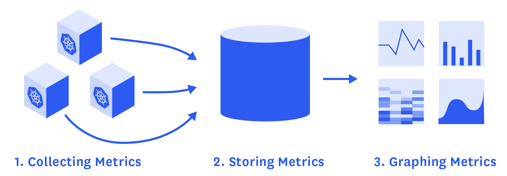

# {{ $frontmatter.title }}

## Cloud Monitoring
Die im Lecture 7 (Cloud Native) genannten 12 Faktoren sind zwangsläufig von begrenztem Umfang. Die Verfasser dieser 12 Faktoren haben viele Dinge berücksichtigt, andere jedoch ausgelassen.

Einer der wichtigsten Aspekte, der in der 12-Faktor-Liste nicht berücksichtigt wurde, ist das **Monitoring**. Jeder Entwickler, der an einer Cloud-nativen Umgebung arbeiten möchte, muss die Überwachung der Services berücksichtigen. Schließlich soll der Weg in die Cloud mehr Stabilität bringen und schnelle Entwicklungszyklen ermöglichen.

Cloud Monitoring nutzt manuelle und automatisierte Tools zur Überwachung und Analyse von und Berichterstattung hinsichtlich Verfügbarkeit und Leistung von Websites, Servern, Applikationen und anderer Cloud-Infrastruktur. Zum Beispiel kann man mit Cloud-Monitoring-Tools eine Applikation auf Geschwindigkeit, Funktionalität und Zuverlässigkeit testen und so sichergehen, dass sie optimal läuft.

Cloud Monitoring wir normalerweise als Teil einer übergreifenden **Cloud-Management-Strategie** durchgeführt, damit IT-Administratoren den Betriebsstatus cloudbasierter Ressourcen prüfen können. Außerdem bietet es eine ganzheitliche Ansicht von Cloud-Metriken, Kundenfluss, Protokolldaten und mehr. Cloud Monitoring kann von einem Cloud-Service oder einem Managed-Service-Anbieter bereitgestellt werden.

Folgender Abschnitt beschreibt Monitoringtypen und deren praktische Umsetzung.

### Periodische Checks

Eine der klassischsten Formen des Monitoring sind periodische Checks/Prüfungen. Bei periodischen Prüfungen wird eine bestimmte Prüfung, z. B. eine Verbindung, gegen die Anwendung durchgeführt. Wenn die Verbindung erfolgreich ist, ist die Prüfung grün, wenn nicht, ist die Prüfung rot und es wird eine Warnung ausgegeben. Die Prüfarten sind vielfältig und reichen von einem einfachen Verbindungsversuch bis hin zu einer vollständigen Interaktion mit der Anwendung.

Diese Prüfungen dienen nicht nur dem Zweck, den Administrator zu warnen, sondern können auch als Auslöser für ein *Self-Healing-System* dienen. In einer containerisierten Umgebung haben wir zum Beispiel mehrere Möglichkeiten, ein Selbstheilungssystem zu implementieren. Man könnte beispielsweise die Direktive **HEALTHCHECK** in das Dockerfile einfügen oder *Liveness-, Readiness- und Startup-Probes* in **Kubernetes** implementieren.

Eine wichtige Frage, die bei regelmäßigen Checks zu beachten ist, ist die Rate der falsch-positiven Ergebnisse. Ein zeitweiliger Netzwerkausfall ist möglicherweise kein Signal für einen Anwendungsausfall und kann dennoch Alarme auslösen. Um eine Alarmmüdigkeit zu vermeiden, hält ein gut konzipiertes Überwachungssystem die Zahl der Fehlalarme auf einem Minimum.

### Feature Tests
Ein Sonderfall der periodischen Checks sind vollständige Feature Tests. Diese Funktionstests lassen die Grenzen zwischen Softwaretests während der Entwicklungszeit und dem Betrieb verschwimmen. Das Ziel ist es, einen vollständigen Anwendungstest, z. B. mit der [Selenium](https://www.selenium.dev/)-Testsuite, gegen eine Produktionsanwendung durchzuführen. Dieser Test könnte zum Beispiel eine vollständige Registrierung im System testen. Diese Testebene stellt sicher, dass die Anwendung auch nach der Bereitstellung noch funktioniert.

Diese Tests sind zwar nicht in jedem Szenario praktikabel, können aber ein hohes Maß an Sicherheit gewährleisten und auch als **Regressionstest** dienen, wenn sich die Infrastruktur und nicht die Anwendung ändert.

### Sammlung von Metriken
Ein weiterer wichtiger Aspekt des Monitoring ist die Erfassung von Metriken. Regelmäßige Kontrollen können nur überprüfen, was vorhanden ist, aber sie können nicht auf ein sich anbahnendes Problem hinweisen, bevor es auftritt. Metriken können ein Frühwarnsystem für einen Fehler in der Anwendung sein. So kann beispielsweise eine Softwareeinführung die Zahl der Anmeldungen erheblich beeinträchtigen. Auch wenn die Änderung durchaus beabsichtigt war, ist es geschäftskritisch, dies zu überwachen und sofort auf einen möglichen Fehler in der Software hinzuweisen. Sind die Ladezeiten zu lang? Hat die Änderung des Layouts den Prozess zu verwirrend gemacht? Metriken können helfen.

[Prometheus](https://prometheus.io/) hat sich als Defacto-Standard für die Überwachung von Cloud-nativen Anwendungen etabliert. Mit Prometheus ist es äußerst einfach, die Erfassung von Metriken in nahezu jede Anwendung zu integrieren. Es ist nicht ungewöhnlich, dass Anwendungen einen kleinen Webserver enthalten, der interne Metriken im Prometheus-Datenformat bereitstellt. Prometheus sammelt dann diese Metriken und bietet Warn- und Abfragedienste.

Der Grund, warum sich Prometheus als Standard etabliert hat, ist seine Fähigkeit, eine dynamische Anzahl von Maschinen zu überwachen. Er fragt zunächst den Cloud-Anbieter nach einer Liste von IP-Adressen ab und fragt dann diese IPs nach den Metriken ab. Wenn Maschinen gestartet und gestoppt werden, behält Prometheus stets den Überblick über sie.

### Sammlung von Logs

Je nachdem, wie gut die Anwendung geschrieben ist, kann sie mehr oder weniger nützliche Protokolle ausgeben. Eines ist sicher: die Anzahl der Fehler kann auch ein Frühwarnsystem für latente Mängel sein. Das Zugriffsprotokoll kann zum Beispiel die einzelnen Einträge von fehlgeschlagenen Anfragen enthalten. Ein Log-Aggregationssystem wie der [ELK-Stack](https://aws.amazon.com/de/opensearch-service/the-elk-stack/) kann Muster in den Protokollen entdecken und warnen, wenn etwas schief läuft.

*ELK-Stack*: Der ELK-Stack ist ein Akronym zur Beschreibung eines Stacks, der aus drei beliebten Projekten besteht: Elasticsearch, Logstash und Kibana. Der ELK-Stack, der oft auch als Elasticsearch bezeichnet wird, bietet die Möglichkeit, Protokolle von allen Systemen und Anwendungen zu sammeln, diese Protokolle zu analysieren und Visualisierungen für die Überwachung von Anwendungen und Infrastrukturen, eine schnellere Fehlerbehebung, Sicherheitsanalysen und vieles mehr zu erstellen.

*Elk Stack. Source: [Guru99](https://www.guru99.com/images/tensorflow/082918_1504_ELKStackTut1.png)*
### Dashboards
Kein Überwachungssystem ist vollständig ohne eine Möglichkeit, sich einen Überblick über die Vorgänge zu verschaffen. Diese Nische wird von Dashboards wie [Grafana](https://grafana.com/) ausgefüllt.

*Grafana Dashboard. Source: [Scaleyourapp.com](https://www.scaleyourapp.com/wp-content/uploads/2019/01/grafana-min.png)*

## Vorteile von Cloud Monitoring
Monitoring ist eine Fähigkeit, kein Vollzeitjob. In der heutigen Welt der Cloud-basierten Architekturen, die durch DevOps-Projekte implementiert werden, müssen Entwickler, Site Reliability Engineers (SREs) und Betriebsmitarbeiter gemeinsam eine effektive Cloud-Überwachungsstrategie definieren. Eine solche Strategie sollte sich darauf konzentrieren, zu erkennen, wann die Service-Level-Objectives (SLOs) nicht erreicht werden, was sich wahrscheinlich negativ auf die Benutzererfahrung auswirkt. Welche Vorteile bietet der Einsatz von Cloud-Monitoring-Tools? 

* Die Skalierung bei erhöhter Aktivität ist nahtlos und funktioniert in Unternehmen jeder Größe
* Dedizierte Tools (und Hardware) werden vom Host gewartet
* Die Tools werden auf verschiedenen Gerätetypen eingesetzt, darunter Desktop-Computer, Tablets und Telefone, sodass das Unternehmen Anwendungen von jedem Standort aus überwachen kann.
* Die Installation ist einfach, da die Infrastruktur und die Konfigurationen bereits vorhanden sind.
* Das System wird nicht unterbrochen, wenn lokale Probleme auftreten, da die Ressourcen nicht Teil der Server und Workstations des Unternehmens sind.
* Abonnementbasierte Lösungen können die Kosten niedrig halten