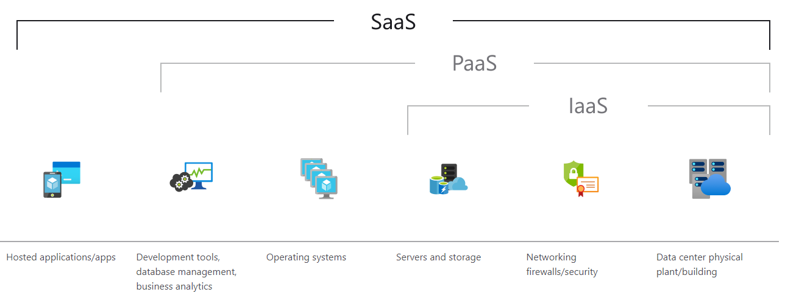
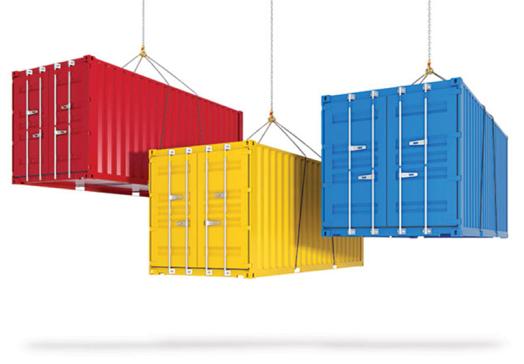
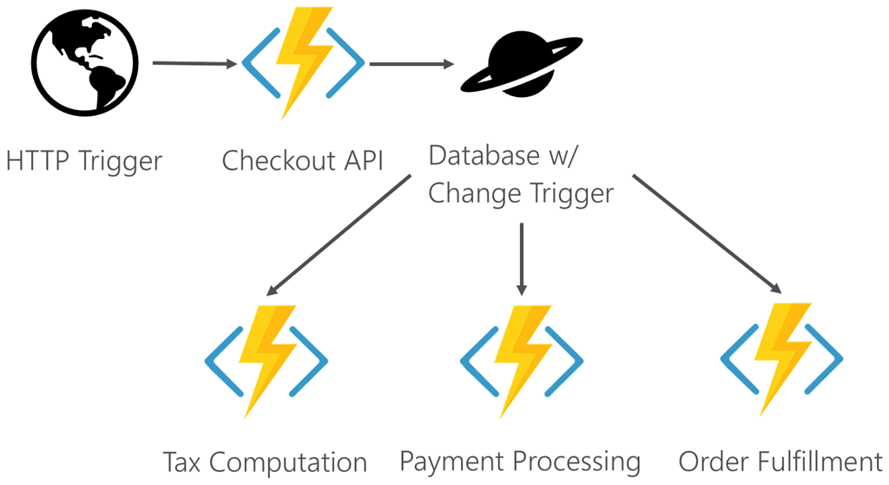

# {{ $frontmatter.title }}

Allgemein gesprochen, werden alle Service Modelle im Begriff XaaS zusammengefasst. Die bekanntesten darunter sind IaaS, PaaS und SaaS. Nachdem wir IaaS und PaaS schon im Detail besprochen haben, wird sich diese Lecture dem SaaS Modell, sowie weiteren Ausprägungen von Service Modellen, widmen.

## SaaS - Software as a Service
Beim SaaS Modell können Benutzer sich über das Internet mit cloudbasierten Apps verbinden und diese nutzen. Dabei wird die gesamte Applikation vom Service Provider verwaltet. Es erfolgt durch die Nutzer kein Kauf der Lizenz, sondern eine nutzungsbedingte Abrechnung (monatlich, jährlich, etc.). Es wird also eine Leihgebühr für die Nutzung der Software erhoben. Die gesamte zugrunde liegende Infrastruktur, Middleware und Software sowie die App-Daten befinden sich im Datencenter des Service Providers. Der Provider verwaltet die Hardware und die Software und stellt bei Abschluss eines entsprechenden Servicevertrags auch die Verfügbarkeit und Sicherheit der App und der Daten sicher. Mit SaaS kann ein Unternehmen eine App im Handumdrehen bereitstellen und nutzen – und das mit minimalen Investitionskosten. Dadurch, dass der Kunde die Software als Dienstleistung bezieht, hat er auch ständigen Zugang zur aktuellsten Version der Software.

*SaaS Service Modell. Source: azure.com*

### Vorteile von SaaS

**Einfach und schnell:** Keine Installationen nötig, das ermöglicht eine rasche Inbetriebnahme. Zugriff über ein Web-Portal oder einen Software-Client.

**Skalierbar und damit kostenoptimiert:** Bezahlung mittels Software-Abo nur die benötigte Anzahl von Usern und auch nur jene Funktionen, die genutzt werden. Ändert sich der Mitarbeiter*innenstand, kann jederzeit aufgestockt oder reduziert werden; dasselbe gilt für die Module, die genutzt werden. Diese Flexibilität optimiert die Kosten.

**Zugriff von überall:** Mitarbeiter:innen im Büro, unterwegs oder im Home-Office können unabhängig vom Standort und von Geräten wie PC, Notebook, Tablet oder Smartphone mit den Programmen arbeiten und auf Informationen zugreifen.

**Sicherheit:** Wiederkehrende unternehmenskritische Tätigkeiten wie das Backup der Daten werden professionell vom Anbieter in sicheren Rechenzentren erledigt. Damit hat das interne IT-Team mehr Zeit für die Betreuung der Mitarbeiter:innen.

**State-of-the-art Software:** Gerade kleine und mittelständische Unternehmen profitieren von ausgereiften Lösungen zu einem leistbaren Preis. Inklusive aktueller regelmäßiger Updates und Weiterentwicklungen.

## DBaaS - Database as a Service
Der Begriff Database-as-a-Service bezieht sich auf Software, die es den Nutzern ermöglicht, Datenbanken mithilfe eines gemeinsamen Sets von Abstraktionen (Primitiven) einzurichten, zu betreiben und zu skalieren, ohne dass sie die genauen Implementierungen dieser Abstraktionen für die jeweilige Datenbank kennen oder sich darum kümmern müssen.

Entwickler:innen könnte beispielsweise eine Datenbankinstanz mit denselben API-Aufrufen oder UI-Klicks einrichten, unabhängig davon, ob es sich um MySQL, Oracle oder MongoDB handelt. In ähnlicher Weise können IT-Administrator:innen eine Sicherung der Datenbank anfordern oder einen Datenbank-Cluster erstellen und dessen Größe ändern, indem dieselben Aufrufe verwendet werden, unabhängig von der jeweils verwendeten Datenbank. Es liegt in der Verantwortung der Plattform, Backups, Größenänderungen von Clustern oder andere abstrakte Operationen für jede der von der Plattform unterstützten Datenbanken korrekt zu implementieren.

Dabei werden sowohl relationale Datenbanken (RDBMS) sowie NoSQL Datenbanken von Cloud Anbietern zur Verfügung gestellt. Beispielsweise sind in Microsoft Azure (Stand 2021) folgende DB verfügbar:
* RDBMS: MySQL, MariaDB, PostgreSQL
* NoSQL: Azure Cosmos DB (MongoDB, Cassandra, Table API ...)

## NaaS - Network as a Service
Network as a Service ist ein Service Modell mit dem Netzwerkdienste virtuell über das Internet zur Verfügung gestellt werden. NaaS bezieht die Vergabe von Ressourcen ein und behandelt das Netzwerk und die Rechner-Ressourcen als einheitliches Ganzes. Die NaaS-Dienste können als Pay-per-Use oder im Abo mit dem NaaS-Provider abgerechnet werden. Um die NaaS-Dienste nutzen zu können, benötigt der Kunde lediglich einen Computer mit Internetzugang und einen Zugang zum NaaS-Provider.

Network as a Service ist kein neues Konzept, sondern wurde durch die Entwicklung der Cloud-Dienste beeinflusst. Dies gilt im Besonderen für die Verfügbarkeit der Dienste, der Rechenleistung und die Zuverlässigkeit des Providers. Die Bereitstellung der NaaS-Services kann über virtuelle Netzwerkdienste erfolgen und Netzwerkvirtualisierungen wie mit dem Protokoll **OpenFlow** mit einschließen.

Zu den von NaaS bereitgestellten Service Modellen gehören u.a. **Virtual Private Networks (VPN)** für die Erweiterung der Unternehmensnetze und die im Netzwerk enthaltenen Ressourcen. Ein solches hybrides Netzwerk aus VPN und Internet kann wie ein Unternehmensnetz genutzt werden. **Bandwidth-on-Demand** ist ein weiterer NaaS-Dienst mit dem die Bandbreite der Übertragungsstrecken dynamisch an den Traffic angepasst werden kann. Und mit dem NaaS-Service **Mobile Network Virtualization** können Netzwerke aus Mobilfunknetzen und WLANs aufgebaut und von Dritten gegen Gebühr genutzt werden.

## CaaS - Container as a Service
Container sind, wie bereits in den letzten Lectures besprochen, Lösungen, die PaaS-ähnliche Vorteile ohne den Mehraufwand von IaaS ermöglichen. Ein Container ist im Wesentlichen eine Laufzeit, die die grundlegenden Elemente enthält, die zum Ausführen einer eindeutigen Anwendung erforderlich sind. Der Kernel des Hostbetriebssystems und der Dienste (etwa Speicher) werden auf einem Host gemeinsam verwendet. Der gemeinsame Kernel ermöglicht es, dass Container schlank sind (einige sind nur wenige MB groß, verglichen mit mehreren GB großen typischen virtuellen Computern. Wenn Hosts bereits ausgeführt werden, können Container schnell gestartet werden, um Hochverfügbarkeit zu ermöglichen. Die Möglichkeit zum schnellen Starten von Containern bietet auch zusätzliche Ebenen der Resilienz. Docker ist eine der gängigeren Implementierungen von Containern.
Das **hostübergreifende** Verwalten von Containern erfordert in der Regel ein Orchestrierungstool wie **Kubernetes**. Das Konfigurieren und Verwalten von Orchestrierungslösungen kann zu weiterem Mehraufwand und größerer Komplexität von Projekten führen. Viele Cloud Anbieter bieten Orchestrierungsdienste über PaaS-Lösungen an, um die Verwaltung von Containern zu vereinfachen.

**CaaS** ist im Wesentlichen das **automatisierte Hosting und die Bereitstellung von containerisierten Softwarepaketen**. Ohne CaaS müssen Softwareentwicklungsteams die zugrunde liegende Infrastruktur, auf der Container laufen, bereitstellen, verwalten und überwachen. Bei dieser Infrastruktur handelt es sich um eine Sammlung von Cloud-Maschinen und Netzwerk-Routing-Systemen, für deren Überwachung und Verwaltung spezielle DevOps-Ressourcen erforderlich sind. 

Die Bereitstellung von containerisierten Anwendungen auf einer CaaS-Plattform ermöglicht die Transparenz der Leistung eines Systems durch Tools wie Logging und Monitoring. CaaS umfasst auch integrierte Funktionen für die automatische Skalierung und das Orchestrierungsmanagement. So können Teams schnell verteilte Systeme mit hoher Transparenz und hoher Verfügbarkeit aufbauen. Darüber hinaus erhöht CaaS die Entwicklungsgeschwindigkeit von Teams, indem es schnelle Implementierungen ermöglicht. Die Verwendung von Containern gewährleistet ein konsistentes Bereitstellungsziel, während CaaS die technischen Betriebskosten senken kann, da weniger DevOps-Ressourcen für die Verwaltung einer Bereitstellung benötigt werden.

## FaaS - Functions as a Service
Functions-as-a-Service (FaaS) ist ein spezieller Containerdienst, der einer serverlosen Lösung ähnelt. Wie der Name schon sagt, basiert FaaS auf Funktionen, die durch ein bestimmtes Ereignis ausgelöst werden können, es handelt sich also um eine **ereignisbasierte Architektur**. Der Grad der Einfachheit ist so hoch, dass sie auch als **serverlose (serverless) Architektur** bezeichnet wird. Die Entwickler:innen schreibt einfach eine Funktion und müssen sich keine Gedanken über Themen wie Bereitstellung, Serverressourcen, Skalierbarkeit etc. machen, denn FaaS ist automatisch skalierbar. Daher basiert die Abrechnung auf dem tatsächlichen Verbrauch und nicht auf dem angegebenen Ressourcenbedarf.

Das bekannteste Beispiel ist [AWS Lambda](https://aws.amazon.com/de/lambda/), aber es gibt auch andere wie [Google Cloud Functions](https://cloud.google.com/functions), [Microsoft Azure Functions](https://azure.microsoft.com/en-us/services/functions/).

*FaaS Beispiel. Source: Microsoft Documentation*
### Anwendungssmöglichkeiten FaaS
Wie bereits erwähnt, ist eine Funktion ein Stück Code mit Businesslogik, das ereignisgesteuert ist. Funktionen können von verschiedenen Typen sein, wie zum Beispiel :
* Funktion zur Verarbeitung einer Web-Anfrage
* Funktion für einen beliebigen geplanten (scheduled) Job
* Eine Funktion, die manuell ausgeführt wird
  
Darüber hinaus können wir auch Funktionen verketten, d.h. eine bestimmte Funktion kann nach ihrer Fertigstellung die Ausführung einer anderen Funktion auslösen. Zum Beispiel kann eine Funktion für Webanfragen nach Abschluss eine beliebige geplante Jobfunktion auslösen. Auf diese Weise wird der Prozess noch autonomer.
