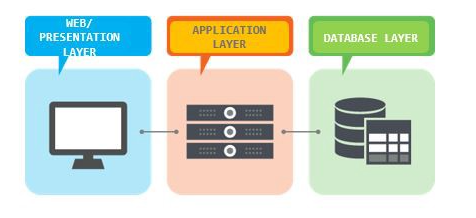
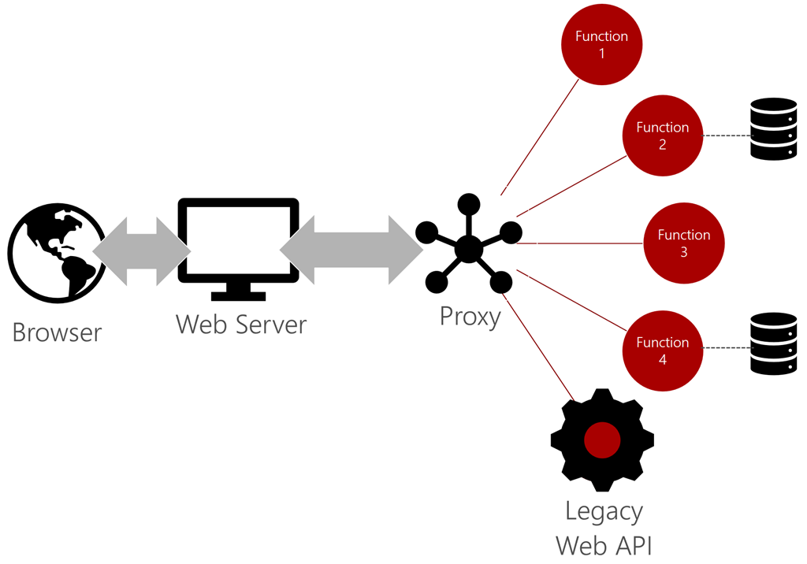

# {{ $frontmatter.title }}

## Architekturansätze Recap
Unabhängig von dem Architekturansatz, der für die Entwicklung einer Anwendung verwendet wird, kann die Implementierung bzw.
Deployment dieser Anwendungen unterschiedlich ausfallen. Unternehmen hosten Anwendungen auf unterschiedlichste Art, von physischer
Hardware (Bare-metal) bis hin zu serverlosen Funktionen.

### N-Tier Architektur
Das N-Tier-Architekturmuster ist eine ausgereifte Architektur und bezieht sich einfach auf Anwendungen, die
verschiedene logische Schichten in separate physische Ebenen aufteilen. Die N-Tier-Architektur ist eine physische Implementierung der
N-Layer-Architektur. Die gängigste Implementierung dieser Architektur umfasst:
* Eine Präsentationsebene, zum Beispiel eine Webanwendung.
* Eine API- oder Datenzugriffsebene, z. B. eine REST-API.
* Eine Datenebene, z. B. eine SQL-Datenbank.

*3-Tier Architektur. Source: [Medium](https://medium.com/coffeetechandme/three-tier-architecture-the-beginning-2d2f6063fa1e)*

### Monolithen und Microservices
Bei Microservices handelt es sich um ein Konzept, bei dem anstelle einer monolithischen Anwendung ein winziger Dienst für jeden Bedarf entwickelt wird. Diese Dienste werden über das Netzwerk verbunden, normalerweise über HTTP. Im Gegensatz dazu bestehen monolithische Anwendungen aus einer einzigen Einheit, in die alle Funktionalitäten eingebunden sind.
Siehe [Microservices und Monolithen](/lectures/07-cloud-native/07-cloud-native.html#microservices) aus vergangener Lecture.

## Serverless Architektur
Eine serverlose Architektur bietet eine klare Trennung zwischen dem Code und der zugehörigen Hostingumgebung. Code wird in einer **Funktion** implementiert, die von einem **Trigger** aufgerufen wird. Nachdem diese Funktion beendet wurde, können alle von der Funktion benötigten Ressourcen freigegeben werden. Der Trigger kann manuell, ein zeitgesteuerter Prozess, eine HTTP-Anforderung oder ein Dateiupload sein. Das Ergebnis des Triggers ist die Ausführung von Code. Obwohl sich serverlose Plattformen unterscheiden, bieten die meisten Zugriff auf vordefinierte APIs und Bindings, um Aufgaben wie das Schreiben in eine Datenbank oder das Einreihen von Ergebnissen in Warteschlangen (Message Queues) zu optimieren.

**"Serverless"** ist eine Architektur, die stark davon abhängig ist, die Hostumgebung zu abstrahieren, um sich auf den Code zu konzentrieren.

Containerlösungen bieten Entwickler:innen vorhandene Buildskripts, mit denen sie Code für "serverlos"-aufbereitete Images veröffentlichen können. Bei anderen Implementierungen werden vorhandene PaaS-Lösungen verwendet, um eine skalierbare Architektur bereitzustellen.

Die Abstraktion bedeutet, dass das DevOps-Team weder Server noch bestimmte Container bereitstellen oder verwalten muss. Die serverlose Plattform hostet Code, entweder als Skript oder als gebuildete ausführbare Dateien, die mit einem zugehörigen SDK erstellt wurden, und weist die erforderlichen Ressourcen zum Skalieren des Codes zu.

### Vorteile

Zu den Vorteilen von serverloser Implementierung gehören:

**Hohe Dichte:** Viele Instanzen desselben serverlosen Codes können im Vergleich zu Containern oder virtuellen Computern auf demselben Host ausgeführt werden. Die Instanzen werden über mehrere Hosts hinweg skaliert, und es werden horizontale Hochskalierung und Resilienz bereitgestellt.

**Microabrechnung:** Die meisten serverlosen Anbieter rechnen auf der Basis von serverlosen Ausführungen ab, sodass in bestimmten Szenarien massiv Kosten eingespart werden können.

**Sofortige Skalierung:** Serverlose Implementierungen können skaliert werden, um Arbeitsauslastungen automatisch und schnell zu berücksichtigen.

**Kürzere Zeit bis zur Markreife:** Entwickler:innen konzentrieren sich auf Code und führen die Bereitstellung direkt auf der serverlosen Plattform aus. Komponenten können unabhängig voneinander freigegeben werden.

|             | IaaS     | PaaS            | Container          | Serverless                |
|-------------|----------|-----------------|--------------------|---------------------------|
| Skalierung  | VM       | Instanz         | App                | Funktion                  |
| Abstraktion | Hardware | Plattform       | Betriebssystemhost | Laufzeit                  |
| Einheit     | VM       | Projekt         | Image              | Code                      |
| Lebensdauer | Monate   | Tage bis Monate | Minuten bis Tage   | Millisekunden bis Minuten |

### Anwendungsbereiche

#### Serverloses Backend
Das vollständige serverlose Backend eignet sich ideal für verschiedene Arten von Szenarien, insbesondere bei der Erstellung von neuen oder "Greenfield"-Anwendungen. Eine Anwendung mit einem großen Oberfläche von APIs kann davon profitieren, jede API als serverlose Funktion zu implementieren. Apps, die auf einer **Microservicesarchitektur** basieren, sind ein weiteres Beispiel, das als vollständiges serverloses Back-End implementiert werden kann. Die Microservices kommunizieren untereinander über verschiedene Protokolle.

#### App Modernization
Eine gängige Herausforderung besteht darin, eine vorhandene monolithische Anwendung in die Cloud zu migrieren. Der am wenigsten riskante Ansatz besteht darin, mithilfe von **"Lift and Shift"** eine vollständige Migration zu virtuellen Computern auszuführen. Viele Unternehmen bevorzugen es, die Migration als Gelegenheit zu nutzen, um ihre Codebasis zu **modernisieren**. Ein praktischer Ansatz für die Migration wird als *"Starve the beast"* bezeichnet. In diesem Szenario wird die monolithische Anwendung zunächst unverändert migriert. Anschließend werden ausgewählte Dienste modernisiert. In einigen Fällen ist die Signatur des Diensts mit dem Original identisch: Er wird einfach als **Funktion** gehostet. Clients werden so aktualisiert, dass sie den neuen Dienst anstelle des monolithischen Endpunkts verwenden. In der Zwischenzeit ermöglichen Schritte wie Datenbankreplikation es Microservices, ihren eigenen Speicher zu hosten, auch wenn Transaktionen noch von der monolithischen Anwendung verarbeitet werden. Schließlich werden alle Clients zu den neuen Diensten migriert. Die monolithische Anwendung wird "ausgehungert", bis alle Funktionen ersetzt wurden. Die Kombination aus serverlosen Instanzen und Proxys kann einen Großteil dieser Migration ermöglichen.

#### Web Applikationen
Web Applikationen sind hervorragende Kandidaten für serverlose Anwendungen. Heutzutage gibt es zwei gängige Ansätze für Web Apps: servergesteuert und clientgesteuert (z.B. Single-Page-Anwendung oder SPA). Servergesteuerte Web-Apps verwenden in der Regel eine Middlewareschicht, um API-Aufrufe zum Rendern der Web-UI auszugeben. SPA-Anwendungen nehmen Aufrufe der REST-API direkt aus dem Browser vor. In beiden Szenarien können serverlose Instanzen die Middleware- oder REST-API-Anforderung unterstützen, indem die erforderliche Geschäftslogik bereitgestellt wird. Eine gängige Architektur ist die Einrichtung eines schlanken statischen Webservers. Die Single-Page-Anwendung (SPA) stellt HTML-, CSS-, JavaScript- und andere Browserressourcen bereit. Die Web-App stellt dann eine Verbindung mit einem Microservices-Backend her.

#### Mobile-Backends
Das ereignisgesteuerte Paradigma von serverlosen Apps macht sie zu idealen Mobile-Backends. Das mobile Gerät löst die Ereignisse aus, und der serverlose Code wird ausgeführt, um Anforderungen zu erfüllen. Beispielsweise senden von Notifications.

Mobile-Entwickler:innen können Geschäftslogik entwickeln, ohne zu Experten auf der Serverseite zu werden. Bisher waren Mobile-Apps mit lokalen Diensten verbunden. 

Das serverlose Modell abstrahiert die serverseitigen Abhängigkeiten und ermöglicht es den Entwickler:innen, sich auf die Geschäftslogik zu konzentrieren. Beispielsweise können Mobile-Entwickler:innen, die Apps mithilfe eines JavaScript-Frameworks erstellen, auch mit JavaScript serverlose Funktionen erstellen. Der serverlose Host verwaltet das Betriebssystem, eine Node.js-Instanz zum Hosten des Codes, Paketabhängigkeiten usw. Für die Entwickler:innen wird ein einfacher Satz von Eingaben und eine Standardvorlage für Ausgaben bereitgestellt. Sie können sich dann auf das Entwickeln und Testen der Geschäftslogik konzentrieren. Sie sind daher in der Lage, vorhandene Fähigkeiten zu nutzen, um die Backend-Logik für die Mobile-App zu erstellen, ohne neue Plattformen erlernen zu müssen.

Eine sehr beliebte Plattform für Mobile-Backends ist [Google Firebase](https://firebase.google.com/), das u.a. auch Firebase Functions zur Verfügung stellt (aber auch DBaaS und Authentifizierungsdienste).

#### IOT (Internet of Things)
IoT bezieht sich auf physische Objekte, die miteinander vernetzt sind. Diese werden mitunter auch als "connected Devices" oder "smart Devices" bezeichnet. Es kann alles von Autos bis hin zu Verkaufsautomaten vernetzt werden und Informationen zum Warenbestand bis hin zu Sensordaten wie Temperatur und Feuchtigkeit senden. Im Unternehmen bietet IoT Verbesserungen des Geschäftsprozesses durch **Überwachung und Automatisierung**. IoT-Daten können verwendet werden, um das Klima in einem großen Lager zu regulieren oder den Warenbestand durch die Lieferkette nachzuverfolgen. IoT kann Chemikalienverluste erkennen und die Feuerwehr rufen, wenn Rauch entdeckt wird.

Die schiere Menge an Geräten und Informationen erfordert oft eine **ereignisgesteuerte Architektur** zur Weiterleitung und Verarbeitung von Nachrichten. Das serverlose Modell ist aus verschiedenen Gründen eine ideale Lösung:

* Es ermöglicht Skalierung, wenn sich die Menge der Geräte und Daten erhöht.
* Es ermöglicht das Hinzufügen neuer Endpunkte zur Unterstützung neuer Geräte und Sensoren.
* Es ermöglicht die unabhängige Versionsverwaltung, damit Entwickler die Geschäftslogik für ein bestimmtes Gerät aktualisieren können, ohne dass das gesamte System bereitgestellt werden muss.
* Resilienz und weniger Ausfallzeiten.
  
Die Allgegenwärtigkeit von IoT hat zu mehreren serverlosen Produkten geführt, die sich speziell auf IoT-Belange konzentrieren, beispielsweise [Azure IoT Hub](https://azure.microsoft.com/en-us/services/iot-hub/) oder [AWS IOT](https://aws.amazon.com/de/iot/). Die serverlose Architektur automatisiert Aufgaben wie Geräteregistrierung, Richtlinienerzwingung, Nachverfolgung und sogar Bereitstellung von Code auf Geräten in der Edge-Umgebung. "Edge" bezieht sich auf Geräte wie Sensoren und Aktoren, die zwar mit dem Internet verbunden, aber kein aktiver Teil davon sind.

## Ressourcen
[E-Book Serverless und Azure (gratis)](https://aka.ms/serverlessbookpdf)

[Architektur Bereitstellungen](https://docs.microsoft.com/de-de/dotnet/architecture/serverless/architecture-deployment-approaches)

[Geschäftsszenarien für serverlose Architektur](https://docs.microsoft.com/de-de/dotnet/architecture/serverless/serverless-business-scenarios)
